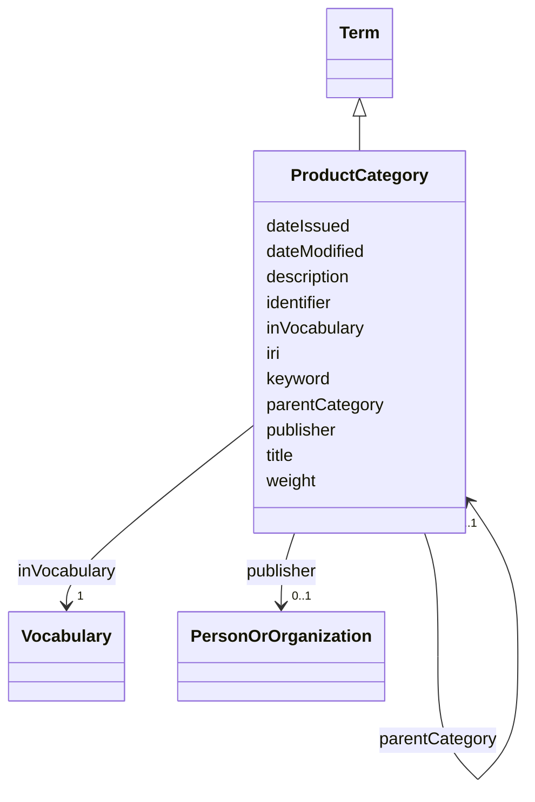

# Class: Product category (ProductCategory) 


_A term used to classify a group of products that share common characteristics or functions, which helps in their organization._


URI: [EVORAO:ProductCategory](https://w3id.org/evorao/ProductCategory)





## Inheritance
* [Resource](Resource.md)
    * [Term](Term.md)
        * **ProductCategory**


## Slots

| Name | Cardinality and Range | Description | Inheritance |
| ---  | --- | --- | --- |
| [parentCategory](parentCategory.md) | 0..1 <br/> [ProductCategory](ProductCategory.md) | An overarching category that encompasses the current category within a hierar... | direct |
| [title](title.md) | 1 <br/> [String](String.md) | A name given to the resource | [Term](Term.md) |
| [description](description.md) | 0..1 _recommended_ <br/> [String](String.md) | A short explanation of the characteristics, features, or nature of the curren... | [Term](Term.md) |
| [weight](weight.md) | 1 <br/> [Integer](Integer.md) | A numerical value indicating relative importance or priority, generally proce... | [Term](Term.md) |
| [inVocabulary](inVocabulary.md) | 1 <br/> [Vocabulary](Vocabulary.md) | Terms belong to a specific vocabulary | [Term](Term.md) |
| [keyword](keyword.md) | * <br/> [String](String.md) | A keyword or tag describing the resource | [Resource](Resource.md) |
| [dateIssued](dateIssued.md) | 0..1 <br/> [Datetime](Datetime.md) | Date of formal issuance (e | [Resource](Resource.md) |
| [dateModified](dateModified.md) | 0..1 <br/> [Datetime](Datetime.md) | Most recent date on which the resource was changed, updated or modified | [Resource](Resource.md) |
| [identifier](identifier.md) | * <br/> [String](String.md) | A unique identifier of the resource being described or cataloged | [Resource](Resource.md) |
| [iri](iri.md) | * <br/> [Uri](Uri.md) | International Resource Identifier (IRI) that uniquely identifies or refers to... | [Resource](Resource.md) |
| [publisher](publisher.md) | 0..1 <br/> [PersonOrOrganization](PersonOrOrganization.md) | The entity responsible for making the resource available | [Resource](Resource.md) |


## Usages

| used by | used in | type | used |
| ---  | --- | --- | --- |
| [ProductCategory](ProductCategory.md) | [parentCategory](parentCategory.md) | range | [ProductCategory](ProductCategory.md) |
| [ProductOrService](ProductOrService.md) | [category](category.md) | range | [ProductCategory](ProductCategory.md) |
| [ProductOrService](ProductOrService.md) | [additionalCategory](additionalCategory.md) | range | [ProductCategory](ProductCategory.md) |
| [Service](Service.md) | [category](category.md) | range | [ProductCategory](ProductCategory.md) |
| [Service](Service.md) | [additionalCategory](additionalCategory.md) | range | [ProductCategory](ProductCategory.md) |
| [Product](Product.md) | [category](category.md) | range | [ProductCategory](ProductCategory.md) |
| [Product](Product.md) | [additionalCategory](additionalCategory.md) | range | [ProductCategory](ProductCategory.md) |
| [Antibody](Antibody.md) | [category](category.md) | range | [ProductCategory](ProductCategory.md) |
| [Antibody](Antibody.md) | [additionalCategory](additionalCategory.md) | range | [ProductCategory](ProductCategory.md) |
| [Hybridoma](Hybridoma.md) | [category](category.md) | range | [ProductCategory](ProductCategory.md) |
| [Hybridoma](Hybridoma.md) | [additionalCategory](additionalCategory.md) | range | [ProductCategory](ProductCategory.md) |
| [Protein](Protein.md) | [category](category.md) | range | [ProductCategory](ProductCategory.md) |
| [Protein](Protein.md) | [additionalCategory](additionalCategory.md) | range | [ProductCategory](ProductCategory.md) |
| [NucleicAcid](NucleicAcid.md) | [category](category.md) | range | [ProductCategory](ProductCategory.md) |
| [NucleicAcid](NucleicAcid.md) | [additionalCategory](additionalCategory.md) | range | [ProductCategory](ProductCategory.md) |
| [DetectionKit](DetectionKit.md) | [category](category.md) | range | [ProductCategory](ProductCategory.md) |
| [DetectionKit](DetectionKit.md) | [additionalCategory](additionalCategory.md) | range | [ProductCategory](ProductCategory.md) |
| [Bundle](Bundle.md) | [category](category.md) | range | [ProductCategory](ProductCategory.md) |
| [Bundle](Bundle.md) | [additionalCategory](additionalCategory.md) | range | [ProductCategory](ProductCategory.md) |
| [Pathogen](Pathogen.md) | [category](category.md) | range | [ProductCategory](ProductCategory.md) |
| [Pathogen](Pathogen.md) | [additionalCategory](additionalCategory.md) | range | [ProductCategory](ProductCategory.md) |
| [Virus](Virus.md) | [category](category.md) | range | [ProductCategory](ProductCategory.md) |
| [Virus](Virus.md) | [additionalCategory](additionalCategory.md) | range | [ProductCategory](ProductCategory.md) |
| [Bacterium](Bacterium.md) | [category](category.md) | range | [ProductCategory](ProductCategory.md) |
| [Bacterium](Bacterium.md) | [additionalCategory](additionalCategory.md) | range | [ProductCategory](ProductCategory.md) |
| [Fungus](Fungus.md) | [category](category.md) | range | [ProductCategory](ProductCategory.md) |
| [Fungus](Fungus.md) | [additionalCategory](additionalCategory.md) | range | [ProductCategory](ProductCategory.md) |
| [Protozoan](Protozoan.md) | [category](category.md) | range | [ProductCategory](ProductCategory.md) |
| [Protozoan](Protozoan.md) | [additionalCategory](additionalCategory.md) | range | [ProductCategory](ProductCategory.md) |
| [Viroid](Viroid.md) | [category](category.md) | range | [ProductCategory](ProductCategory.md) |
| [Viroid](Viroid.md) | [additionalCategory](additionalCategory.md) | range | [ProductCategory](ProductCategory.md) |
| [Prion](Prion.md) | [category](category.md) | range | [ProductCategory](ProductCategory.md) |
| [Prion](Prion.md) | [additionalCategory](additionalCategory.md) | range | [ProductCategory](ProductCategory.md) |


## Identifier and Mapping Information


### Schema Source


* from schema: https://w3id.org/evorao/


## Mappings

| Mapping Type | Mapped Value |
| ---  | ---  |
| self | EVORAO:ProductCategory |
| native | EVORAO:ProductCategory |
| exact | wd:Q63981612, wd:Q63981612 |
| broad | skos:ConceptScheme, skos:ConceptScheme |
| related | schema:CategoryCode, schema:CategoryCode |
| close | ncit:C25372, ncit:C25372 |


## LinkML Source

<!-- TODO: investigate https://stackoverflow.com/questions/37606292/how-to-create-tabbed-code-blocks-in-mkdocs-or-sphinx -->

### Direct

<details>
```yaml
name: ProductCategory
description: A term used to classify a group of products that share common characteristics
  or functions, which helps in their organization.
title: Product category
from_schema: https://w3id.org/evorao/
exact_mappings:
- wd:Q63981612
- wd:Q63981612
close_mappings:
- ncit:C25372
- ncit:C25372
related_mappings:
- schema:CategoryCode
- schema:CategoryCode
broad_mappings:
- skos:ConceptScheme
- skos:ConceptScheme
is_a: Term
slots:
- parentCategory
slot_usage:
  parentCategory:
    name: parentCategory
    description: An overarching category that encompasses the current category within
      a hierarchical classification system. It serves as the top-level classification,
      organizing related subcategories under its umbrella to create a structured and
      logical order.
    title: parent category
    broad_mappings:
    - dct:isPartOf
    domain_of:
    - ProductCategory
    range: ProductCategory
    required: false
    multivalued: false

```
</details>

### Induced

<details>
```yaml
name: ProductCategory
description: A term used to classify a group of products that share common characteristics
  or functions, which helps in their organization.
title: Product category
from_schema: https://w3id.org/evorao/
exact_mappings:
- wd:Q63981612
- wd:Q63981612
close_mappings:
- ncit:C25372
- ncit:C25372
related_mappings:
- schema:CategoryCode
- schema:CategoryCode
broad_mappings:
- skos:ConceptScheme
- skos:ConceptScheme
is_a: Term
slot_usage:
  parentCategory:
    name: parentCategory
    description: An overarching category that encompasses the current category within
      a hierarchical classification system. It serves as the top-level classification,
      organizing related subcategories under its umbrella to create a structured and
      logical order.
    title: parent category
    broad_mappings:
    - dct:isPartOf
    domain_of:
    - ProductCategory
    range: ProductCategory
    required: false
    multivalued: false
attributes:
  parentCategory:
    name: parentCategory
    description: An overarching category that encompasses the current category within
      a hierarchical classification system. It serves as the top-level classification,
      organizing related subcategories under its umbrella to create a structured and
      logical order.
    title: parent category
    from_schema: https://w3id.org/evorao/
    broad_mappings:
    - dct:isPartOf
    rank: 1000
    alias: parentCategory
    owner: ProductCategory
    domain_of:
    - ProductCategory
    range: ProductCategory
    required: false
    multivalued: false
  title:
    name: title
    description: A name given to the resource.
    title: title
    comments:
    - The title of the item should be as short and descriptive as possible.
    - 'E.g. for virus products it should basically be based on the following Pattern:
      ''Virus name'', ''virus host type'', ''collection year'', ''country of collection''
      ex ''suspected epidemiological origin'', ''genotype'', ''strain'', ''variant
      name or specific feature.'
    from_schema: https://w3id.org/evorao/
    exact_mappings:
    - schema:name
    - rdfs:label
    rank: 1000
    slot_uri: dct:title
    alias: title
    owner: ProductCategory
    domain_of:
    - Term
    - Dataset
    - DataService
    - Publication
    - License
    - Certification
    - FundingSource
    range: string
    required: true
    multivalued: false
  description:
    name: description
    description: A short explanation of the characteristics, features, or nature of
      the current item.
    title: description
    comments:
    - Describe this item in few lines. This description will serve as a summary to
      present the resource.
    from_schema: https://w3id.org/evorao/
    exact_mappings:
    - schema:description
    rank: 1000
    slot_uri: dct:description
    alias: description
    owner: ProductCategory
    domain_of:
    - Term
    - Dataset
    - DataService
    - PersonOrOrganization
    - File
    - ContactPoint
    - License
    - Certification
    - FundingSource
    range: string
    required: false
    recommended: true
    multivalued: false
  weight:
    name: weight
    description: A numerical value indicating relative importance or priority, generally
      processed in ascending order. This weight helps prioritize content when organizing
      or processing data. Its value can be negative, with a default set to 0.
    title: weight
    comments:
    - The lowest weighted Data providers are triggered first.
    - This property may be usefull to populate at first entities that are referenced
      by others (e.g. Version ahead of Rank ahead of Taxon).
    from_schema: https://w3id.org/evorao/
    close_mappings:
    - adms:status
    rank: 1000
    ifabsent: int(0)
    alias: weight
    owner: ProductCategory
    domain_of:
    - Term
    - DataProvider
    range: integer
    required: true
    multivalued: false
  inVocabulary:
    name: inVocabulary
    description: Terms belong to a specific vocabulary.
    title: in Vocabulary
    from_schema: https://w3id.org/evorao/
    close_mappings:
    - wdp:P972
    related_mappings:
    - dct:isReferencedBy
    broad_mappings:
    - dct:isPartOf
    rank: 1000
    alias: inVocabulary
    owner: ProductCategory
    domain_of:
    - Term
    range: Vocabulary
    required: true
    multivalued: false
  keyword:
    name: keyword
    description: A keyword or tag describing the resource.
    title: keyword
    from_schema: https://w3id.org/evorao/
    rank: 1000
    slot_uri: dcat:keyword
    alias: keyword
    owner: ProductCategory
    domain_of:
    - Resource
    range: string
    required: false
    multivalued: true
  dateIssued:
    name: dateIssued
    description: Date of formal issuance (e.g., publication) of the resource.
    title: date issued
    comments:
    - encoded using the relevant ISO 8601 Date and Time compliant string [DATETIME].
    from_schema: https://w3id.org/evorao/
    exact_mappings:
    - sepio:0000051
    close_mappings:
    - schema:datePublished
    - schema:dateCreated
    rank: 1000
    slot_uri: dct:issued
    alias: dateIssued
    owner: ProductCategory
    domain_of:
    - Resource
    range: datetime
    required: false
    multivalued: false
  dateModified:
    name: dateModified
    description: Most recent date on which the resource was changed, updated or modified.
    title: date modified
    comments:
    - encoded using the relevant ISO 8601 Date and Time compliant string [DATETIME].
    from_schema: https://w3id.org/evorao/
    exact_mappings:
    - sepio:0000036
    close_mappings:
    - schema:dateModified
    rank: 1000
    slot_uri: dct:modified
    alias: dateModified
    owner: ProductCategory
    domain_of:
    - Resource
    range: datetime
    required: false
    multivalued: false
  identifier:
    name: identifier
    description: A unique identifier of the resource being described or cataloged.
    title: identifier
    comments:
    - The identifier is a text string which is assigned to the resource to provide
      an unambiguous reference within a particular context. Persistent identifiers
      should be provided as HTTP URIs.
    from_schema: https://w3id.org/evorao/
    exact_mappings:
    - schema:identifier
    rank: 1000
    slot_uri: dct:identifier
    alias: identifier
    owner: ProductCategory
    domain_of:
    - Resource
    range: string
    required: false
    multivalued: true
  iri:
    name: iri
    description: International Resource Identifier (IRI) that uniquely identifies
      or refers to the resource. IRIs include URIs, and URIs include URLs.
    title: IRI
    comments:
    - An IRI is a global identifier standardized by IETF RFC 3987. It may or may not
      be resolvable on the web. IRIs include URIs, and URIs include URLs.
    from_schema: https://w3id.org/evorao/
    close_mappings:
    - biolink:iri
    related_mappings:
    - mi:url
    narrow_mappings:
    - schema:url
    rank: 1000
    is_a: identifier
    alias: iri
    owner: ProductCategory
    domain_of:
    - Resource
    range: uri
    required: false
    multivalued: true
  publisher:
    name: publisher
    description: The entity responsible for making the resource available.
    title: publisher
    comments:
    - Resources of type foaf:Agent like EVORAO:PersonOrOrganization are recommended
      as values for this property.
    from_schema: https://w3id.org/evorao/
    rank: 1000
    slot_uri: dct:publisher
    alias: publisher
    owner: ProductCategory
    domain_of:
    - Resource
    range: PersonOrOrganization
    required: false
    multivalued: false

```
</details>