# Class: Protein (Protein) 


_A protein as a derived product from a pathogen_


URI: [EVORAO:Protein](https://w3id.org/evorao/Protein)

```mermaid
 classDiagram
    class Protein
    click Protein href "../Protein"
      Product <|-- Protein
        click Product href "../Product"
      
      Protein : accessPointURL
        
      Protein : additionalCategory
        
          
    
    
    Protein --> "* _recommended_" ProductCategory : additionalCategory
    click ProductCategory href "../ProductCategory"

        
      Protein : availability
        
      Protein : biologicalMaterialOrigin
        
          
    
    
    Protein --> "1" BiologicalMaterialOrigin : biologicalMaterialOrigin
    click BiologicalMaterialOrigin href "../BiologicalMaterialOrigin"

        
      Protein : biosafetyRestrictions
        
      Protein : canItBeUsedToProduceGMO
        
      Protein : category
        
          
    
    
    Protein --> "1" ProductCategory : category
    click ProductCategory href "../ProductCategory"

        
      Protein : certification
        
          
    
    
    Protein --> "*" Certification : certification
    click Certification href "../Certification"

        
      Protein : collection
        
          
    
    
    Protein --> "1..*" Collection : collection
    click Collection href "../Collection"

        
      Protein : complementaryDocument
        
          
    
    
    Protein --> "*" Document : complementaryDocument
    click Document href "../Document"

        
      Protein : contactPoint
        
          
    
    
    Protein --> "0..1 _recommended_" ContactPoint : contactPoint
    click ContactPoint href "../ContactPoint"

        
      Protein : description
        
      Protein : domain
        
      Protein : expressedAs
        
      Protein : expressionSystem
        
      Protein : externalRelatedReference
        
          
    
    
    Protein --> "*" ExternalRelatedReference : externalRelatedReference
    click ExternalRelatedReference href "../ExternalRelatedReference"

        
      Protein : functionalCharacterization
        
      Protein : functionalTechnicalDescription
        
      Protein : hasIATAClassification
        
          
    
    
    Protein --> "1" IATAClassification : hasIATAClassification
    click IATAClassification href "../IATAClassification"

        
      Protein : inclusionBodiesType
        
      Protein : internalReference
        
      Protein : keywords
        
          
    
    
    Protein --> "1..* _recommended_" Keyword : keywords
    click Keyword href "../Keyword"

        
      Protein : materialSafetyDataSheet
        
          
    
    
    Protein --> "0..1" MSDS : materialSafetyDataSheet
    click MSDS href "../MSDS"

        
      Protein : note
        
      Protein : originator
        
          
    
    
    Protein --> "0..1" Originator : originator
    click Originator href "../Originator"

        
      Protein : pathogenIdentification
        
          
    
    
    Protein --> "1..*" PathogenIdentification : pathogenIdentification
    click PathogenIdentification href "../PathogenIdentification"

        
      Protein : productPicture
        
          
    
    
    Protein --> "*" Image : productPicture
    click Image href "../Image"

        
      Protein : proteinPurification
        
      Protein : proteinTAG
        
          
    
    
    Protein --> "*" ProteinTag : proteinTAG
    click ProteinTag href "../ProteinTag"

        
      Protein : provider
        
          
    
    
    Protein --> "1" Provider : provider
    click Provider href "../Provider"

        
      Protein : qualityGrading
        
      Protein : refSKU
        
      Protein : relatedDOI
        
          
    
    
    Protein --> "*" DOI : relatedDOI
    click DOI href "../DOI"

        
      Protein : relatedPDB
        
          
    
    
    Protein --> "*" PDBReference : relatedPDB
    click PDBReference href "../PDBReference"

        
      Protein : riskGroup
        
          
    
    
    Protein --> "0..1 _recommended_" RiskGroup : riskGroup
    click RiskGroup href "../RiskGroup"

        
      Protein : sequence
        
          
    
    
    Protein --> "1..* _recommended_" Sequence : sequence
    click Sequence href "../Sequence"

        
      Protein : shippingConditions
        
      Protein : specialFeature
        
          
    
    
    Protein --> "*" SpecialFeature : specialFeature
    click SpecialFeature href "../SpecialFeature"

        
      Protein : storageConditions
        
      Protein : technicalRecommendation
        
      Protein : theTAGStatusOfTheSolubilizedProtein
        
      Protein : thirdPartyDistributionConsent
        
      Protein : title
        
      Protein : typeOfFunctionalCharacterization
        
      Protein : unitCost
        
      Protein : unitDefinition
        
      Protein : usageRestrictions
        
      
```





## Inheritance
* [Resource](Resource.md)
    * [Dataset](Dataset.md)
        * [ProductOrService](ProductOrService.md)
            * [Product](Product.md)
                * **Protein**


## Slots

| Name | Cardinality and Range | Description | Inheritance |
| ---  | --- | --- | --- |
| [biologicalMaterialOrigin](biologicalMaterialOrigin.md) | 1 <br/> [BiologicalMaterialOrigin](BiologicalMaterialOrigin.md) | Information about the origin of the biological material, essential for access... | direct |
| [sequence](sequence.md) | 1..* _recommended_ <br/> [Sequence](Sequence.md) | The related sequence information from a sequence provider or in fasta format | direct |
| [relatedPDB](relatedPDB.md) | * <br/> [PDBReference](PDBReference.md) | Identifier for 3D structural data as per the PDB (Protein Data Bank) database | direct |
| [specialFeature](specialFeature.md) | * <br/> [SpecialFeature](SpecialFeature.md) | Distinctive attributes of a product that set it apart from other similar item... | direct |
| [proteinTAG](proteinTAG.md) | * <br/> [ProteinTag](ProteinTag.md) | Peptide sequences genetically grafted onto a recombinant protein | direct |
| [domain](domain.md) | * <br/> [String](String.md) | A distinct structural and functional unit within the protein, often capable o... | direct |
| [expressedAs](expressedAs.md) | * <br/> [String](String.md) | Refers to the form in which the protein is produced and manifested in a biolo... | direct |
| [inclusionBodiesType](inclusionBodiesType.md) | * <br/> [String](String.md) | Refers to the state of aggregated proteins within a cell | direct |
| [expressionSystem](expressionSystem.md) | * <br/> [String](String.md) | The host organism or cellular environment used to produce a protein from a sp... | direct |
| [functionalCharacterization](functionalCharacterization.md) | * <br/> [String](String.md) | The process of determining and describing the specific biological activities ... | direct |
| [functionalTechnicalDescription](functionalTechnicalDescription.md) | * <br/> [String](String.md) | Detailed information about the specific biological functions, mechanisms of a... | direct |
| [proteinPurification](proteinPurification.md) | * <br/> [String](String.md) | Refers to the degree of purity achieved for a protein sample | direct |
| [theTAGStatusOfTheSolubilizedProtein](theTAGStatusOfTheSolubilizedProtein.md) | * <br/> [String](String.md) | Indicates the presence and condition of a tag on the protein after solubiliza... | direct |
| [typeOfFunctionalCharacterization](typeOfFunctionalCharacterization.md) | * <br/> [String](String.md) | Refers to the classification of a protein based on the specific type of funct... | direct |
| [hasIATAClassification](hasIATAClassification.md) | 1 <br/> [IATAClassification](IATAClassification.md) | The corresponding International Air Transport Association (IATA)'s category f... | [Product](Product.md) |
| [shippingConditions](shippingConditions.md) | 1 <br/> [String](String.md) | Specification of the terms and parameters for transporting | [Product](Product.md) |
| [materialSafetyDataSheet](materialSafetyDataSheet.md) | 0..1 <br/> [MSDS](MSDS.md) | A Material Safety Data Sheet (MSDS) or Safety Data Sheet (SDS) is a standardi... | [Product](Product.md) |
| [originator](originator.md) | 0..1 <br/> [Originator](Originator.md) | The individual or organization responsible for the original discovery, isolat... | [Product](Product.md) |
| [storageConditions](storageConditions.md) | 1 <br/> [String](String.md) | Specifies the conditions under which the product has to be stored to maintain... | [Product](Product.md) |
| [thirdPartyDistributionConsent](thirdPartyDistributionConsent.md) | 0..1 <br/> [Boolean](Boolean.md) | Indicates whether the biological material can be distributed without restrict... | [Product](Product.md) |
| [usageRestrictions](usageRestrictions.md) | 0..1 <br/> [String](String.md) | Specifies any limitations or conditions on the use of the biological material... | [Product](Product.md) |
| [accessPointURL](accessPointURL.md) | 1 <br/> [Uri](Uri.md) | The URL that permits to access to the product/service detailed description pa... | [ProductOrService](ProductOrService.md) |
| [refSKU](refSKU.md) | 1 <br/> [String](String.md) | The reference or the stock keeping unit of the service or item provided in th... | [ProductOrService](ProductOrService.md) |
| [unitDefinition](unitDefinition.md) | 0..1 _recommended_ <br/> [String](String.md) | A short description of what will be delivered by ordering one unit of this it... | [ProductOrService](ProductOrService.md) |
| [category](category.md) | 1 <br/> [ProductCategory](ProductCategory.md) | The main category of the service or product | [ProductOrService](ProductOrService.md) |
| [additionalCategory](additionalCategory.md) | * _recommended_ <br/> [ProductCategory](ProductCategory.md) | Any category apart from its main category in which this product or service ca... | [ProductOrService](ProductOrService.md) |
| [unitCost](unitCost.md) | 1 _recommended_ <br/> [String](String.md) | The cost per access for one unit as defined by the unit definition | [ProductOrService](ProductOrService.md) |
| [qualityGrading](qualityGrading.md) | 0..1 <br/> [String](String.md) | Information that permits to assess the quality level of what will be provided | [ProductOrService](ProductOrService.md) |
| [pathogenIdentification](pathogenIdentification.md) | 1..* <br/> [PathogenIdentification](PathogenIdentification.md) | The identification of the pathogen or group of pathogens (e | [ProductOrService](ProductOrService.md) |
| [relatedDOI](relatedDOI.md) | * <br/> [DOI](DOI.md) | Any Digital Object Identifier that can be related | [ProductOrService](ProductOrService.md) |
| [riskGroup](riskGroup.md) | 0..1 _recommended_ <br/> [RiskGroup](RiskGroup.md) | The highest risk group related to this resource | [ProductOrService](ProductOrService.md) |
| [biosafetyRestrictions](biosafetyRestrictions.md) | 0..1 <br/> [String](String.md) | Information about guidelines and regulations designed to prevent the exposure... | [ProductOrService](ProductOrService.md) |
| [canItBeUsedToProduceGMO](canItBeUsedToProduceGMO.md) | 1 _recommended_ <br/> [Boolean](Boolean.md) | Indicates if the current service or product can be used to produce GMO | [ProductOrService](ProductOrService.md) |
| [provider](provider.md) | 1 <br/> [Provider](Provider.md) | A provider of this product or service, as a specific organization | [ProductOrService](ProductOrService.md) |
| [collection](collection.md) | 1..* <br/> [Collection](Collection.md) | The collection(s) to which belongs this item | [ProductOrService](ProductOrService.md) |
| [keywords](keywords.md) | 1..* _recommended_ <br/> [Keyword](Keyword.md) | List of terms used to tag and categorize this Item | [ProductOrService](ProductOrService.md) |
| [availability](availability.md) | 1 <br/> [String](String.md) | The state or condition in which this item is accessible and ready for use or ... | [ProductOrService](ProductOrService.md) |
| [complementaryDocument](complementaryDocument.md) | * <br/> [Document](Document.md) | Any additional documents that provide supplementary information, instructions... | [ProductOrService](ProductOrService.md) |
| [technicalRecommendation](technicalRecommendation.md) | 0..1 <br/> [String](String.md) | Expert advice or guidelines provided to ensure the optimal use, performance, ... | [ProductOrService](ProductOrService.md) |
| [productPicture](productPicture.md) | * <br/> [Image](Image.md) | A picture that can represent the item | [ProductOrService](ProductOrService.md) |
| [externalRelatedReference](externalRelatedReference.md) | * <br/> [ExternalRelatedReference](ExternalRelatedReference.md) | A reference that permits to retrieve another related item from an external pr... | [ProductOrService](ProductOrService.md) |
| [certification](certification.md) | * <br/> [Certification](Certification.md) | Any certification related to the current product or service; e | [ProductOrService](ProductOrService.md) |
| [internalReference](internalReference.md) | 0..1 <br/> [String](String.md) | Any reference or indication to be used for local retrieval purpose | [ProductOrService](ProductOrService.md) |
| [note](note.md) | 0..1 <br/> [String](String.md) | An aditional information as a textual comment | [ProductOrService](ProductOrService.md) |
| [contactPoint](contactPoint.md) | 0..1 _recommended_ <br/> [ContactPoint](ContactPoint.md) | An information that allows someone to establish communication | [ProductOrService](ProductOrService.md) |
| [title](title.md) | 1 <br/> [String](String.md) | A name given to the resource | [Dataset](Dataset.md) |
| [description](description.md) | 1 _recommended_ <br/> [String](String.md) | A short explanation of the characteristics, features, or nature of the curren... | [Dataset](Dataset.md) |


## Identifier and Mapping Information


### Schema Source


* from schema: https://w3id.org/evorao/


## Mappings

| Mapping Type | Mapped Value |
| ---  | ---  |
| self | EVORAO:Protein |
| native | EVORAO:Protein |
| close | wd:Q8054, wd:Q8054 |


## LinkML Source

<!-- TODO: investigate https://stackoverflow.com/questions/37606292/how-to-create-tabbed-code-blocks-in-mkdocs-or-sphinx -->

### Direct

<details>
```yaml
name: Protein
description: A protein as a derived product from a pathogen
title: Protein
from_schema: https://w3id.org/evorao/
close_mappings:
- wd:Q8054
- wd:Q8054
is_a: Product
slots:
- biologicalMaterialOrigin
- sequence
- relatedPDB
- specialFeature
- proteinTAG
- domain
- expressedAs
- inclusionBodiesType
- expressionSystem
- functionalCharacterization
- functionalTechnicalDescription
- proteinPurification
- theTAGStatusOfTheSolubilizedProtein
- typeOfFunctionalCharacterization
slot_usage:
  biologicalMaterialOrigin:
    name: biologicalMaterialOrigin
    description: Information about the origin of the biological material, essential
      for access, utilization, and benefit-sharing of genetic resources in compliance
      with the Nagoya Protocol
    title: Biological Material origin
    domain_of:
    - Protein
    - NucleicAcid
    - Pathogen
    range: BiologicalMaterialOrigin
    required: true
    multivalued: false
  sequence:
    name: sequence
    description: The related sequence information from a sequence provider or in fasta
      format
    title: sequence
    domain_of:
    - Protein
    - RecombinantPartIdentification
    - NucleicAcid
    - Pathogen
    range: Sequence
    required: true
    multivalued: true
  relatedPDB:
    name: relatedPDB
    description: Identifier for 3D structural data as per the PDB (Protein Data Bank)
      database
    title: related PDB
    close_mappings:
    - wdp:P638
    domain_of:
    - Protein
    range: PDBReference
    required: false
    multivalued: true
  specialFeature:
    name: specialFeature
    description: Distinctive attributes of a product that set it apart from other
      similar items e.g., Reference strain, Vaccinal strain, Antiviral resistant strain
      ...
    title: special feature
    domain_of:
    - Protein
    range: SpecialFeature
    required: false
    multivalued: true
  proteinTAG:
    name: proteinTAG
    description: Peptide sequences genetically grafted onto a recombinant protein
    title: protein TAG
    domain_of:
    - Protein
    range: ProteinTag
    required: false
    multivalued: true
  domain:
    name: domain
    description: A distinct structural and functional unit within the protein, often
      capable of independent folding and stability, which contributes to the protein's
      overall function
    title: domain
    domain_of:
    - Protein
    range: string
    required: false
    multivalued: true
  expressedAs:
    name: expressedAs
    description: Refers to the form in which the protein is produced and manifested
      in a biological system. Possible values include 'Soluble' (proteins that are
      dissolved in the cellular or extracellular fluid) and 'Inclusion bodies' (aggregated
      proteins that are insoluble and form within the cell)
    title: expressed as
    domain_of:
    - Protein
    range: string
    required: false
    multivalued: true
  inclusionBodiesType:
    name: inclusionBodiesType
    description: Refers to the state of aggregated proteins within a cell. Possible
      values include 'Denatured' (proteins are in an unfolded, inactive state) and
      'Refolded' (proteins have been processed to regain their functional, active
      conformation).
    title: inclusion bodies type
    domain_of:
    - Protein
    range: string
    required: false
    multivalued: true
  expressionSystem:
    name: expressionSystem
    description: The host organism or cellular environment used to produce a protein
      from a specific gene. Possible values include 'E. coli' (bacterial system),
      'Insect cells' (using baculovirus vectors), and 'Mammalian cells' (mammalian
      cell lines).
    title: expression system
    domain_of:
    - Protein
    range: string
    required: false
    multivalued: true
  functionalCharacterization:
    name: functionalCharacterization
    description: The process of determining and describing the specific biological
      activities and roles of a protein. Possible values include 'Functionally characterized'
      (the protein's functions have been identified and described) and 'No functional
      characterization' (the protein's functions have not been identified or described).
    title: functional characterization
    domain_of:
    - Protein
    range: string
    required: false
    multivalued: true
  functionalTechnicalDescription:
    name: functionalTechnicalDescription
    description: Detailed information about the specific biological functions, mechanisms
      of action, and technical attributes of a protein. This includes how the protein
      interacts within biological systems, its role in cellular processes, and any
      relevant technical details such as structure, activity, and interactions with
      other molecules.
    title: functional/Technical description
    domain_of:
    - Protein
    range: string
    required: false
    multivalued: true
  proteinPurification:
    name: proteinPurification
    description: Refers to the degree of purity achieved for a protein sample. Possible
      values include '>95%' (the protein is highly purified, with more than 95% purity)
      and 'Unpurified expression host lysate or partly purified protein' (the protein
      is either unpurified and present in the host cell lysate or only partially purified).
    title: protein purification
    domain_of:
    - Protein
    range: string
    required: false
    multivalued: true
  theTAGStatusOfTheSolubilizedProtein:
    name: theTAGStatusOfTheSolubilizedProtein
    description: Indicates the presence and condition of a tag on the protein after
      solubilization. Possible values include 'Uncleaved Tag' (the tag is still attached
      to the protein), 'Cleaved Tag' (the tag has been removed from the protein),
      and 'No Tag' (the protein does not have a tag)
    title: TAG status of the solubilized protein
    domain_of:
    - Protein
    range: string
    required: false
    multivalued: true
  typeOfFunctionalCharacterization:
    name: typeOfFunctionalCharacterization
    description: Refers to the classification of a protein based on the specific type
      of functional analysis performed to determine its biological activities and
      roles. Possible values include 'Enzymatic' (the protein has been characterized
      for its enzyme activity) and 'Antigenic' (the protein has been characterized
      for its ability to elicit an immune response).
    title: type of functional Characterization
    domain_of:
    - Protein
    range: string
    required: false
    multivalued: true

```
</details>

### Induced

<details>
```yaml
name: Protein
description: A protein as a derived product from a pathogen
title: Protein
from_schema: https://w3id.org/evorao/
close_mappings:
- wd:Q8054
- wd:Q8054
is_a: Product
slot_usage:
  biologicalMaterialOrigin:
    name: biologicalMaterialOrigin
    description: Information about the origin of the biological material, essential
      for access, utilization, and benefit-sharing of genetic resources in compliance
      with the Nagoya Protocol
    title: Biological Material origin
    domain_of:
    - Protein
    - NucleicAcid
    - Pathogen
    range: BiologicalMaterialOrigin
    required: true
    multivalued: false
  sequence:
    name: sequence
    description: The related sequence information from a sequence provider or in fasta
      format
    title: sequence
    domain_of:
    - Protein
    - RecombinantPartIdentification
    - NucleicAcid
    - Pathogen
    range: Sequence
    required: true
    multivalued: true
  relatedPDB:
    name: relatedPDB
    description: Identifier for 3D structural data as per the PDB (Protein Data Bank)
      database
    title: related PDB
    close_mappings:
    - wdp:P638
    domain_of:
    - Protein
    range: PDBReference
    required: false
    multivalued: true
  specialFeature:
    name: specialFeature
    description: Distinctive attributes of a product that set it apart from other
      similar items e.g., Reference strain, Vaccinal strain, Antiviral resistant strain
      ...
    title: special feature
    domain_of:
    - Protein
    range: SpecialFeature
    required: false
    multivalued: true
  proteinTAG:
    name: proteinTAG
    description: Peptide sequences genetically grafted onto a recombinant protein
    title: protein TAG
    domain_of:
    - Protein
    range: ProteinTag
    required: false
    multivalued: true
  domain:
    name: domain
    description: A distinct structural and functional unit within the protein, often
      capable of independent folding and stability, which contributes to the protein's
      overall function
    title: domain
    domain_of:
    - Protein
    range: string
    required: false
    multivalued: true
  expressedAs:
    name: expressedAs
    description: Refers to the form in which the protein is produced and manifested
      in a biological system. Possible values include 'Soluble' (proteins that are
      dissolved in the cellular or extracellular fluid) and 'Inclusion bodies' (aggregated
      proteins that are insoluble and form within the cell)
    title: expressed as
    domain_of:
    - Protein
    range: string
    required: false
    multivalued: true
  inclusionBodiesType:
    name: inclusionBodiesType
    description: Refers to the state of aggregated proteins within a cell. Possible
      values include 'Denatured' (proteins are in an unfolded, inactive state) and
      'Refolded' (proteins have been processed to regain their functional, active
      conformation).
    title: inclusion bodies type
    domain_of:
    - Protein
    range: string
    required: false
    multivalued: true
  expressionSystem:
    name: expressionSystem
    description: The host organism or cellular environment used to produce a protein
      from a specific gene. Possible values include 'E. coli' (bacterial system),
      'Insect cells' (using baculovirus vectors), and 'Mammalian cells' (mammalian
      cell lines).
    title: expression system
    domain_of:
    - Protein
    range: string
    required: false
    multivalued: true
  functionalCharacterization:
    name: functionalCharacterization
    description: The process of determining and describing the specific biological
      activities and roles of a protein. Possible values include 'Functionally characterized'
      (the protein's functions have been identified and described) and 'No functional
      characterization' (the protein's functions have not been identified or described).
    title: functional characterization
    domain_of:
    - Protein
    range: string
    required: false
    multivalued: true
  functionalTechnicalDescription:
    name: functionalTechnicalDescription
    description: Detailed information about the specific biological functions, mechanisms
      of action, and technical attributes of a protein. This includes how the protein
      interacts within biological systems, its role in cellular processes, and any
      relevant technical details such as structure, activity, and interactions with
      other molecules.
    title: functional/Technical description
    domain_of:
    - Protein
    range: string
    required: false
    multivalued: true
  proteinPurification:
    name: proteinPurification
    description: Refers to the degree of purity achieved for a protein sample. Possible
      values include '>95%' (the protein is highly purified, with more than 95% purity)
      and 'Unpurified expression host lysate or partly purified protein' (the protein
      is either unpurified and present in the host cell lysate or only partially purified).
    title: protein purification
    domain_of:
    - Protein
    range: string
    required: false
    multivalued: true
  theTAGStatusOfTheSolubilizedProtein:
    name: theTAGStatusOfTheSolubilizedProtein
    description: Indicates the presence and condition of a tag on the protein after
      solubilization. Possible values include 'Uncleaved Tag' (the tag is still attached
      to the protein), 'Cleaved Tag' (the tag has been removed from the protein),
      and 'No Tag' (the protein does not have a tag)
    title: TAG status of the solubilized protein
    domain_of:
    - Protein
    range: string
    required: false
    multivalued: true
  typeOfFunctionalCharacterization:
    name: typeOfFunctionalCharacterization
    description: Refers to the classification of a protein based on the specific type
      of functional analysis performed to determine its biological activities and
      roles. Possible values include 'Enzymatic' (the protein has been characterized
      for its enzyme activity) and 'Antigenic' (the protein has been characterized
      for its ability to elicit an immune response).
    title: type of functional Characterization
    domain_of:
    - Protein
    range: string
    required: false
    multivalued: true
attributes:
  biologicalMaterialOrigin:
    name: biologicalMaterialOrigin
    description: Information about the origin of the biological material, essential
      for access, utilization, and benefit-sharing of genetic resources in compliance
      with the Nagoya Protocol
    title: Biological Material origin
    from_schema: https://w3id.org/evorao/
    rank: 1000
    alias: biologicalMaterialOrigin
    owner: Protein
    domain_of:
    - Protein
    - NucleicAcid
    - Pathogen
    range: BiologicalMaterialOrigin
    required: true
    multivalued: false
  sequence:
    name: sequence
    description: The related sequence information from a sequence provider or in fasta
      format
    title: sequence
    from_schema: https://w3id.org/evorao/
    rank: 1000
    alias: sequence
    owner: Protein
    domain_of:
    - Protein
    - RecombinantPartIdentification
    - NucleicAcid
    - Pathogen
    range: Sequence
    required: true
    recommended: true
    multivalued: true
  relatedPDB:
    name: relatedPDB
    description: Identifier for 3D structural data as per the PDB (Protein Data Bank)
      database
    title: related PDB
    from_schema: https://w3id.org/evorao/
    close_mappings:
    - wdp:P638
    rank: 1000
    alias: relatedPDB
    owner: Protein
    domain_of:
    - Protein
    range: PDBReference
    required: false
    multivalued: true
  specialFeature:
    name: specialFeature
    description: Distinctive attributes of a product that set it apart from other
      similar items e.g., Reference strain, Vaccinal strain, Antiviral resistant strain
      ...
    title: special feature
    from_schema: https://w3id.org/evorao/
    rank: 1000
    alias: specialFeature
    owner: Protein
    domain_of:
    - Protein
    range: SpecialFeature
    required: false
    multivalued: true
  proteinTAG:
    name: proteinTAG
    description: Peptide sequences genetically grafted onto a recombinant protein
    title: protein TAG
    from_schema: https://w3id.org/evorao/
    rank: 1000
    alias: proteinTAG
    owner: Protein
    domain_of:
    - Protein
    range: ProteinTag
    required: false
    multivalued: true
  domain:
    name: domain
    description: A distinct structural and functional unit within the protein, often
      capable of independent folding and stability, which contributes to the protein's
      overall function
    title: domain
    from_schema: https://w3id.org/evorao/
    rank: 1000
    alias: domain
    owner: Protein
    domain_of:
    - Protein
    range: string
    required: false
    multivalued: true
  expressedAs:
    name: expressedAs
    description: Refers to the form in which the protein is produced and manifested
      in a biological system. Possible values include 'Soluble' (proteins that are
      dissolved in the cellular or extracellular fluid) and 'Inclusion bodies' (aggregated
      proteins that are insoluble and form within the cell)
    title: expressed as
    from_schema: https://w3id.org/evorao/
    rank: 1000
    alias: expressedAs
    owner: Protein
    domain_of:
    - Protein
    range: string
    required: false
    multivalued: true
    equals_string_in:
    - Soluble
    - Inclusion bodies
  inclusionBodiesType:
    name: inclusionBodiesType
    description: Refers to the state of aggregated proteins within a cell. Possible
      values include 'Denatured' (proteins are in an unfolded, inactive state) and
      'Refolded' (proteins have been processed to regain their functional, active
      conformation).
    title: inclusion bodies type
    from_schema: https://w3id.org/evorao/
    rank: 1000
    alias: inclusionBodiesType
    owner: Protein
    domain_of:
    - Protein
    range: string
    required: false
    multivalued: true
    equals_string_in:
    - Denatured
    - Refolded
  expressionSystem:
    name: expressionSystem
    description: The host organism or cellular environment used to produce a protein
      from a specific gene. Possible values include 'E. coli' (bacterial system),
      'Insect cells' (using baculovirus vectors), and 'Mammalian cells' (mammalian
      cell lines).
    title: expression system
    from_schema: https://w3id.org/evorao/
    rank: 1000
    alias: expressionSystem
    owner: Protein
    domain_of:
    - Protein
    range: string
    required: false
    multivalued: true
    equals_string_in:
    - E. coli
    - Insect cells
    - Mammalian cells
  functionalCharacterization:
    name: functionalCharacterization
    description: The process of determining and describing the specific biological
      activities and roles of a protein. Possible values include 'Functionally characterized'
      (the protein's functions have been identified and described) and 'No functional
      characterization' (the protein's functions have not been identified or described).
    title: functional characterization
    from_schema: https://w3id.org/evorao/
    rank: 1000
    alias: functionalCharacterization
    owner: Protein
    domain_of:
    - Protein
    range: string
    required: false
    multivalued: true
    equals_string_in:
    - Functionally characterized
    - No functional characterization
  functionalTechnicalDescription:
    name: functionalTechnicalDescription
    description: Detailed information about the specific biological functions, mechanisms
      of action, and technical attributes of a protein. This includes how the protein
      interacts within biological systems, its role in cellular processes, and any
      relevant technical details such as structure, activity, and interactions with
      other molecules.
    title: functional/Technical description
    from_schema: https://w3id.org/evorao/
    rank: 1000
    alias: functionalTechnicalDescription
    owner: Protein
    domain_of:
    - Protein
    range: string
    required: false
    multivalued: true
  proteinPurification:
    name: proteinPurification
    description: Refers to the degree of purity achieved for a protein sample. Possible
      values include '>95%' (the protein is highly purified, with more than 95% purity)
      and 'Unpurified expression host lysate or partly purified protein' (the protein
      is either unpurified and present in the host cell lysate or only partially purified).
    title: protein purification
    from_schema: https://w3id.org/evorao/
    rank: 1000
    alias: proteinPurification
    owner: Protein
    domain_of:
    - Protein
    range: string
    required: false
    multivalued: true
    equals_string_in:
    - Greater than 95 percent
    - Unpurified expression host lysate or partly purified protein
  theTAGStatusOfTheSolubilizedProtein:
    name: theTAGStatusOfTheSolubilizedProtein
    description: Indicates the presence and condition of a tag on the protein after
      solubilization. Possible values include 'Uncleaved Tag' (the tag is still attached
      to the protein), 'Cleaved Tag' (the tag has been removed from the protein),
      and 'No Tag' (the protein does not have a tag)
    title: TAG status of the solubilized protein
    from_schema: https://w3id.org/evorao/
    rank: 1000
    alias: theTAGStatusOfTheSolubilizedProtein
    owner: Protein
    domain_of:
    - Protein
    range: string
    required: false
    multivalued: true
  typeOfFunctionalCharacterization:
    name: typeOfFunctionalCharacterization
    description: Refers to the classification of a protein based on the specific type
      of functional analysis performed to determine its biological activities and
      roles. Possible values include 'Enzymatic' (the protein has been characterized
      for its enzyme activity) and 'Antigenic' (the protein has been characterized
      for its ability to elicit an immune response).
    title: type of functional Characterization
    from_schema: https://w3id.org/evorao/
    rank: 1000
    alias: typeOfFunctionalCharacterization
    owner: Protein
    domain_of:
    - Protein
    range: string
    required: false
    multivalued: true
    equals_string_in:
    - Enzymatic
    - Antigenic
  hasIATAClassification:
    name: hasIATAClassification
    description: The corresponding International Air Transport Association (IATA)'s
      category for this Product
    title: IATA classification
    from_schema: https://w3id.org/evorao/
    rank: 1000
    alias: hasIATAClassification
    owner: Protein
    domain_of:
    - Product
    range: IATAClassification
    required: true
    multivalued: false
  shippingConditions:
    name: shippingConditions
    description: 'Specification of the terms and parameters for transporting

      '
    title: shipping conditions
    from_schema: https://w3id.org/evorao/
    rank: 1000
    alias: shippingConditions
    owner: Protein
    domain_of:
    - Product
    range: string
    required: true
    multivalued: false
  materialSafetyDataSheet:
    name: materialSafetyDataSheet
    description: A Material Safety Data Sheet (MSDS) or Safety Data Sheet (SDS) is
      a standardized document that contains crucial occupational safety and health
      information related to the product
    title: material safety data sheet
    comments:
    - The MSD  is a document that provides detailed information about the properties,
      hazards, handling, storage, and emergency procedures related to the use of a
      chemical or substance
    from_schema: https://w3id.org/evorao/
    rank: 1000
    alias: materialSafetyDataSheet
    owner: Protein
    domain_of:
    - Product
    range: MSDS
    required: false
    multivalued: false
  originator:
    name: originator
    description: The individual or organization responsible for the original discovery,
      isolation, or creation of an item, providing information about the source or
      origin of the sample
    title: originator
    from_schema: https://w3id.org/evorao/
    rank: 1000
    alias: originator
    owner: Protein
    domain_of:
    - Product
    range: Originator
    required: false
    multivalued: false
  storageConditions:
    name: storageConditions
    description: Specifies the conditions under which the product has to be stored
      to maintain stability and integrity, such as temperature, buffer, and other
      environmental factors.
    title: storage conditions
    comments:
    - e.g, could be a xsd:string in enumeration ('Freeze Dried', 'Liquid Nitrogen',
      'Viral Storage Medium -20C', 'Viral Storage Medium -80C', 'Living plant material
      (>= +4°C)', 'Gas Phase', 'Ethanol -20C', 'Ethanol -80C', 'Dried')
    from_schema: https://w3id.org/evorao/
    rank: 1000
    alias: storageConditions
    owner: Protein
    domain_of:
    - Product
    range: string
    required: true
    multivalued: false
  thirdPartyDistributionConsent:
    name: thirdPartyDistributionConsent
    description: Indicates whether the biological material can be distributed without
      restriction to third parties, as indicated by the ABS permit, in case an ABS
      permit is required
    title: third party distribution consent
    from_schema: https://w3id.org/evorao/
    rank: 1000
    alias: thirdPartyDistributionConsent
    owner: Protein
    domain_of:
    - Product
    range: boolean
    required: false
    multivalued: false
  usageRestrictions:
    name: usageRestrictions
    description: Specifies any limitations or conditions on the use of the biological
      material, including restrictions on research, commercial use, or distribution,
      considering any potential concerns about the related genetic material
    title: usage restrictions
    from_schema: https://w3id.org/evorao/
    rank: 1000
    alias: usageRestrictions
    owner: Protein
    domain_of:
    - Product
    range: string
    required: false
    multivalued: false
  accessPointURL:
    name: accessPointURL
    description: The URL that permits to access to the product/service detailed description
      page on the provider's website and/or allows to place an order about it or at
      least describe the process to place an order/enquiry
    title: access point URL
    from_schema: https://w3id.org/evorao/
    exact_mappings:
    - dcat:landingPage
    rank: 1000
    alias: accessPointURL
    owner: Protein
    domain_of:
    - ProductOrService
    range: uri
    required: true
    multivalued: false
  refSKU:
    name: refSKU
    description: The reference or the stock keeping unit of the service or item provided
      in the provider's catalogue
    title: ref-SKU
    from_schema: https://w3id.org/evorao/
    exact_mappings:
    - dct:identifier
    rank: 1000
    alias: refSKU
    owner: Protein
    domain_of:
    - ProductOrService
    range: string
    required: true
    multivalued: false
  unitDefinition:
    name: unitDefinition
    description: A short description of what will be delivered by ordering one unit
      of this item
    title: unit definition
    comments:
    - 'The description of what will be delivered to the end-user (e.g.: packaging,
      quantity...)'
    from_schema: https://w3id.org/evorao/
    rank: 1000
    alias: unitDefinition
    owner: Protein
    domain_of:
    - ProductOrService
    range: string
    required: false
    recommended: true
    multivalued: false
  category:
    name: category
    description: The main category of the service or product
    title: category
    from_schema: https://w3id.org/evorao/
    exact_mappings:
    - dcat:theme
    rank: 1000
    alias: category
    owner: Protein
    domain_of:
    - ProductOrService
    range: ProductCategory
    required: true
    multivalued: false
  additionalCategory:
    name: additionalCategory
    description: Any category apart from its main category in which this product or
      service can fit
    title: additional category
    from_schema: https://w3id.org/evorao/
    exact_mappings:
    - dcat:theme
    rank: 1000
    alias: additionalCategory
    owner: Protein
    domain_of:
    - ProductOrService
    range: ProductCategory
    required: false
    recommended: true
    multivalued: true
  unitCost:
    name: unitCost
    description: The cost per access for one unit as defined by the unit definition
    title: unit cost
    comments:
    - The cost per access may not be defined or be specific to a request, so it has
      to be a xsd:string instead of an xsd:float as initialy suggested to permit description
      of cost as conditional to what is requested
    from_schema: https://w3id.org/evorao/
    rank: 1000
    ifabsent: string(on request)
    alias: unitCost
    owner: Protein
    domain_of:
    - ProductOrService
    range: string
    required: true
    recommended: true
    multivalued: false
  qualityGrading:
    name: qualityGrading
    description: Information that permits to assess the quality level of what will
      be provided
    title: quality grading
    from_schema: https://w3id.org/evorao/
    rank: 1000
    alias: qualityGrading
    owner: Protein
    domain_of:
    - ProductOrService
    range: string
    required: false
    multivalued: false
  pathogenIdentification:
    name: pathogenIdentification
    description: The identification of the pathogen or group of pathogens (e.g; name,
      taxon identification, etc.) related to the current item.
    title: pathogen identification
    comments:
    - 'The pathogen identification contains information about name and taxon but in
      some cases(e.g: FAIRSHARING) there may have no direct pathogen related but simply
      a taxonomic information .... the default value should be the root of virology:
      Viruses'
    from_schema: https://w3id.org/evorao/
    rank: 1000
    alias: pathogenIdentification
    owner: Protein
    domain_of:
    - ProductOrService
    range: PathogenIdentification
    required: true
    multivalued: true
  relatedDOI:
    name: relatedDOI
    description: Any Digital Object Identifier that can be related
    title: DOI
    from_schema: https://w3id.org/evorao/
    close_mappings:
    - wdp:P356
    rank: 1000
    alias: relatedDOI
    owner: Protein
    domain_of:
    - ProductOrService
    - Publication
    range: DOI
    required: false
    multivalued: true
  riskGroup:
    name: riskGroup
    description: The highest risk group related to this resource. The risk group of
      a biological agent guiding its initial handling in labs according to the risk
      group classification defined by the WHO laboratory biosafety manual
    title: risk group
    from_schema: https://w3id.org/evorao/
    close_mappings:
    - wdp:P12663
    rank: 1000
    alias: riskGroup
    owner: Protein
    domain_of:
    - ProductOrService
    range: RiskGroup
    required: false
    recommended: true
    multivalued: false
  biosafetyRestrictions:
    name: biosafetyRestrictions
    description: Information about guidelines and regulations designed to prevent
      the exposure to or release of potentially harmful biological agents. It thereby
      contributes to protecting people and the environment from biohazards while accessing
      this product or service
    title: biosafety restrictions
    from_schema: https://w3id.org/evorao/
    rank: 1000
    alias: biosafetyRestrictions
    owner: Protein
    domain_of:
    - ProductOrService
    range: string
    required: false
    multivalued: false
  canItBeUsedToProduceGMO:
    name: canItBeUsedToProduceGMO
    description: Indicates if the current service or product can be used to produce
      GMO
    title: can it be used to produce GMO
    comments:
    - Set to TRUE if it can produce GMO. It is recommended to have a value for this
      field, no value will be understood as unknown
    from_schema: https://w3id.org/evorao/
    rank: 1000
    alias: canItBeUsedToProduceGMO
    owner: Protein
    domain_of:
    - ProductOrService
    range: boolean
    required: true
    recommended: true
    multivalued: false
  provider:
    name: provider
    description: A provider of this product or service, as a specific organization
    title: provider
    from_schema: https://w3id.org/evorao/
    rank: 1000
    alias: provider
    owner: Protein
    domain_of:
    - ProductOrService
    range: Provider
    required: true
    multivalued: false
  collection:
    name: collection
    description: The collection(s) to which belongs this item
    title: collection
    from_schema: https://w3id.org/evorao/
    rank: 1000
    alias: collection
    owner: Protein
    domain_of:
    - ProductOrService
    range: Collection
    required: true
    multivalued: true
  keywords:
    name: keywords
    description: List of terms used to tag and categorize this Item
    title: keywords
    from_schema: https://w3id.org/evorao/
    exact_mappings:
    - dcat:keyword
    rank: 1000
    alias: keywords
    owner: Protein
    domain_of:
    - ProductOrService
    range: Keyword
    required: true
    recommended: true
    multivalued: true
  availability:
    name: availability
    description: The state or condition in which this item is accessible and ready
      for use or can be obtained
    title: availability
    comments:
    - Possible availabilities may differ from a project to another
    from_schema: https://w3id.org/evorao/
    rank: 1000
    ifabsent: string(on request)
    alias: availability
    owner: Protein
    domain_of:
    - ProductOrService
    range: string
    required: true
    multivalued: false
  complementaryDocument:
    name: complementaryDocument
    description: Any additional documents that provide supplementary information,
      instructions, or guidelines relevant to the use of this item
    title: complementary document
    from_schema: https://w3id.org/evorao/
    rank: 1000
    alias: complementaryDocument
    owner: Protein
    domain_of:
    - ProductOrService
    range: Document
    required: false
    multivalued: true
  technicalRecommendation:
    name: technicalRecommendation
    description: Expert advice or guidelines provided to ensure the optimal use, performance,
      and maintenance of what is provided, including best practices, troubleshooting
      tips, and procedural instructions
    title: technical recommendation
    from_schema: https://w3id.org/evorao/
    rank: 1000
    alias: technicalRecommendation
    owner: Protein
    domain_of:
    - ProductOrService
    range: string
    required: false
    multivalued: false
  productPicture:
    name: productPicture
    description: A picture that can represent the item
    title: product picture
    from_schema: https://w3id.org/evorao/
    rank: 1000
    alias: productPicture
    owner: Protein
    domain_of:
    - ProductOrService
    range: Image
    required: false
    multivalued: true
  externalRelatedReference:
    name: externalRelatedReference
    description: A reference that permits to retrieve another related item from an
      external provider
    title: external related reference
    from_schema: https://w3id.org/evorao/
    rank: 1000
    alias: externalRelatedReference
    owner: Protein
    domain_of:
    - ProductOrService
    range: ExternalRelatedReference
    required: false
    multivalued: true
  certification:
    name: certification
    description: Any certification related to the current product or service; e.g.,
      ISO certification
    title: certification
    from_schema: https://w3id.org/evorao/
    close_mappings:
    - dct:conformsTo
    rank: 1000
    alias: certification
    owner: Protein
    domain_of:
    - ProductOrService
    range: Certification
    required: false
    multivalued: true
  internalReference:
    name: internalReference
    description: Any reference or indication to be used for local retrieval purpose
    title: internal reference
    from_schema: https://w3id.org/evorao/
    rank: 1000
    alias: internalReference
    owner: Protein
    domain_of:
    - ProductOrService
    range: string
    required: false
    multivalued: false
  note:
    name: note
    description: An aditional information as a textual comment
    title: note
    from_schema: https://w3id.org/evorao/
    rank: 1000
    alias: note
    owner: Protein
    domain_of:
    - ProductOrService
    range: string
    required: false
    multivalued: false
  contactPoint:
    name: contactPoint
    description: An information that allows someone to establish communication
    title: contact point
    from_schema: https://w3id.org/evorao/
    exact_mappings:
    - dcat:contactPoint
    rank: 1000
    alias: contactPoint
    owner: Protein
    domain_of:
    - ProductOrService
    - PersonOrOrganization
    range: ContactPoint
    required: false
    recommended: true
    multivalued: false
  title:
    name: title
    description: A name given to the resource
    title: title
    comments:
    - 'The title of the item should be as short and descriptive as possible. E.g.
      for virus products it should basically be based on the following Pattern:

      ''Virus name'', ''virus host type'', ''collection year'', ''country of collection''
      ex ''suspected epidemiological origin'', ''genotype'', ''strain'', ''variant
      name or specific feature'
    from_schema: https://w3id.org/evorao/
    close_mappings:
    - rdfs:label
    rank: 1000
    slot_uri: dct:title
    alias: title
    owner: Protein
    domain_of:
    - Dataset
    - DataService
    - Publication
    - Term
    - License
    - Certification
    range: string
    required: true
    multivalued: false
  description:
    name: description
    description: A short explanation of the characteristics, features, or nature of
      the current item
    title: description
    comments:
    - 'Describe this item in few lines. This description will serve as a summary to
      present the resource.

      '
    from_schema: https://w3id.org/evorao/
    rank: 1000
    slot_uri: dct:description
    alias: description
    owner: Protein
    domain_of:
    - Dataset
    - DataService
    - Term
    - PersonOrOrganization
    - File
    - ContactPoint
    - License
    - Certification
    range: string
    required: true
    recommended: true
    multivalued: false

```
</details>