# Class: Protein (Protein) 


_A protein as a derived product from a pathogen._


URI: [EVORAO:Protein](https://w3id.org/evorao/Protein)

```mermaid
 classDiagram
    class Protein
    click Protein href "../Protein"
      Product <|-- Protein
        click Product href "../Product"
      
      Protein : accessPointUrl
        
      Protein : additionalCategory
        
          
    
    
    Protein --> "* _recommended_" ProductCategory : additionalCategory
    click ProductCategory href "../ProductCategory"

        
      Protein : availability
        
      Protein : biologicalMaterialOrigin
        
          
    
    
    Protein --> "1" BiologicalMaterialOrigin : biologicalMaterialOrigin
    click BiologicalMaterialOrigin href "../BiologicalMaterialOrigin"

        
      Protein : biosafetyLevel
        
          
    
    
    Protein --> "0..1" BiosafetyLevel : biosafetyLevel
    click BiosafetyLevel href "../BiosafetyLevel"

        
      Protein : biosafetyRestrictions
        
      Protein : canBeUsedToProduceGmo
        
      Protein : category
        
          
    
    
    Protein --> "1" ProductCategory : category
    click ProductCategory href "../ProductCategory"

        
      Protein : certification
        
          
    
    
    Protein --> "*" Certification : certification
    click Certification href "../Certification"

        
      Protein : collection
        
          
    
    
    Protein --> "1..*" Collection : collection
    click Collection href "../Collection"

        
      Protein : complementaryDocument
        
          
    
    
    Protein --> "*" Document : complementaryDocument
    click Document href "../Document"

        
      Protein : contactPoint
        
          
    
    
    Protein --> "0..1 _recommended_" ContactPoint : contactPoint
    click ContactPoint href "../ContactPoint"

        
      Protein : dateIssued
        
      Protein : dateModified
        
      Protein : description
        
      Protein : doi
        
          
    
    
    Protein --> "*" Doi : doi
    click Doi href "../Doi"

        
      Protein : domain
        
      Protein : expressedAs
        
      Protein : expressionSystem
        
      Protein : externalRelatedReference
        
          
    
    
    Protein --> "*" ExternalRelatedReference : externalRelatedReference
    click ExternalRelatedReference href "../ExternalRelatedReference"

        
      Protein : functionalAndTechnicalDescription
        
      Protein : functionalCharacterization
        
      Protein : fundingSource
        
          
    
    
    Protein --> "*" FundingSource : fundingSource
    click FundingSource href "../FundingSource"

        
      Protein : iataClassification
        
          
    
    
    Protein --> "1" IataClassification : iataClassification
    click IataClassification href "../IataClassification"

        
      Protein : identifier
        
      Protein : inclusionBodiesType
        
      Protein : internalReference
        
      Protein : iri
        
      Protein : keyword
        
      Protein : keywords
        
          
    
    
    Protein --> "1..* _recommended_" Keyword : keywords
    click Keyword href "../Keyword"

        
      Protein : materialSafetyDataSheet
        
          
    
    
    Protein --> "0..1" ReasearchInfrastructure : materialSafetyDataSheet
    click ReasearchInfrastructure href "../ReasearchInfrastructure"

        
      Protein : note
        
      Protein : originator
        
          
    
    
    Protein --> "0..1" Originator : originator
    click Originator href "../Originator"

        
      Protein : pathogenIdentification
        
          
    
    
    Protein --> "1..*" PathogenIdentification : pathogenIdentification
    click PathogenIdentification href "../PathogenIdentification"

        
      Protein : preparationTechnique
        
      Protein : productPicture
        
          
    
    
    Protein --> "*" Image : productPicture
    click Image href "../Image"

        
      Protein : proteinPurification
        
      Protein : provider
        
          
    
    
    Protein --> "1" Provider : provider
    click Provider href "../Provider"

        
      Protein : qualityGrading
        
      Protein : refSku
        
      Protein : relatedPdb
        
          
    
    
    Protein --> "*" PdbReference : relatedPdb
    click PdbReference href "../PdbReference"

        
      Protein : riskGroup
        
          
    
    
    Protein --> "0..1 _recommended_" RiskGroup : riskGroup
    click RiskGroup href "../RiskGroup"

        
      Protein : sequence
        
          
    
    
    Protein --> "1..* _recommended_" Sequence : sequence
    click Sequence href "../Sequence"

        
      Protein : shippingConditions
        
      Protein : specialFeature
        
          
    
    
    Protein --> "*" SpecialFeature : specialFeature
    click SpecialFeature href "../SpecialFeature"

        
      Protein : storageConditions
        
      Protein : tagSequence
        
          
    
    
    Protein --> "*" TagSequence : tagSequence
    click TagSequence href "../TagSequence"

        
      Protein : tagStatusOfTheSolubilizedProtein
        
      Protein : technicalRecommendation
        
      Protein : thirdPartyDistributionConsent
        
      Protein : title
        
      Protein : typeOfFunctionalCharacterization
        
      Protein : unitCost
        
      Protein : unitCostCurrency
        
      Protein : unitCostNote
        
      Protein : unitDefinition
        
      Protein : usageRestrictions
        
      Protein : version
        
      
```





## Inheritance
* [Resource](Resource.md)
    * [Dataset](Dataset.md)
        * [ProductOrService](ProductOrService.md)
            * [Product](Product.md)
                * **Protein**


## Slots

| Name | Cardinality and Range | Description | Inheritance |
| ---  | --- | --- | --- |
| [biologicalMaterialOrigin](biologicalMaterialOrigin.md) | 1 <br/> [BiologicalMaterialOrigin](BiologicalMaterialOrigin.md) | Information about the origin of the biological material, essential for access... | direct |
| [sequence](sequence.md) | 1..* _recommended_ <br/> [Sequence](Sequence.md) | The related sequence information from a sequence provider or in fasta format | direct |
| [relatedPdb](relatedPdb.md) | * <br/> [PdbReference](PdbReference.md) | Identifier for 3D structural data as per the PDB (Protein Data Bank) database | direct |
| [specialFeature](specialFeature.md) | * <br/> [SpecialFeature](SpecialFeature.md) | Distinctive attributes of a product that set it apart from other similar item... | direct |
| [tagSequence](tagSequence.md) | * <br/> [TagSequence](TagSequence.md) | The name of the DNA coding sequence or corresponding peptide/protein sequence... | direct |
| [domain](domain.md) | * <br/> [String](String.md) | A distinct structural and functional unit within the protein, often capable o... | direct |
| [expressedAs](expressedAs.md) | * <br/> [String](String.md) | Refers to the form in which the protein is produced and manifested in a biolo... | direct |
| [inclusionBodiesType](inclusionBodiesType.md) | * <br/> [String](String.md) | Refers to the state of aggregated proteins within a cell | direct |
| [expressionSystem](expressionSystem.md) | * <br/> [String](String.md) | The host organism or cellular environment used to produce a protein from a sp... | direct |
| [functionalCharacterization](functionalCharacterization.md) | * <br/> [String](String.md) | The process of determining and describing the specific biological activities ... | direct |
| [functionalAndTechnicalDescription](functionalAndTechnicalDescription.md) | * <br/> [String](String.md) | Detailed information about the specific biological functions, mechanisms of a... | direct |
| [proteinPurification](proteinPurification.md) | * <br/> [String](String.md) | Refers to the degree of purity achieved for a protein sample | direct |
| [tagStatusOfTheSolubilizedProtein](tagStatusOfTheSolubilizedProtein.md) | * <br/> [String](String.md) | Indicates the presence and condition of a tag on the protein after solubiliza... | direct |
| [typeOfFunctionalCharacterization](typeOfFunctionalCharacterization.md) | * <br/> [String](String.md) | Refers to the classification of a protein based on the specific type of funct... | direct |
| [iataClassification](iataClassification.md) | 1 <br/> [IataClassification](IataClassification.md) | The corresponding International Air Transport Association (IATA)'s category f... | [Product](Product.md) |
| [shippingConditions](shippingConditions.md) | 1 <br/> [String](String.md) | Specification of the terms and parameters for transporting | [Product](Product.md) |
| [materialSafetyDataSheet](materialSafetyDataSheet.md) | 0..1 <br/> [ReasearchInfrastructure](ReasearchInfrastructure.md) | A Material Safety Data Sheet (MSDS) or Safety Data Sheet (SDS) is a standardi... | [Product](Product.md) |
| [originator](originator.md) | 0..1 <br/> [Originator](Originator.md) | The individual or organization responsible for the original discovery, isolat... | [Product](Product.md) |
| [storageConditions](storageConditions.md) | 1 <br/> [String](String.md) | Specifies the conditions under which the product has to be stored to maintain... | [Product](Product.md) |
| [thirdPartyDistributionConsent](thirdPartyDistributionConsent.md) | 0..1 <br/> [Boolean](Boolean.md) | Indicates whether the biological material can be distributed without restrict... | [Product](Product.md) |
| [usageRestrictions](usageRestrictions.md) | 0..1 <br/> [String](String.md) | Specifies any limitations or conditions on the use of the biological material... | [Product](Product.md) |
| [preparationTechnique](preparationTechnique.md) | 0..1 <br/> [String](String.md) | The technique, method, or procedure employed to obtain or prepare the materia... | [Product](Product.md) |
| [accessPointUrl](accessPointUrl.md) | 1 <br/> [Uri](Uri.md) | The URL that permits to access to the product/service detailed description pa... | [ProductOrService](ProductOrService.md) |
| [refSku](refSku.md) | 1 <br/> [String](String.md) | The reference or the stock keeping unit of the service or item provided in th... | [ProductOrService](ProductOrService.md) |
| [unitDefinition](unitDefinition.md) | 0..1 _recommended_ <br/> [String](String.md) | A short description of what will be delivered by ordering one unit of this it... | [ProductOrService](ProductOrService.md) |
| [category](category.md) | 1 <br/> [ProductCategory](ProductCategory.md) | The main category of the service or product | [ProductOrService](ProductOrService.md) |
| [additionalCategory](additionalCategory.md) | * _recommended_ <br/> [ProductCategory](ProductCategory.md) | Any category apart from its main category in which this product or service ca... | [ProductOrService](ProductOrService.md) |
| [unitCost](unitCost.md) | 0..1 _recommended_ <br/> [Decimal](Decimal.md) | The cost per access for one unit as defined by the unit definition | [ProductOrService](ProductOrService.md) |
| [unitCostCurrency](unitCostCurrency.md) | 0..1 _recommended_ <br/> [String](String.md) | The currency in which the unit cost is expressed, following ISO 4217 three-le... | [ProductOrService](ProductOrService.md) |
| [unitCostNote](unitCostNote.md) | 0..1 <br/> [String](String.md) | A free-text note describing special conditions or cases where the cost cannot... | [ProductOrService](ProductOrService.md) |
| [qualityGrading](qualityGrading.md) | 0..1 <br/> [String](String.md) | Information that permits to assess the quality level of what will be provided | [ProductOrService](ProductOrService.md) |
| [pathogenIdentification](pathogenIdentification.md) | 1..* <br/> [PathogenIdentification](PathogenIdentification.md) | The identification of the pathogen or group of pathogens (e | [ProductOrService](ProductOrService.md) |
| [doi](doi.md) | * <br/> [Doi](Doi.md) | A Digital Object Identifier (DOI) that can be related | [ProductOrService](ProductOrService.md) |
| [riskGroup](riskGroup.md) | 0..1 _recommended_ <br/> [RiskGroup](RiskGroup.md) | The highest risk group related to this resource | [ProductOrService](ProductOrService.md) |
| [biosafetyLevel](biosafetyLevel.md) | 0..1 <br/> [BiosafetyLevel](BiosafetyLevel.md) | The level of biocontainment required or applied in the facility where the bio... | [ProductOrService](ProductOrService.md) |
| [biosafetyRestrictions](biosafetyRestrictions.md) | 0..1 <br/> [String](String.md) | Information about guidelines and regulations designed to prevent the exposure... | [ProductOrService](ProductOrService.md) |
| [canBeUsedToProduceGmo](canBeUsedToProduceGmo.md) | 1 _recommended_ <br/> [Boolean](Boolean.md) | Indicates if the current service or product can be used to produce GMO | [ProductOrService](ProductOrService.md) |
| [provider](provider.md) | 1 <br/> [Provider](Provider.md) | A provider of this product or service, as a specific organization | [ProductOrService](ProductOrService.md) |
| [collection](collection.md) | 1..* <br/> [Collection](Collection.md) | The collection(s) to which belongs this item | [ProductOrService](ProductOrService.md) |
| [keywords](keywords.md) | 1..* _recommended_ <br/> [Keyword](Keyword.md) | List of terms used to tag and categorize this Item | [ProductOrService](ProductOrService.md) |
| [availability](availability.md) | 1 <br/> [String](String.md) | The state or condition in which this item is accessible and ready for use or ... | [ProductOrService](ProductOrService.md) |
| [complementaryDocument](complementaryDocument.md) | * <br/> [Document](Document.md) | Any additional documents that provide supplementary information, instructions... | [ProductOrService](ProductOrService.md) |
| [technicalRecommendation](technicalRecommendation.md) | 0..1 <br/> [String](String.md) | Expert advice or guidelines provided to ensure the optimal use, performance, ... | [ProductOrService](ProductOrService.md) |
| [productPicture](productPicture.md) | * <br/> [Image](Image.md) | A picture that can represent the item | [ProductOrService](ProductOrService.md) |
| [externalRelatedReference](externalRelatedReference.md) | * <br/> [ExternalRelatedReference](ExternalRelatedReference.md) | A reference that permits to retrieve another related item from an external pr... | [ProductOrService](ProductOrService.md) |
| [certification](certification.md) | * <br/> [Certification](Certification.md) | Any certification related to the current product or service; e | [ProductOrService](ProductOrService.md) |
| [internalReference](internalReference.md) | 0..1 <br/> [String](String.md) | Any reference or indication to be used for local retrieval purpose | [ProductOrService](ProductOrService.md) |
| [note](note.md) | 0..1 <br/> [String](String.md) | An aditional information as a textual comment | [ProductOrService](ProductOrService.md) |
| [contactPoint](contactPoint.md) | 0..1 _recommended_ <br/> [ContactPoint](ContactPoint.md) | An information that allows someone to establish communication | [ProductOrService](ProductOrService.md) |
| [fundingSource](fundingSource.md) | * <br/> [FundingSource](FundingSource.md) | A program, grant, or project providing financial support for the access or us... | [ProductOrService](ProductOrService.md) |
| [title](title.md) | 1 <br/> [String](String.md) | A name given to the resource | [Dataset](Dataset.md) |
| [description](description.md) | 1 _recommended_ <br/> [String](String.md) | A short explanation of the characteristics, features, or nature of the curren... | [Dataset](Dataset.md) |
| [version](version.md) | 0..1 _recommended_ <br/> [String](String.md) | The version indicator (name or identifier) of a resource | [Dataset](Dataset.md) |
| [keyword](keyword.md) | * <br/> [String](String.md) | A keyword or tag describing the resource | [Resource](Resource.md) |
| [dateIssued](dateIssued.md) | 0..1 <br/> [Datetime](Datetime.md) | Date of formal issuance (e | [Resource](Resource.md) |
| [dateModified](dateModified.md) | 0..1 <br/> [Datetime](Datetime.md) | Most recent date on which the resource was changed, updated or modified | [Resource](Resource.md) |
| [identifier](identifier.md) | * <br/> [String](String.md) | A unique identifier of the resource being described or cataloged | [Resource](Resource.md) |
| [iri](iri.md) | * <br/> [Uri](Uri.md) | International Resource Identifier (IRI) that uniquely identifies or refers to... | [Resource](Resource.md) |


## Identifier and Mapping Information


### Schema Source


* from schema: https://w3id.org/evorao/


## Mappings

| Mapping Type | Mapped Value |
| ---  | ---  |
| self | EVORAO:Protein |
| native | EVORAO:Protein |
| close | wd:Q8054, snomed:88878007, sio:010043, schema:Protein, wd:Q8054, snomed:88878007, sio:010043, schema:Protein |


## LinkML Source

<!-- TODO: investigate https://stackoverflow.com/questions/37606292/how-to-create-tabbed-code-blocks-in-mkdocs-or-sphinx -->

### Direct

<details>
```yaml
name: Protein
description: A protein as a derived product from a pathogen.
title: Protein
from_schema: https://w3id.org/evorao/
close_mappings:
- wd:Q8054
- snomed:88878007
- sio:010043
- schema:Protein
- wd:Q8054
- snomed:88878007
- sio:010043
- schema:Protein
is_a: Product
slots:
- biologicalMaterialOrigin
- sequence
- relatedPdb
- specialFeature
- tagSequence
- domain
- expressedAs
- inclusionBodiesType
- expressionSystem
- functionalCharacterization
- functionalAndTechnicalDescription
- proteinPurification
- tagStatusOfTheSolubilizedProtein
- typeOfFunctionalCharacterization
slot_usage:
  biologicalMaterialOrigin:
    name: biologicalMaterialOrigin
    description: Information about the origin of the biological material, essential
      for access, utilization, and benefit-sharing of genetic resources in compliance
      with the Nagoya Protocol.
    title: biological material origin
    related_mappings:
    - sepio:0000058
    domain_of:
    - Protein
    - NucleicAcid
    - Pathogen
    range: BiologicalMaterialOrigin
    required: true
    multivalued: false
  sequence:
    name: sequence
    description: The related sequence information from a sequence provider or in fasta
      format.
    title: sequence
    close_mappings:
    - geno:0000239
    - bao:0002817
    related_mappings:
    - uniprotrdfs:sequence
    domain_of:
    - Protein
    - RecombinantPartIdentification
    - NucleicAcid
    - Pathogen
    range: Sequence
    required: true
    multivalued: true
  relatedPdb:
    name: relatedPdb
    description: Identifier for 3D structural data as per the PDB (Protein Data Bank)
      database.
    title: related PDB
    close_mappings:
    - wdp:P638
    domain_of:
    - Protein
    range: PdbReference
    required: false
    multivalued: true
  specialFeature:
    name: specialFeature
    description: Distinctive attributes of a product that set it apart from other
      similar items e.g., Reference strain, Vaccinal strain, Antiviral resistant strain
      ...
    title: special feature
    domain_of:
    - Protein
    range: SpecialFeature
    required: false
    multivalued: true
  tagSequence:
    name: tagSequence
    description: The name of the DNA coding sequence or corresponding peptide/protein
      sequence fused to a sequence of interest, used to facilitate experimental operations
      such as purification, detection, localization, tracking, solubility enhancement,
      or selection. Applicable to both proteins and nucleic acids.
    title: tag sequence
    exact_mappings:
    - bao:0002796
    domain_of:
    - Protein
    - NucleicAcid
    range: TagSequence
    required: false
    multivalued: true
  domain:
    name: domain
    description: A distinct structural and functional unit within the protein, often
      capable of independent folding and stability, which contributes to the protein's
      overall function.
    title: domain
    close_mappings:
    - uniprotrdfs:domain
    domain_of:
    - Protein
    range: string
    required: false
    multivalued: true
  expressedAs:
    name: expressedAs
    description: Refers to the form in which the protein is produced and manifested
      in a biological system. Possible values include 'Soluble' (proteins that are
      dissolved in the cellular or extracellular fluid) and 'Inclusion bodies' (aggregated
      proteins that are insoluble and form within the cell).
    title: expressed as
    close_mappings:
    - apollo:00000102
    domain_of:
    - Protein
    range: string
    required: false
    multivalued: true
  inclusionBodiesType:
    name: inclusionBodiesType
    description: Refers to the state of aggregated proteins within a cell. Possible
      values include 'Denatured' (proteins are in an unfolded, inactive state) and
      'Refolded' (proteins have been processed to regain their functional, active
      conformation).
    title: inclusion bodies type
    domain_of:
    - Protein
    range: string
    required: false
    multivalued: true
  expressionSystem:
    name: expressionSystem
    description: The host organism or cellular environment used to produce a protein
      from a specific gene. Possible values include 'E. coli' (bacterial system),
      'Insect cells' (using baculovirus vectors), and 'Mammalian cells' (mammalian
      cell lines).
    title: expression system
    close_mappings:
    - ro:0002206
    domain_of:
    - Protein
    range: string
    required: false
    multivalued: true
  functionalCharacterization:
    name: functionalCharacterization
    description: The process of determining and describing the specific biological
      activities and roles of a protein. Possible values include 'Functionally characterized'
      (the protein's functions have been identified and described) and 'No functional
      characterization' (the protein's functions have not been identified or described).
    title: functional characterization
    domain_of:
    - Protein
    range: string
    required: false
    multivalued: true
  functionalAndTechnicalDescription:
    name: functionalAndTechnicalDescription
    description: Detailed information about the specific biological functions, mechanisms
      of action, and technical attributes of a protein. This includes how the protein
      interacts within biological systems, its role in cellular processes, and any
      relevant technical details such as structure, activity, and interactions with
      other molecules.
    title: functional and technical description
    domain_of:
    - Protein
    range: string
    required: false
    multivalued: true
  proteinPurification:
    name: proteinPurification
    description: Refers to the degree of purity achieved for a protein sample. Possible
      values include '>95%' (the protein is highly purified, with more than 95% purity)
      and 'Unpurified expression host lysate or partly purified protein' (the protein
      is either unpurified and present in the host cell lysate or only partially purified).
    title: protein purification
    domain_of:
    - Protein
    range: string
    required: false
    multivalued: true
  tagStatusOfTheSolubilizedProtein:
    name: tagStatusOfTheSolubilizedProtein
    description: Indicates the presence and condition of a tag on the protein after
      solubilization. Possible values include 'Uncleaved Tag' (the tag is still attached
      to the protein), 'Cleaved Tag' (the tag has been removed from the protein),
      and 'No Tag' (the protein does not have a tag).
    title: tag status of the solubilized protein
    domain_of:
    - Protein
    range: string
    required: false
    multivalued: true
  typeOfFunctionalCharacterization:
    name: typeOfFunctionalCharacterization
    description: Refers to the classification of a protein based on the specific type
      of functional analysis performed to determine its biological activities and
      roles. Possible values include 'Enzymatic' (the protein has been characterized
      for its enzyme activity) and 'Antigenic' (the protein has been characterized
      for its ability to elicit an immune response).
    title: type of functional Characterization
    domain_of:
    - Protein
    range: string
    required: false
    multivalued: true

```
</details>

### Induced

<details>
```yaml
name: Protein
description: A protein as a derived product from a pathogen.
title: Protein
from_schema: https://w3id.org/evorao/
close_mappings:
- wd:Q8054
- snomed:88878007
- sio:010043
- schema:Protein
- wd:Q8054
- snomed:88878007
- sio:010043
- schema:Protein
is_a: Product
slot_usage:
  biologicalMaterialOrigin:
    name: biologicalMaterialOrigin
    description: Information about the origin of the biological material, essential
      for access, utilization, and benefit-sharing of genetic resources in compliance
      with the Nagoya Protocol.
    title: biological material origin
    related_mappings:
    - sepio:0000058
    domain_of:
    - Protein
    - NucleicAcid
    - Pathogen
    range: BiologicalMaterialOrigin
    required: true
    multivalued: false
  sequence:
    name: sequence
    description: The related sequence information from a sequence provider or in fasta
      format.
    title: sequence
    close_mappings:
    - geno:0000239
    - bao:0002817
    related_mappings:
    - uniprotrdfs:sequence
    domain_of:
    - Protein
    - RecombinantPartIdentification
    - NucleicAcid
    - Pathogen
    range: Sequence
    required: true
    multivalued: true
  relatedPdb:
    name: relatedPdb
    description: Identifier for 3D structural data as per the PDB (Protein Data Bank)
      database.
    title: related PDB
    close_mappings:
    - wdp:P638
    domain_of:
    - Protein
    range: PdbReference
    required: false
    multivalued: true
  specialFeature:
    name: specialFeature
    description: Distinctive attributes of a product that set it apart from other
      similar items e.g., Reference strain, Vaccinal strain, Antiviral resistant strain
      ...
    title: special feature
    domain_of:
    - Protein
    range: SpecialFeature
    required: false
    multivalued: true
  tagSequence:
    name: tagSequence
    description: The name of the DNA coding sequence or corresponding peptide/protein
      sequence fused to a sequence of interest, used to facilitate experimental operations
      such as purification, detection, localization, tracking, solubility enhancement,
      or selection. Applicable to both proteins and nucleic acids.
    title: tag sequence
    exact_mappings:
    - bao:0002796
    domain_of:
    - Protein
    - NucleicAcid
    range: TagSequence
    required: false
    multivalued: true
  domain:
    name: domain
    description: A distinct structural and functional unit within the protein, often
      capable of independent folding and stability, which contributes to the protein's
      overall function.
    title: domain
    close_mappings:
    - uniprotrdfs:domain
    domain_of:
    - Protein
    range: string
    required: false
    multivalued: true
  expressedAs:
    name: expressedAs
    description: Refers to the form in which the protein is produced and manifested
      in a biological system. Possible values include 'Soluble' (proteins that are
      dissolved in the cellular or extracellular fluid) and 'Inclusion bodies' (aggregated
      proteins that are insoluble and form within the cell).
    title: expressed as
    close_mappings:
    - apollo:00000102
    domain_of:
    - Protein
    range: string
    required: false
    multivalued: true
  inclusionBodiesType:
    name: inclusionBodiesType
    description: Refers to the state of aggregated proteins within a cell. Possible
      values include 'Denatured' (proteins are in an unfolded, inactive state) and
      'Refolded' (proteins have been processed to regain their functional, active
      conformation).
    title: inclusion bodies type
    domain_of:
    - Protein
    range: string
    required: false
    multivalued: true
  expressionSystem:
    name: expressionSystem
    description: The host organism or cellular environment used to produce a protein
      from a specific gene. Possible values include 'E. coli' (bacterial system),
      'Insect cells' (using baculovirus vectors), and 'Mammalian cells' (mammalian
      cell lines).
    title: expression system
    close_mappings:
    - ro:0002206
    domain_of:
    - Protein
    range: string
    required: false
    multivalued: true
  functionalCharacterization:
    name: functionalCharacterization
    description: The process of determining and describing the specific biological
      activities and roles of a protein. Possible values include 'Functionally characterized'
      (the protein's functions have been identified and described) and 'No functional
      characterization' (the protein's functions have not been identified or described).
    title: functional characterization
    domain_of:
    - Protein
    range: string
    required: false
    multivalued: true
  functionalAndTechnicalDescription:
    name: functionalAndTechnicalDescription
    description: Detailed information about the specific biological functions, mechanisms
      of action, and technical attributes of a protein. This includes how the protein
      interacts within biological systems, its role in cellular processes, and any
      relevant technical details such as structure, activity, and interactions with
      other molecules.
    title: functional and technical description
    domain_of:
    - Protein
    range: string
    required: false
    multivalued: true
  proteinPurification:
    name: proteinPurification
    description: Refers to the degree of purity achieved for a protein sample. Possible
      values include '>95%' (the protein is highly purified, with more than 95% purity)
      and 'Unpurified expression host lysate or partly purified protein' (the protein
      is either unpurified and present in the host cell lysate or only partially purified).
    title: protein purification
    domain_of:
    - Protein
    range: string
    required: false
    multivalued: true
  tagStatusOfTheSolubilizedProtein:
    name: tagStatusOfTheSolubilizedProtein
    description: Indicates the presence and condition of a tag on the protein after
      solubilization. Possible values include 'Uncleaved Tag' (the tag is still attached
      to the protein), 'Cleaved Tag' (the tag has been removed from the protein),
      and 'No Tag' (the protein does not have a tag).
    title: tag status of the solubilized protein
    domain_of:
    - Protein
    range: string
    required: false
    multivalued: true
  typeOfFunctionalCharacterization:
    name: typeOfFunctionalCharacterization
    description: Refers to the classification of a protein based on the specific type
      of functional analysis performed to determine its biological activities and
      roles. Possible values include 'Enzymatic' (the protein has been characterized
      for its enzyme activity) and 'Antigenic' (the protein has been characterized
      for its ability to elicit an immune response).
    title: type of functional Characterization
    domain_of:
    - Protein
    range: string
    required: false
    multivalued: true
attributes:
  biologicalMaterialOrigin:
    name: biologicalMaterialOrigin
    description: Information about the origin of the biological material, essential
      for access, utilization, and benefit-sharing of genetic resources in compliance
      with the Nagoya Protocol.
    title: biological material origin
    from_schema: https://w3id.org/evorao/
    related_mappings:
    - sepio:0000058
    rank: 1000
    alias: biologicalMaterialOrigin
    owner: Protein
    domain_of:
    - Protein
    - NucleicAcid
    - Pathogen
    range: BiologicalMaterialOrigin
    required: true
    multivalued: false
  sequence:
    name: sequence
    description: The related sequence information from a sequence provider or in fasta
      format.
    title: sequence
    from_schema: https://w3id.org/evorao/
    close_mappings:
    - geno:0000239
    - bao:0002817
    related_mappings:
    - uniprotrdfs:sequence
    rank: 1000
    alias: sequence
    owner: Protein
    domain_of:
    - Protein
    - RecombinantPartIdentification
    - NucleicAcid
    - Pathogen
    range: Sequence
    required: true
    recommended: true
    multivalued: true
  relatedPdb:
    name: relatedPdb
    description: Identifier for 3D structural data as per the PDB (Protein Data Bank)
      database.
    title: related PDB
    from_schema: https://w3id.org/evorao/
    close_mappings:
    - wdp:P638
    rank: 1000
    alias: relatedPdb
    owner: Protein
    domain_of:
    - Protein
    range: PdbReference
    required: false
    multivalued: true
  specialFeature:
    name: specialFeature
    description: Distinctive attributes of a product that set it apart from other
      similar items e.g., Reference strain, Vaccinal strain, Antiviral resistant strain
      ...
    title: special feature
    from_schema: https://w3id.org/evorao/
    rank: 1000
    alias: specialFeature
    owner: Protein
    domain_of:
    - Protein
    range: SpecialFeature
    required: false
    multivalued: true
  tagSequence:
    name: tagSequence
    description: The name of the DNA coding sequence or corresponding peptide/protein
      sequence fused to a sequence of interest, used to facilitate experimental operations
      such as purification, detection, localization, tracking, solubility enhancement,
      or selection. Applicable to both proteins and nucleic acids.
    title: tag sequence
    from_schema: https://w3id.org/evorao/
    exact_mappings:
    - bao:0002796
    rank: 1000
    alias: tagSequence
    owner: Protein
    domain_of:
    - Protein
    - NucleicAcid
    range: TagSequence
    required: false
    multivalued: true
  domain:
    name: domain
    description: A distinct structural and functional unit within the protein, often
      capable of independent folding and stability, which contributes to the protein's
      overall function.
    title: domain
    from_schema: https://w3id.org/evorao/
    close_mappings:
    - uniprotrdfs:domain
    rank: 1000
    alias: domain
    owner: Protein
    domain_of:
    - Protein
    range: string
    required: false
    multivalued: true
  expressedAs:
    name: expressedAs
    description: Refers to the form in which the protein is produced and manifested
      in a biological system. Possible values include 'Soluble' (proteins that are
      dissolved in the cellular or extracellular fluid) and 'Inclusion bodies' (aggregated
      proteins that are insoluble and form within the cell).
    title: expressed as
    from_schema: https://w3id.org/evorao/
    close_mappings:
    - apollo:00000102
    rank: 1000
    alias: expressedAs
    owner: Protein
    domain_of:
    - Protein
    range: string
    required: false
    multivalued: true
    equals_string_in:
    - Soluble
    - Inclusion bodies
  inclusionBodiesType:
    name: inclusionBodiesType
    description: Refers to the state of aggregated proteins within a cell. Possible
      values include 'Denatured' (proteins are in an unfolded, inactive state) and
      'Refolded' (proteins have been processed to regain their functional, active
      conformation).
    title: inclusion bodies type
    from_schema: https://w3id.org/evorao/
    rank: 1000
    alias: inclusionBodiesType
    owner: Protein
    domain_of:
    - Protein
    range: string
    required: false
    multivalued: true
    equals_string_in:
    - Denatured
    - Refolded
  expressionSystem:
    name: expressionSystem
    description: The host organism or cellular environment used to produce a protein
      from a specific gene. Possible values include 'E. coli' (bacterial system),
      'Insect cells' (using baculovirus vectors), and 'Mammalian cells' (mammalian
      cell lines).
    title: expression system
    from_schema: https://w3id.org/evorao/
    close_mappings:
    - ro:0002206
    rank: 1000
    alias: expressionSystem
    owner: Protein
    domain_of:
    - Protein
    range: string
    required: false
    multivalued: true
    equals_string_in:
    - E. coli
    - Insect cells
    - Mammalian cells
  functionalCharacterization:
    name: functionalCharacterization
    description: The process of determining and describing the specific biological
      activities and roles of a protein. Possible values include 'Functionally characterized'
      (the protein's functions have been identified and described) and 'No functional
      characterization' (the protein's functions have not been identified or described).
    title: functional characterization
    from_schema: https://w3id.org/evorao/
    rank: 1000
    alias: functionalCharacterization
    owner: Protein
    domain_of:
    - Protein
    range: string
    required: false
    multivalued: true
    equals_string_in:
    - Functionally characterized
    - No functional characterization
  functionalAndTechnicalDescription:
    name: functionalAndTechnicalDescription
    description: Detailed information about the specific biological functions, mechanisms
      of action, and technical attributes of a protein. This includes how the protein
      interacts within biological systems, its role in cellular processes, and any
      relevant technical details such as structure, activity, and interactions with
      other molecules.
    title: functional and technical description
    from_schema: https://w3id.org/evorao/
    rank: 1000
    alias: functionalAndTechnicalDescription
    owner: Protein
    domain_of:
    - Protein
    range: string
    required: false
    multivalued: true
  proteinPurification:
    name: proteinPurification
    description: Refers to the degree of purity achieved for a protein sample. Possible
      values include '>95%' (the protein is highly purified, with more than 95% purity)
      and 'Unpurified expression host lysate or partly purified protein' (the protein
      is either unpurified and present in the host cell lysate or only partially purified).
    title: protein purification
    from_schema: https://w3id.org/evorao/
    rank: 1000
    alias: proteinPurification
    owner: Protein
    domain_of:
    - Protein
    range: string
    required: false
    multivalued: true
    equals_string_in:
    - Greater than 95 percent
    - Unpurified expression host lysate or partly purified protein
  tagStatusOfTheSolubilizedProtein:
    name: tagStatusOfTheSolubilizedProtein
    description: Indicates the presence and condition of a tag on the protein after
      solubilization. Possible values include 'Uncleaved Tag' (the tag is still attached
      to the protein), 'Cleaved Tag' (the tag has been removed from the protein),
      and 'No Tag' (the protein does not have a tag).
    title: tag status of the solubilized protein
    from_schema: https://w3id.org/evorao/
    rank: 1000
    alias: tagStatusOfTheSolubilizedProtein
    owner: Protein
    domain_of:
    - Protein
    range: string
    required: false
    multivalued: true
  typeOfFunctionalCharacterization:
    name: typeOfFunctionalCharacterization
    description: Refers to the classification of a protein based on the specific type
      of functional analysis performed to determine its biological activities and
      roles. Possible values include 'Enzymatic' (the protein has been characterized
      for its enzyme activity) and 'Antigenic' (the protein has been characterized
      for its ability to elicit an immune response).
    title: type of functional Characterization
    from_schema: https://w3id.org/evorao/
    rank: 1000
    alias: typeOfFunctionalCharacterization
    owner: Protein
    domain_of:
    - Protein
    range: string
    required: false
    multivalued: true
    equals_string_in:
    - Enzymatic
    - Antigenic
  iataClassification:
    name: iataClassification
    description: The corresponding International Air Transport Association (IATA)'s
      category for this Product.
    title: IATA classification
    from_schema: https://w3id.org/evorao/
    close_mappings:
    - wdp:P238
    - schema:iataCode
    rank: 1000
    alias: iataClassification
    owner: Protein
    domain_of:
    - Product
    range: IataClassification
    required: true
    multivalued: false
  shippingConditions:
    name: shippingConditions
    description: Specification of the terms and parameters for transporting.
    title: shipping conditions
    from_schema: https://w3id.org/evorao/
    close_mappings:
    - schema:shippingConditions
    rank: 1000
    alias: shippingConditions
    owner: Protein
    domain_of:
    - Product
    range: string
    required: true
    multivalued: false
  materialSafetyDataSheet:
    name: materialSafetyDataSheet
    description: A Material Safety Data Sheet (MSDS) or Safety Data Sheet (SDS) is
      a standardized document that contains crucial occupational safety and health
      information related to the product.
    title: material safety data sheet
    comments:
    - The MSD  is a document that provides detailed information about the properties,
      hazards, handling, storage, and emergency procedures related to the use of a
      chemical or substance.
    from_schema: https://w3id.org/evorao/
    rank: 1000
    alias: materialSafetyDataSheet
    owner: Protein
    domain_of:
    - Product
    range: ReasearchInfrastructure
    required: false
    multivalued: false
  originator:
    name: originator
    description: The individual or organization responsible for the original discovery,
      isolation, or creation of an item, providing information about the source or
      origin of the sample.
    title: originator
    from_schema: https://w3id.org/evorao/
    close_mappings:
    - dct:provenance
    rank: 1000
    alias: originator
    owner: Protein
    domain_of:
    - Product
    range: Originator
    required: false
    multivalued: false
  storageConditions:
    name: storageConditions
    description: Specifies the conditions under which the product has to be stored
      to maintain stability and integrity, such as temperature, buffer, and other
      environmental factors.
    title: storage conditions
    comments:
    - e.g, could be a xsd:string in enumeration ('Freeze Dried', 'Liquid Nitrogen',
      'Viral Storage Medium -20C', 'Viral Storage Medium -80C', 'Living plant material
      (>= +4°C)', 'Gas Phase', 'Ethanol -20C', 'Ethanol -80C', 'Dried').
    from_schema: https://w3id.org/evorao/
    rank: 1000
    alias: storageConditions
    owner: Protein
    domain_of:
    - Product
    range: string
    required: true
    multivalued: false
  thirdPartyDistributionConsent:
    name: thirdPartyDistributionConsent
    description: Indicates whether the biological material can be distributed without
      restriction to third parties, as indicated by the ABS permit, in case an ABS
      permit is required.
    title: third party distribution consent
    from_schema: https://w3id.org/evorao/
    rank: 1000
    alias: thirdPartyDistributionConsent
    owner: Protein
    domain_of:
    - Product
    range: boolean
    required: false
    multivalued: false
  usageRestrictions:
    name: usageRestrictions
    description: Specifies any limitations or conditions on the use of the biological
      material, including restrictions on research, commercial use, or distribution,
      considering any potential concerns about the related genetic material.
    title: usage restrictions
    from_schema: https://w3id.org/evorao/
    rank: 1000
    alias: usageRestrictions
    owner: Protein
    domain_of:
    - Product
    range: string
    required: false
    multivalued: false
  preparationTechnique:
    name: preparationTechnique
    description: The technique, method, or procedure employed to obtain or prepare
      the material prior to its use or storage.
    title: preparation technique
    from_schema: https://w3id.org/evorao/
    rank: 1000
    alias: preparationTechnique
    owner: Protein
    domain_of:
    - Product
    range: string
    required: false
    multivalued: false
  accessPointUrl:
    name: accessPointUrl
    description: The URL that permits to access to the product/service detailed description
      page on the provider's website and/or allows to place an order about it or at
      least describe the process to place an order/enquiry.
    title: access point URL
    from_schema: https://w3id.org/evorao/
    exact_mappings:
    - schema:serviceURL
    related_mappings:
    - dcat:landingPage
    broad_mappings:
    - schema:url
    rank: 1000
    alias: accessPointUrl
    owner: Protein
    domain_of:
    - ProductOrService
    range: uri
    required: true
    multivalued: false
  refSku:
    name: refSku
    description: The reference or the stock keeping unit of the service or item provided
      in the provider's catalogue.
    title: ref SKU
    from_schema: https://w3id.org/evorao/
    exact_mappings:
    - schema:sku
    close_mappings:
    - dwc:catalogNumber
    broad_mappings:
    - dct:identifier
    - schema:identifier
    rank: 1000
    is_a: identifier
    alias: refSku
    owner: Protein
    domain_of:
    - ProductOrService
    range: string
    required: true
    multivalued: false
  unitDefinition:
    name: unitDefinition
    description: A short description of what will be delivered by ordering one unit
      of this item.
    title: unit definition
    comments:
    - 'The description of what will be delivered to the end-user (e.g.: packaging,
      quantity...).'
    from_schema: https://w3id.org/evorao/
    related_mappings:
    - dct:format
    rank: 1000
    alias: unitDefinition
    owner: Protein
    domain_of:
    - ProductOrService
    range: string
    required: false
    recommended: true
    multivalued: false
  category:
    name: category
    description: The main category of the service or product.
    title: category
    from_schema: https://w3id.org/evorao/
    close_mappings:
    - schema:category
    - gr:category
    rank: 1000
    slot_uri: dcat:theme
    alias: category
    owner: Protein
    domain_of:
    - ProductOrService
    range: ProductCategory
    required: true
    multivalued: false
  additionalCategory:
    name: additionalCategory
    description: Any category apart from its main category in which this product or
      service can fit.
    title: additional category
    from_schema: https://w3id.org/evorao/
    close_mappings:
    - schema:additionalType
    rank: 1000
    is_a: category
    alias: additionalCategory
    owner: Protein
    domain_of:
    - ProductOrService
    range: ProductCategory
    required: false
    recommended: true
    multivalued: true
  unitCost:
    name: unitCost
    description: The cost per access for one unit as defined by the unit definition.
    title: unit cost
    comments:
    - The cost per access may not always be defined as a fixed numerical value. In
      some cases, the price is conditional or available only upon request. To accommodate
      such cases, descriptive information should be provided through the property
      EVORAO:unitCostNote (xsd:string). This allows handling of cost statements such
      as “on request,” “depends on volume,” or “free access for academics,” which
      cannot be captured by a simple numeric value.
    from_schema: https://w3id.org/evorao/
    close_mappings:
    - schema:price
    rank: 1000
    alias: unitCost
    owner: Protein
    domain_of:
    - ProductOrService
    range: decimal
    required: false
    recommended: true
    multivalued: false
  unitCostCurrency:
    name: unitCostCurrency
    description: The currency in which the unit cost is expressed, following ISO 4217
      three-letter codes (e.g., EUR, USD).
    title: unit cost currency
    from_schema: https://w3id.org/evorao/
    close_mappings:
    - schema:priceCurrency
    rank: 1000
    ifabsent: string(EUR)
    alias: unitCostCurrency
    owner: Protein
    domain_of:
    - ProductOrService
    range: string
    required: false
    recommended: true
    multivalued: false
  unitCostNote:
    name: unitCostNote
    description: A free-text note describing special conditions or cases where the
      cost cannot be represented by a numerical value (e.g., on request, free for
      academics, depends on volume).
    title: unit cost note
    from_schema: https://w3id.org/evorao/
    rank: 1000
    alias: unitCostNote
    owner: Protein
    domain_of:
    - ProductOrService
    range: string
    required: false
    multivalued: false
  qualityGrading:
    name: qualityGrading
    description: Information that permits to assess the quality level of what will
      be provided.
    title: quality grading
    from_schema: https://w3id.org/evorao/
    close_mappings:
    - bao:0002662
    - sio:000217
    rank: 1000
    alias: qualityGrading
    owner: Protein
    domain_of:
    - ProductOrService
    range: string
    required: false
    multivalued: false
  pathogenIdentification:
    name: pathogenIdentification
    description: The identification of the pathogen or group of pathogens (e.g; name,
      taxon identification, etc.) related to the current item.
    title: pathogen identification
    comments:
    - 'The pathogen identification contains information about name and taxon but in
      some cases(e.g: FAIRSHARING) there may have no direct pathogen related but simply
      a taxonomic information .... the default value should be the root of virology:
      Viruses.'
    from_schema: https://w3id.org/evorao/
    rank: 1000
    alias: pathogenIdentification
    owner: Protein
    domain_of:
    - ProductOrService
    range: PathogenIdentification
    required: true
    multivalued: true
  doi:
    name: doi
    description: A Digital Object Identifier (DOI) that can be related.
    title: DOI
    from_schema: https://w3id.org/evorao/
    exact_mappings:
    - wdp:P356
    close_mappings:
    - wdp:P356
    - reproduceme:doi
    broad_mappings:
    - dct:bibliographicCitation
    rank: 1000
    alias: doi
    owner: Protein
    domain_of:
    - ProductOrService
    - Publication
    range: Doi
    required: false
    multivalued: true
  riskGroup:
    name: riskGroup
    description: The highest risk group related to this resource. The risk group of
      a biological agent guiding its initial handling in labs according to the risk
      group classification defined by the WHO laboratory biosafety manual.
    title: risk group
    comments:
    - The Risk Group (RG) assignments to an item are jurisdiction-dependent and may
      differ between countries/regions and by material form (e.g., live isolate, inactivated
      preparation, nucleic acid). Assignments can also change over time. We store
      here a single reference assignment; users must verify the current, locally applicable
      assignment with their competent authority.
    from_schema: https://w3id.org/evorao/
    exact_mappings:
    - wdp:P12663
    related_mappings:
    - bao:0002826
    rank: 1000
    alias: riskGroup
    owner: Protein
    domain_of:
    - ProductOrService
    range: RiskGroup
    required: false
    recommended: true
    multivalued: false
  biosafetyLevel:
    name: biosafetyLevel
    description: The level of biocontainment required or applied in the facility where
      the biological agent is manipulated.
    title: biosafety level
    comments:
    - The Biosafety Level (BSL) reflects the operational safety measures implemented,
      which may differ from the intrinsic risk defined by the agent’s Risk Group (RG).
    from_schema: https://w3id.org/evorao/
    exact_mappings:
    - wdp:P1604
    - bao:0002826
    rank: 1000
    alias: biosafetyLevel
    owner: Protein
    domain_of:
    - ProductOrService
    range: BiosafetyLevel
    required: false
    multivalued: false
  biosafetyRestrictions:
    name: biosafetyRestrictions
    description: Information about guidelines and regulations designed to prevent
      the exposure to or release of potentially harmful biological agents. It thereby
      contributes to protecting people and the environment from biohazards while accessing
      this product or service.
    title: biosafety restrictions
    from_schema: https://w3id.org/evorao/
    related_mappings:
    - bao:0002826
    rank: 1000
    alias: biosafetyRestrictions
    owner: Protein
    domain_of:
    - ProductOrService
    range: string
    required: false
    multivalued: false
  canBeUsedToProduceGmo:
    name: canBeUsedToProduceGmo
    description: Indicates if the current service or product can be used to produce
      GMO.
    title: can be used to produce GMO
    comments:
    - Set to TRUE if it can produce GMO.
    - It is recommended to have a value for this field, no value will be understood
      as unknown.
    from_schema: https://w3id.org/evorao/
    broad_mappings:
    - schema:potentialUse
    rank: 1000
    alias: canBeUsedToProduceGmo
    owner: Protein
    domain_of:
    - ProductOrService
    range: boolean
    required: true
    recommended: true
    multivalued: false
  provider:
    name: provider
    description: A provider of this product or service, as a specific organization.
    title: provider
    from_schema: https://w3id.org/evorao/
    exact_mappings:
    - sio:000066
    close_mappings:
    - schema:provider
    - dct:publisher
    rank: 1000
    alias: provider
    owner: Protein
    domain_of:
    - ProductOrService
    range: Provider
    required: true
    multivalued: false
  collection:
    name: collection
    description: The collection(s) to which belongs this item.
    title: collection
    from_schema: https://w3id.org/evorao/
    related_mappings:
    - afop:AFX_0002720
    broad_mappings:
    - dct:isPartOf
    rank: 1000
    alias: collection
    owner: Protein
    domain_of:
    - ProductOrService
    range: Collection
    required: true
    multivalued: true
  keywords:
    name: keywords
    description: List of terms used to tag and categorize this Item.
    title: keywords
    from_schema: https://w3id.org/evorao/
    exact_mappings:
    - schema:keywords
    close_mappings:
    - dcat:keyword
    rank: 1000
    alias: keywords
    owner: Protein
    domain_of:
    - ProductOrService
    range: Keyword
    required: true
    recommended: true
    multivalued: true
  availability:
    name: availability
    description: The state or condition in which this item is accessible and ready
      for use or can be obtained.
    title: availability
    comments:
    - Possible availabilities may differ from a project to another.
    from_schema: https://w3id.org/evorao/
    close_mappings:
    - schema:availability
    - dct:available
    rank: 1000
    ifabsent: string(on request)
    alias: availability
    owner: Protein
    domain_of:
    - ProductOrService
    range: string
    required: true
    multivalued: false
  complementaryDocument:
    name: complementaryDocument
    description: Any additional documents that provide supplementary information,
      instructions, or guidelines relevant to the use of this item.
    title: complementary document
    from_schema: https://w3id.org/evorao/
    close_mappings:
    - sepio:0000442
    rank: 1000
    alias: complementaryDocument
    owner: Protein
    domain_of:
    - ProductOrService
    range: Document
    required: false
    multivalued: true
  technicalRecommendation:
    name: technicalRecommendation
    description: Expert advice or guidelines provided to ensure the optimal use, performance,
      and maintenance of what is provided, including best practices, troubleshooting
      tips, and procedural instructions.
    title: technical recommendation
    from_schema: https://w3id.org/evorao/
    rank: 1000
    alias: technicalRecommendation
    owner: Protein
    domain_of:
    - ProductOrService
    range: string
    required: false
    multivalued: false
  productPicture:
    name: productPicture
    description: A picture that can represent the item.
    title: product picture
    from_schema: https://w3id.org/evorao/
    rank: 1000
    alias: productPicture
    owner: Protein
    domain_of:
    - ProductOrService
    range: Image
    required: false
    multivalued: true
  externalRelatedReference:
    name: externalRelatedReference
    description: A reference that permits to retrieve another related item from an
      external provider.
    title: external related reference
    from_schema: https://w3id.org/evorao/
    broad_mappings:
    - dct:references
    rank: 1000
    alias: externalRelatedReference
    owner: Protein
    domain_of:
    - ProductOrService
    range: ExternalRelatedReference
    required: false
    multivalued: true
  certification:
    name: certification
    description: Any certification related to the current product or service; e.g.,
      ISO certification.
    title: certification
    from_schema: https://w3id.org/evorao/
    exact_mappings:
    - schema:hasCertification
    close_mappings:
    - dct:conformsTo
    rank: 1000
    alias: certification
    owner: Protein
    domain_of:
    - ProductOrService
    range: Certification
    required: false
    multivalued: true
  internalReference:
    name: internalReference
    description: Any reference or indication to be used for local retrieval purpose.
    title: internal reference
    from_schema: https://w3id.org/evorao/
    broad_mappings:
    - dct:references
    rank: 1000
    alias: internalReference
    owner: Protein
    domain_of:
    - ProductOrService
    range: string
    required: false
    multivalued: false
  note:
    name: note
    description: An aditional information as a textual comment.
    title: note
    from_schema: https://w3id.org/evorao/
    rank: 1000
    slot_uri: skos:note
    alias: note
    owner: Protein
    domain_of:
    - ProductOrService
    range: string
    required: false
    multivalued: false
  contactPoint:
    name: contactPoint
    description: An information that allows someone to establish communication.
    title: contact point
    from_schema: https://w3id.org/evorao/
    exact_mappings:
    - schema:contactPoint
    rank: 1000
    slot_uri: dcat:contactPoint
    alias: contactPoint
    owner: Protein
    domain_of:
    - ProductOrService
    - PersonOrOrganization
    range: ContactPoint
    required: false
    recommended: true
    multivalued: false
  fundingSource:
    name: fundingSource
    description: A program, grant, or project providing financial support for the
      access or use of the product or service, either fully or partially.
    title: funding source
    comments:
    - Links a product or service to one or more financial mechanisms, initiatives,
      or grants that enable or support its provision or access.
    from_schema: https://w3id.org/evorao/
    exact_mappings:
    - schema:funding
    rank: 1000
    alias: fundingSource
    owner: Protein
    domain_of:
    - ProductOrService
    range: FundingSource
    required: false
    multivalued: true
  title:
    name: title
    description: A name given to the resource.
    title: title
    comments:
    - The title of the item should be as short and descriptive as possible.
    - 'E.g. for virus products it should basically be based on the following Pattern:
      ''Virus name'', ''virus host type'', ''collection year'', ''country of collection''
      ex ''suspected epidemiological origin'', ''genotype'', ''strain'', ''variant
      name or specific feature.'
    from_schema: https://w3id.org/evorao/
    exact_mappings:
    - schema:name
    - rdfs:label
    rank: 1000
    slot_uri: dct:title
    alias: title
    owner: Protein
    domain_of:
    - Dataset
    - DataService
    - Publication
    - Term
    - License
    - Certification
    - FundingSource
    range: string
    required: true
    multivalued: false
  description:
    name: description
    description: A short explanation of the characteristics, features, or nature of
      the current item.
    title: description
    comments:
    - Describe this item in few lines. This description will serve as a summary to
      present the resource.
    from_schema: https://w3id.org/evorao/
    exact_mappings:
    - schema:description
    rank: 1000
    slot_uri: dct:description
    alias: description
    owner: Protein
    domain_of:
    - Dataset
    - DataService
    - Term
    - PersonOrOrganization
    - File
    - ContactPoint
    - License
    - Certification
    - FundingSource
    range: string
    required: true
    recommended: true
    multivalued: false
  version:
    name: version
    description: The version indicator (name or identifier) of a resource.
    title: version
    from_schema: https://w3id.org/evorao/
    exact_mappings:
    - pav:version
    close_mappings:
    - wdp:P393
    - schema:version
    related_mappings:
    - schema:identifier
    rank: 1000
    slot_uri: dcat:version
    alias: version
    owner: Protein
    domain_of:
    - Dataset
    - Version
    - Taxonomy
    range: string
    required: false
    recommended: true
    multivalued: false
  keyword:
    name: keyword
    description: A keyword or tag describing the resource.
    title: keyword
    from_schema: https://w3id.org/evorao/
    rank: 1000
    slot_uri: dcat:keyword
    alias: keyword
    owner: Protein
    domain_of:
    - Resource
    range: string
    required: false
    multivalued: true
  dateIssued:
    name: dateIssued
    description: Date of formal issuance (e.g., publication) of the resource.
    title: date issued
    comments:
    - encoded using the relevant ISO 8601 Date and Time compliant string [DATETIME].
    from_schema: https://w3id.org/evorao/
    exact_mappings:
    - sepio:0000051
    close_mappings:
    - schema:datePublished
    - schema:dateCreated
    rank: 1000
    slot_uri: dct:issued
    alias: dateIssued
    owner: Protein
    domain_of:
    - Resource
    range: datetime
    required: false
    multivalued: false
  dateModified:
    name: dateModified
    description: Most recent date on which the resource was changed, updated or modified.
    title: date modified
    comments:
    - encoded using the relevant ISO 8601 Date and Time compliant string [DATETIME].
    from_schema: https://w3id.org/evorao/
    exact_mappings:
    - sepio:0000036
    close_mappings:
    - schema:dateModified
    rank: 1000
    slot_uri: dct:modified
    alias: dateModified
    owner: Protein
    domain_of:
    - Resource
    range: datetime
    required: false
    multivalued: false
  identifier:
    name: identifier
    description: A unique identifier of the resource being described or cataloged.
    title: identifier
    comments:
    - The identifier is a text string which is assigned to the resource to provide
      an unambiguous reference within a particular context. Persistent identifiers
      should be provided as HTTP URIs.
    from_schema: https://w3id.org/evorao/
    exact_mappings:
    - schema:identifier
    rank: 1000
    slot_uri: dct:identifier
    alias: identifier
    owner: Protein
    domain_of:
    - Resource
    range: string
    required: false
    multivalued: true
  iri:
    name: iri
    description: International Resource Identifier (IRI) that uniquely identifies
      or refers to the resource. IRIs include URIs, and URIs include URLs.
    title: IRI
    comments:
    - An IRI is a global identifier standardized by IETF RFC 3987. It may or may not
      be resolvable on the web. IRIs include URIs, and URIs include URLs.
    from_schema: https://w3id.org/evorao/
    close_mappings:
    - biolink:iri
    related_mappings:
    - mi:url
    narrow_mappings:
    - schema:url
    rank: 1000
    is_a: identifier
    alias: iri
    owner: Protein
    domain_of:
    - Resource
    range: uri
    required: false
    multivalued: true

```
</details>