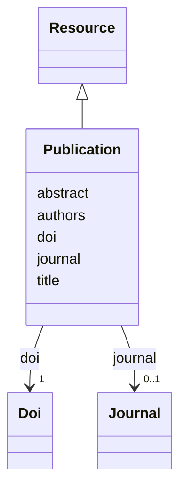

# Class: Publication (Publication) 


_A scientific publication_


URI: [EVORAO:Publication](https://w3id.org/evorao/Publication)





## Inheritance
* [Resource](Resource.md)
    * **Publication**


## Slots

| Name | Cardinality and Range | Description | Inheritance |
| ---  | --- | --- | --- |
| [title](title.md) | 1 <br/> [String](String.md) | A name given to the resource | direct |
| [authors](authors.md) | 1 <br/> [String](String.md) | The list of authors | direct |
| [abstract](abstract.md) | 1 <br/> [String](String.md) | Concise summary of the publication | direct |
| [doi](doi.md) | 1 <br/> [Doi](Doi.md) | A Digital Object Identifier (DOI) that can be related | direct |
| [journal](journal.md) | 0..1 <br/> [Journal](Journal.md) | The scientific journal in which the publication was published | direct |


## Identifier and Mapping Information


### Schema Source


* from schema: https://w3id.org/evorao/


## Mappings

| Mapping Type | Mapped Value |
| ---  | ---  |
| self | EVORAO:Publication |
| native | EVORAO:Publication |
| exact | dct:BibliographicResource, dct:BibliographicResource |
| close | wd:Q591041, reproduceme:Publication, wd:Q591041, reproduceme:Publication |


## LinkML Source

<!-- TODO: investigate https://stackoverflow.com/questions/37606292/how-to-create-tabbed-code-blocks-in-mkdocs-or-sphinx -->

### Direct

<details>
```yaml
name: Publication
description: A scientific publication
title: Publication
from_schema: https://w3id.org/evorao/
exact_mappings:
- dct:BibliographicResource
- dct:BibliographicResource
close_mappings:
- wd:Q591041
- reproduceme:Publication
- wd:Q591041
- reproduceme:Publication
is_a: Resource
slots:
- title
- authors
- abstract
- doi
- journal
slot_usage:
  title:
    name: title
    description: A name given to the resource
    title: title
    comments:
    - 'The title of the item should be as short and descriptive as possible. E.g.
      for virus products it should basically be based on the following Pattern: ''Virus
      name'', ''virus host type'', ''collection year'', ''country of collection''
      ex ''suspected epidemiological origin'', ''genotype'', ''strain'', ''variant
      name or specific feature'
    exact_mappings:
    - schema:name
    - rdfs:label
    slot_uri: dct:title
    domain_of:
    - Publication
    - Dataset
    - DataService
    - Term
    - License
    - Certification
    range: string
    required: true
    multivalued: false
  authors:
    name: authors
    description: The list of authors
    title: authors
    close_mappings:
    - wdp:P2093
    - schema:author
    related_mappings:
    - sio:001315
    - iao:0000321
    domain_of:
    - Publication
    range: string
    required: true
    multivalued: false
  abstract:
    name: abstract
    description: Concise summary of the publication
    title: abstract
    close_mappings:
    - dct:abstract
    - schema:abstract
    domain_of:
    - Publication
    range: string
    required: true
    multivalued: false
  doi:
    name: doi
    description: A Digital Object Identifier (DOI) that can be related
    title: DOI
    exact_mappings:
    - wdp:P356
    close_mappings:
    - reproduceme:doi
    broad_mappings:
    - dct:bibliographicCitation
    domain_of:
    - Publication
    - ProductOrService
    range: Doi
    required: true
    multivalued: false
  journal:
    name: journal
    description: The scientific journal in which the publication was published
    title: journal
    close_mappings:
    - wdp:P1433
    - biolink:published_in
    - uniprotrdfs:publishedIn
    domain_of:
    - Publication
    range: Journal
    required: false
    multivalued: false

```
</details>

### Induced

<details>
```yaml
name: Publication
description: A scientific publication
title: Publication
from_schema: https://w3id.org/evorao/
exact_mappings:
- dct:BibliographicResource
- dct:BibliographicResource
close_mappings:
- wd:Q591041
- reproduceme:Publication
- wd:Q591041
- reproduceme:Publication
is_a: Resource
slot_usage:
  title:
    name: title
    description: A name given to the resource
    title: title
    comments:
    - 'The title of the item should be as short and descriptive as possible. E.g.
      for virus products it should basically be based on the following Pattern: ''Virus
      name'', ''virus host type'', ''collection year'', ''country of collection''
      ex ''suspected epidemiological origin'', ''genotype'', ''strain'', ''variant
      name or specific feature'
    exact_mappings:
    - schema:name
    - rdfs:label
    slot_uri: dct:title
    domain_of:
    - Publication
    - Dataset
    - DataService
    - Term
    - License
    - Certification
    range: string
    required: true
    multivalued: false
  authors:
    name: authors
    description: The list of authors
    title: authors
    close_mappings:
    - wdp:P2093
    - schema:author
    related_mappings:
    - sio:001315
    - iao:0000321
    domain_of:
    - Publication
    range: string
    required: true
    multivalued: false
  abstract:
    name: abstract
    description: Concise summary of the publication
    title: abstract
    close_mappings:
    - dct:abstract
    - schema:abstract
    domain_of:
    - Publication
    range: string
    required: true
    multivalued: false
  doi:
    name: doi
    description: A Digital Object Identifier (DOI) that can be related
    title: DOI
    exact_mappings:
    - wdp:P356
    close_mappings:
    - reproduceme:doi
    broad_mappings:
    - dct:bibliographicCitation
    domain_of:
    - Publication
    - ProductOrService
    range: Doi
    required: true
    multivalued: false
  journal:
    name: journal
    description: The scientific journal in which the publication was published
    title: journal
    close_mappings:
    - wdp:P1433
    - biolink:published_in
    - uniprotrdfs:publishedIn
    domain_of:
    - Publication
    range: Journal
    required: false
    multivalued: false
attributes:
  title:
    name: title
    description: A name given to the resource
    title: title
    comments:
    - 'The title of the item should be as short and descriptive as possible. E.g.
      for virus products it should basically be based on the following Pattern: ''Virus
      name'', ''virus host type'', ''collection year'', ''country of collection''
      ex ''suspected epidemiological origin'', ''genotype'', ''strain'', ''variant
      name or specific feature'
    from_schema: https://w3id.org/evorao/
    exact_mappings:
    - schema:name
    - rdfs:label
    rank: 1000
    slot_uri: dct:title
    alias: title
    owner: Publication
    domain_of:
    - Publication
    - Dataset
    - DataService
    - Term
    - License
    - Certification
    range: string
    required: true
    multivalued: false
  authors:
    name: authors
    description: The list of authors
    title: authors
    from_schema: https://w3id.org/evorao/
    close_mappings:
    - wdp:P2093
    - schema:author
    related_mappings:
    - sio:001315
    - iao:0000321
    rank: 1000
    alias: authors
    owner: Publication
    domain_of:
    - Publication
    range: string
    required: true
    multivalued: false
  abstract:
    name: abstract
    description: Concise summary of the publication
    title: abstract
    from_schema: https://w3id.org/evorao/
    close_mappings:
    - dct:abstract
    - schema:abstract
    rank: 1000
    alias: abstract
    owner: Publication
    domain_of:
    - Publication
    range: string
    required: true
    multivalued: false
  doi:
    name: doi
    description: A Digital Object Identifier (DOI) that can be related
    title: DOI
    from_schema: https://w3id.org/evorao/
    exact_mappings:
    - wdp:P356
    close_mappings:
    - reproduceme:doi
    broad_mappings:
    - dct:bibliographicCitation
    rank: 1000
    alias: doi
    owner: Publication
    domain_of:
    - Publication
    - ProductOrService
    range: Doi
    required: true
    multivalued: false
  journal:
    name: journal
    description: The scientific journal in which the publication was published
    title: journal
    from_schema: https://w3id.org/evorao/
    close_mappings:
    - wdp:P1433
    - biolink:published_in
    - uniprotrdfs:publishedIn
    rank: 1000
    alias: journal
    owner: Publication
    domain_of:
    - Publication
    range: Journal
    required: false
    multivalued: false

```
</details>