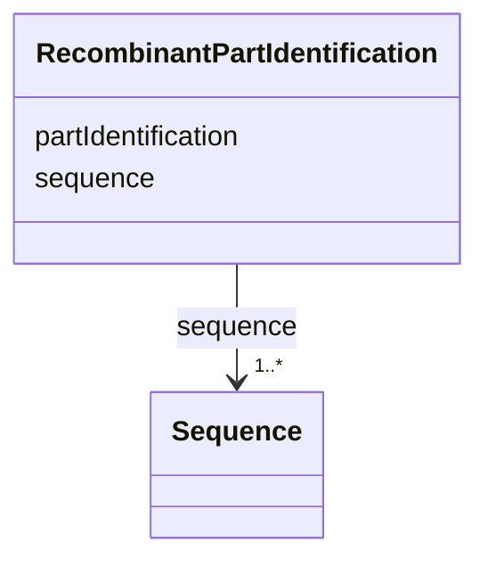

# Class: Recombinant part identification (RecombinantPartIdentification)


_Identification of a recombinant part_


URI: [EVORA:RecombinantPartIdentification](https://evora-project.eu/RecombinantPartIdentification)





<!-- no inheritance hierarchy -->


## Slots

| Name | Cardinality and Range | Description | Inheritance |
| ---  | --- | --- | --- |
| [partIdentification](partIdentification.md) | 1 <br/> [String](String.md) | A short designation of this recombinant part of the related biological materi... | direct |
| [sequence](sequence.md) | 1..* <br/> [Sequence](Sequence.md) | The related sequence information from a sequence provider or in fasta format | direct |


## Usages

| used by | used in | type | used |
| ---  | --- | --- | --- |
| [BiologicalPartOrigin](BiologicalPartOrigin.md) | [recombinantPartIdentification](recombinantPartIdentification.md) | range | [RecombinantPartIdentification](RecombinantPartIdentification.md) |
| [NaturalPartOrigin](NaturalPartOrigin.md) | [recombinantPartIdentification](recombinantPartIdentification.md) | range | [RecombinantPartIdentification](RecombinantPartIdentification.md) |
| [SyntheticPartOrigin](SyntheticPartOrigin.md) | [recombinantPartIdentification](recombinantPartIdentification.md) | range | [RecombinantPartIdentification](RecombinantPartIdentification.md) |


## Identifier and Mapping Information


### Schema Source


* from schema: https://evora-project.eu/


## Mappings

| Mapping Type | Mapped Value |
| ---  | ---  |
| self | EVORA:RecombinantPartIdentification |
| native | EVORA:RecombinantPartIdentification |


## LinkML Source

<!-- TODO: investigate https://stackoverflow.com/questions/37606292/how-to-create-tabbed-code-blocks-in-mkdocs-or-sphinx -->

### Direct

<details>
```yaml
name: RecombinantPartIdentification
description: Identification of a recombinant part
title: Recombinant part identification
from_schema: https://evora-project.eu/
slots:
- partIdentification
- sequence
slot_usage:
  partIdentification:
    name: partIdentification
    description: A short designation of this recombinant part of the related biological
      material
    title: Part identification
    range: string
    required: true
    multivalued: false
  sequence:
    name: sequence
    description: The related sequence information from a sequence provider or in fasta
      format
    title: sequence
    range: Sequence
    required: true
    multivalued: true

```
</details>

### Induced

<details>
```yaml
name: RecombinantPartIdentification
description: Identification of a recombinant part
title: Recombinant part identification
from_schema: https://evora-project.eu/
slot_usage:
  partIdentification:
    name: partIdentification
    description: A short designation of this recombinant part of the related biological
      material
    title: Part identification
    range: string
    required: true
    multivalued: false
  sequence:
    name: sequence
    description: The related sequence information from a sequence provider or in fasta
      format
    title: sequence
    range: Sequence
    required: true
    multivalued: true
attributes:
  partIdentification:
    name: partIdentification
    description: A short designation of this recombinant part of the related biological
      material
    title: Part identification
    from_schema: https://evora-project.eu/
    rank: 1000
    alias: partIdentification
    owner: RecombinantPartIdentification
    domain_of:
    - RecombinantPartIdentification
    range: string
    required: true
    multivalued: false
  sequence:
    name: sequence
    description: The related sequence information from a sequence provider or in fasta
      format
    title: sequence
    from_schema: https://evora-project.eu/
    rank: 1000
    alias: sequence
    owner: RecombinantPartIdentification
    domain_of:
    - RecombinantPartIdentification
    - Protein
    - Nucleic Acid
    - Pathogen
    range: Sequence
    required: true
    multivalued: true

```
</details>