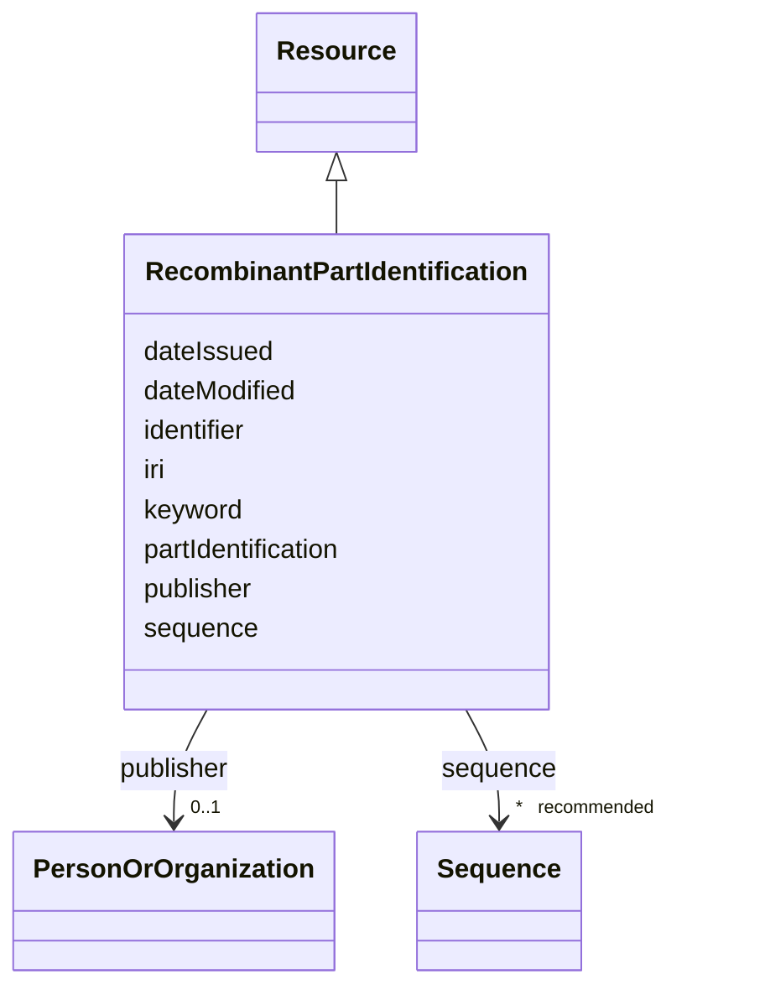

# Class: Recombinant part identification (RecombinantPartIdentification) 


_Identification of a recombinant part._


URI: [EVORAO:RecombinantPartIdentification](https://w3id.org/evorao/RecombinantPartIdentification)





## Inheritance
* [Resource](Resource.md)
    * **RecombinantPartIdentification**


## Slots

| Name | Cardinality and Range | Description | Inheritance |
| ---  | --- | --- | --- |
| [partIdentification](partIdentification.md) | 1 <br/> [String](String.md) | A short designation of this recombinant part of the related biological materi... | direct |
| [sequence](sequence.md) | * _recommended_ <br/> [Sequence](Sequence.md) | The related sequence information from a sequence provider or in fasta format | direct |
| [keyword](keyword.md) | * <br/> [String](String.md) | A keyword or tag describing the resource | [Resource](Resource.md) |
| [dateIssued](dateIssued.md) | 0..1 <br/> [Datetime](Datetime.md) | Date of formal issuance (e | [Resource](Resource.md) |
| [dateModified](dateModified.md) | 0..1 <br/> [Datetime](Datetime.md) | Most recent date on which the resource was changed, updated or modified | [Resource](Resource.md) |
| [identifier](identifier.md) | * <br/> [String](String.md) | A unique identifier of the resource being described or cataloged | [Resource](Resource.md) |
| [iri](iri.md) | * <br/> [Uri](Uri.md) | International Resource Identifier (IRI) that uniquely identifies or refers to... | [Resource](Resource.md) |
| [publisher](publisher.md) | 0..1 <br/> [PersonOrOrganization](PersonOrOrganization.md) | The entity responsible for making the resource available | [Resource](Resource.md) |


## Usages

| used by | used in | type | used |
| ---  | --- | --- | --- |
| [BiologicalPartOrigin](BiologicalPartOrigin.md) | [recombinantPartIdentification](recombinantPartIdentification.md) | range | [RecombinantPartIdentification](RecombinantPartIdentification.md) |
| [NaturalPartOrigin](NaturalPartOrigin.md) | [recombinantPartIdentification](recombinantPartIdentification.md) | range | [RecombinantPartIdentification](RecombinantPartIdentification.md) |
| [SyntheticPartOrigin](SyntheticPartOrigin.md) | [recombinantPartIdentification](recombinantPartIdentification.md) | range | [RecombinantPartIdentification](RecombinantPartIdentification.md) |


## Identifier and Mapping Information


### Schema Source


* from schema: https://w3id.org/evorao/


## Mappings

| Mapping Type | Mapped Value |
| ---  | ---  |
| self | EVORAO:RecombinantPartIdentification |
| native | EVORAO:RecombinantPartIdentification |


## LinkML Source

<!-- TODO: investigate https://stackoverflow.com/questions/37606292/how-to-create-tabbed-code-blocks-in-mkdocs-or-sphinx -->

### Direct

<details>
```yaml
name: RecombinantPartIdentification
description: Identification of a recombinant part.
title: Recombinant part identification
from_schema: https://w3id.org/evorao/
is_a: Resource
slots:
- partIdentification
- sequence
slot_usage:
  partIdentification:
    name: partIdentification
    description: A short designation of this recombinant part of the related biological
      material.
    title: Part identification
    domain_of:
    - RecombinantPartIdentification
    range: string
    required: true
    multivalued: false
  sequence:
    name: sequence
    description: The related sequence information from a sequence provider or in fasta
      format.
    title: sequence
    comments:
    - Sequence information is logically one of the minimal quality requirements for
      entities such as pathogens, nucleic acids, and proteins, and should always be
      provided. However, in some rare cases, a nucleic acid may still be valuable
      even if it has not been sequenced after being extracted from identified material.
      In such exceptional cases, the sequence may legitimately be missing.
    close_mappings:
    - geno:0000239
    - bao:0002817
    related_mappings:
    - uniprotrdfs:sequence
    domain_of:
    - RecombinantPartIdentification
    - Protein
    - NucleicAcid
    - Pathogen
    range: Sequence
    required: false
    recommended: true
    multivalued: true

```
</details>

### Induced

<details>
```yaml
name: RecombinantPartIdentification
description: Identification of a recombinant part.
title: Recombinant part identification
from_schema: https://w3id.org/evorao/
is_a: Resource
slot_usage:
  partIdentification:
    name: partIdentification
    description: A short designation of this recombinant part of the related biological
      material.
    title: Part identification
    domain_of:
    - RecombinantPartIdentification
    range: string
    required: true
    multivalued: false
  sequence:
    name: sequence
    description: The related sequence information from a sequence provider or in fasta
      format.
    title: sequence
    comments:
    - Sequence information is logically one of the minimal quality requirements for
      entities such as pathogens, nucleic acids, and proteins, and should always be
      provided. However, in some rare cases, a nucleic acid may still be valuable
      even if it has not been sequenced after being extracted from identified material.
      In such exceptional cases, the sequence may legitimately be missing.
    close_mappings:
    - geno:0000239
    - bao:0002817
    related_mappings:
    - uniprotrdfs:sequence
    domain_of:
    - RecombinantPartIdentification
    - Protein
    - NucleicAcid
    - Pathogen
    range: Sequence
    required: false
    recommended: true
    multivalued: true
attributes:
  partIdentification:
    name: partIdentification
    description: A short designation of this recombinant part of the related biological
      material.
    title: Part identification
    from_schema: https://w3id.org/evorao/
    rank: 1000
    alias: partIdentification
    owner: RecombinantPartIdentification
    domain_of:
    - RecombinantPartIdentification
    range: string
    required: true
    multivalued: false
  sequence:
    name: sequence
    description: The related sequence information from a sequence provider or in fasta
      format.
    title: sequence
    comments:
    - Sequence information is logically one of the minimal quality requirements for
      entities such as pathogens, nucleic acids, and proteins, and should always be
      provided. However, in some rare cases, a nucleic acid may still be valuable
      even if it has not been sequenced after being extracted from identified material.
      In such exceptional cases, the sequence may legitimately be missing.
    from_schema: https://w3id.org/evorao/
    close_mappings:
    - geno:0000239
    - bao:0002817
    related_mappings:
    - uniprotrdfs:sequence
    rank: 1000
    alias: sequence
    owner: RecombinantPartIdentification
    domain_of:
    - RecombinantPartIdentification
    - Protein
    - NucleicAcid
    - Pathogen
    range: Sequence
    required: false
    recommended: true
    multivalued: true
  keyword:
    name: keyword
    description: A keyword or tag describing the resource.
    title: keyword
    from_schema: https://w3id.org/evorao/
    rank: 1000
    slot_uri: dcat:keyword
    alias: keyword
    owner: RecombinantPartIdentification
    domain_of:
    - Resource
    range: string
    required: false
    multivalued: true
  dateIssued:
    name: dateIssued
    description: Date of formal issuance (e.g., publication) of the resource.
    title: date issued
    comments:
    - encoded using the relevant ISO 8601 Date and Time compliant string [DATETIME].
    from_schema: https://w3id.org/evorao/
    exact_mappings:
    - sepio:0000051
    close_mappings:
    - schema:datePublished
    - schema:dateCreated
    rank: 1000
    slot_uri: dct:issued
    alias: dateIssued
    owner: RecombinantPartIdentification
    domain_of:
    - Resource
    range: datetime
    required: false
    multivalued: false
  dateModified:
    name: dateModified
    description: Most recent date on which the resource was changed, updated or modified.
    title: date modified
    comments:
    - encoded using the relevant ISO 8601 Date and Time compliant string [DATETIME].
    from_schema: https://w3id.org/evorao/
    exact_mappings:
    - sepio:0000036
    close_mappings:
    - schema:dateModified
    rank: 1000
    slot_uri: dct:modified
    alias: dateModified
    owner: RecombinantPartIdentification
    domain_of:
    - Resource
    range: datetime
    required: false
    multivalued: false
  identifier:
    name: identifier
    description: A unique identifier of the resource being described or cataloged.
    title: identifier
    comments:
    - The identifier is a text string which is assigned to the resource to provide
      an unambiguous reference within a particular context. Persistent identifiers
      should be provided as HTTP URIs.
    from_schema: https://w3id.org/evorao/
    exact_mappings:
    - schema:identifier
    rank: 1000
    slot_uri: dct:identifier
    alias: identifier
    owner: RecombinantPartIdentification
    domain_of:
    - Resource
    range: string
    required: false
    multivalued: true
  iri:
    name: iri
    description: International Resource Identifier (IRI) that uniquely identifies
      or refers to the resource. IRIs include URIs, and URIs include URLs.
    title: IRI
    comments:
    - An IRI is a global identifier standardized by IETF RFC 3987. It may or may not
      be resolvable on the web. IRIs include URIs, and URIs include URLs.
    from_schema: https://w3id.org/evorao/
    close_mappings:
    - biolink:iri
    related_mappings:
    - mi:url
    narrow_mappings:
    - schema:url
    rank: 1000
    is_a: identifier
    alias: iri
    owner: RecombinantPartIdentification
    domain_of:
    - Resource
    range: uri
    required: false
    multivalued: true
  publisher:
    name: publisher
    description: The entity responsible for making the resource available.
    title: publisher
    comments:
    - Resources of type foaf:Agent like EVORAO:PersonOrOrganization are recommended
      as values for this property.
    from_schema: https://w3id.org/evorao/
    rank: 1000
    slot_uri: dct:publisher
    alias: publisher
    owner: RecombinantPartIdentification
    domain_of:
    - Resource
    range: PersonOrOrganization
    required: false
    multivalued: false

```
</details>