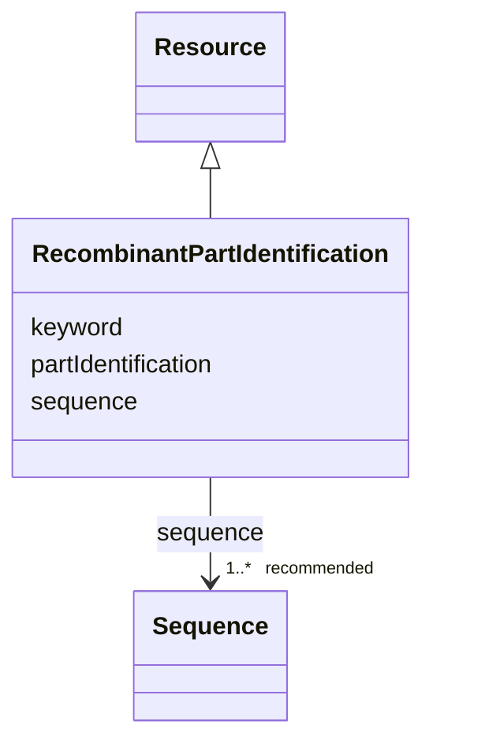

# Class: Recombinant part identification (RecombinantPartIdentification) 


_Identification of a recombinant part_


URI: [EVORAO:RecombinantPartIdentification](https://w3id.org/evorao/RecombinantPartIdentification)





## Inheritance
* [Resource](Resource.md)
    * **RecombinantPartIdentification**


## Slots

| Name | Cardinality and Range | Description | Inheritance |
| ---  | --- | --- | --- |
| [partIdentification](partIdentification.md) | 1 <br/> [String](String.md) | A short designation of this recombinant part of the related biological materi... | direct |
| [sequence](sequence.md) | 1..* _recommended_ <br/> [Sequence](Sequence.md) | The related sequence information from a sequence provider or in fasta format | direct |
| [keyword](keyword.md) | * <br/> [String](String.md) | A keyword or tag describing the resource | [Resource](Resource.md) |


## Usages

| used by | used in | type | used |
| ---  | --- | --- | --- |
| [BiologicalPartOrigin](BiologicalPartOrigin.md) | [recombinantPartIdentification](recombinantPartIdentification.md) | range | [RecombinantPartIdentification](RecombinantPartIdentification.md) |
| [NaturalPartOrigin](NaturalPartOrigin.md) | [recombinantPartIdentification](recombinantPartIdentification.md) | range | [RecombinantPartIdentification](RecombinantPartIdentification.md) |
| [SyntheticPartOrigin](SyntheticPartOrigin.md) | [recombinantPartIdentification](recombinantPartIdentification.md) | range | [RecombinantPartIdentification](RecombinantPartIdentification.md) |


## Identifier and Mapping Information


### Schema Source


* from schema: https://w3id.org/evorao/


## Mappings

| Mapping Type | Mapped Value |
| ---  | ---  |
| self | EVORAO:RecombinantPartIdentification |
| native | EVORAO:RecombinantPartIdentification |


## LinkML Source

<!-- TODO: investigate https://stackoverflow.com/questions/37606292/how-to-create-tabbed-code-blocks-in-mkdocs-or-sphinx -->

### Direct

<details>
```yaml
name: RecombinantPartIdentification
description: Identification of a recombinant part
title: Recombinant part identification
from_schema: https://w3id.org/evorao/
is_a: Resource
slots:
- partIdentification
- sequence
slot_usage:
  partIdentification:
    name: partIdentification
    description: A short designation of this recombinant part of the related biological
      material
    title: Part identification
    domain_of:
    - RecombinantPartIdentification
    range: string
    required: true
    multivalued: false
  sequence:
    name: sequence
    description: The related sequence information from a sequence provider or in fasta
      format
    title: sequence
    close_mappings:
    - geno:0000239
    - bao:0002817
    related_mappings:
    - uniprotrdfs:sequence
    domain_of:
    - RecombinantPartIdentification
    - Protein
    - NucleicAcid
    - Pathogen
    range: Sequence
    required: true
    recommended: true
    multivalued: true

```
</details>

### Induced

<details>
```yaml
name: RecombinantPartIdentification
description: Identification of a recombinant part
title: Recombinant part identification
from_schema: https://w3id.org/evorao/
is_a: Resource
slot_usage:
  partIdentification:
    name: partIdentification
    description: A short designation of this recombinant part of the related biological
      material
    title: Part identification
    domain_of:
    - RecombinantPartIdentification
    range: string
    required: true
    multivalued: false
  sequence:
    name: sequence
    description: The related sequence information from a sequence provider or in fasta
      format
    title: sequence
    close_mappings:
    - geno:0000239
    - bao:0002817
    related_mappings:
    - uniprotrdfs:sequence
    domain_of:
    - RecombinantPartIdentification
    - Protein
    - NucleicAcid
    - Pathogen
    range: Sequence
    required: true
    recommended: true
    multivalued: true
attributes:
  partIdentification:
    name: partIdentification
    description: A short designation of this recombinant part of the related biological
      material
    title: Part identification
    from_schema: https://w3id.org/evorao/
    rank: 1000
    alias: partIdentification
    owner: RecombinantPartIdentification
    domain_of:
    - RecombinantPartIdentification
    range: string
    required: true
    multivalued: false
  sequence:
    name: sequence
    description: The related sequence information from a sequence provider or in fasta
      format
    title: sequence
    from_schema: https://w3id.org/evorao/
    close_mappings:
    - geno:0000239
    - bao:0002817
    related_mappings:
    - uniprotrdfs:sequence
    rank: 1000
    alias: sequence
    owner: RecombinantPartIdentification
    domain_of:
    - RecombinantPartIdentification
    - Protein
    - NucleicAcid
    - Pathogen
    range: Sequence
    required: true
    recommended: true
    multivalued: true
  keyword:
    name: keyword
    description: A keyword or tag describing the resource
    title: keyword
    from_schema: https://w3id.org/evorao/
    rank: 1000
    slot_uri: dcat:keyword
    alias: keyword
    owner: RecombinantPartIdentification
    domain_of:
    - Resource
    range: string
    required: false
    multivalued: true

```
</details>