# Class: Resource (Resource) 


_Resource published or curated by a single agent_


* __NOTE__: this is an abstract class and should not be instantiated directly


URI: [dcat:Resource](http://www.w3.org/ns/dcat#Resource)

```mermaid
 classDiagram
    class Resource
    click Resource href "../Resource"
      Resource <|-- Dataset
        click Dataset href "../Dataset"
      Resource <|-- DataService
        click DataService href "../DataService"
      Resource <|-- Version
        click Version href "../Version"
      Resource <|-- PathogenIdentification
        click PathogenIdentification href "../PathogenIdentification"
      Resource <|-- Publication
        click Publication href "../Publication"
      Resource <|-- Term
        click Term href "../Term"
      Resource <|-- ExternalRelatedReference
        click ExternalRelatedReference href "../ExternalRelatedReference"
      Resource <|-- Sequence
        click Sequence href "../Sequence"
      Resource <|-- SequenceReference
        click SequenceReference href "../SequenceReference"
      Resource <|-- PersonOrOrganization
        click PersonOrOrganization href "../PersonOrOrganization"
      Resource <|-- BiologicalMaterialOrigin
        click BiologicalMaterialOrigin href "../BiologicalMaterialOrigin"
      Resource <|-- BiologicalPartOrigin
        click BiologicalPartOrigin href "../BiologicalPartOrigin"
      Resource <|-- RecombinantPartIdentification
        click RecombinantPartIdentification href "../RecombinantPartIdentification"
      Resource <|-- MaterialSafetyDataSheet
        click MaterialSafetyDataSheet href "../MaterialSafetyDataSheet"
      Resource <|-- File
        click File href "../File"
      Resource <|-- ContactPoint
        click ContactPoint href "../ContactPoint"
      Resource <|-- License
        click License href "../License"
      Resource <|-- Certification
        click Certification href "../Certification"
      Resource <|-- FundingSource
        click FundingSource href "../FundingSource"
      
      Resource : dateIssued
        
      Resource : dateModified
        
      Resource : identifier
        
      Resource : iri
        
      Resource : keyword
        
      
```





## Inheritance
* **Resource**
    * [Dataset](Dataset.md)
    * [DataService](DataService.md)
    * [Version](Version.md)
    * [PathogenIdentification](PathogenIdentification.md)
    * [Publication](Publication.md)
    * [Term](Term.md)
    * [ExternalRelatedReference](ExternalRelatedReference.md)
    * [Sequence](Sequence.md)
    * [SequenceReference](SequenceReference.md)
    * [PersonOrOrganization](PersonOrOrganization.md)
    * [BiologicalMaterialOrigin](BiologicalMaterialOrigin.md)
    * [BiologicalPartOrigin](BiologicalPartOrigin.md)
    * [RecombinantPartIdentification](RecombinantPartIdentification.md)
    * [MaterialSafetyDataSheet](MaterialSafetyDataSheet.md)
    * [File](File.md)
    * [ContactPoint](ContactPoint.md)
    * [License](License.md)
    * [Certification](Certification.md)
    * [FundingSource](FundingSource.md)


## Slots

| Name | Cardinality and Range | Description | Inheritance |
| ---  | --- | --- | --- |
| [keyword](keyword.md) | * <br/> [String](String.md) | A keyword or tag describing the resource | direct |
| [dateIssued](dateIssued.md) | 0..1 <br/> [Datetime](Datetime.md) | Date of formal issuance (e | direct |
| [dateModified](dateModified.md) | 0..1 <br/> [Datetime](Datetime.md) | Most recent date on which the resource was changed, updated or modified | direct |
| [identifier](identifier.md) | * <br/> [String](String.md) | A unique identifier of the resource being described or cataloged | direct |
| [iri](iri.md) | * <br/> [Uri](Uri.md) | International Resource Identifier (IRI) that uniquely identifies or refers to... | direct |


## Usages

| used by | used in | type | used |
| ---  | --- | --- | --- |
| [Version](Version.md) | [resource](resource.md) | range | [Resource](Resource.md) |


## Identifier and Mapping Information


### Schema Source


* from schema: https://w3id.org/evorao/


## Mappings

| Mapping Type | Mapped Value |
| ---  | ---  |
| self | dcat:Resource |
| native | EVORAO:Resource |


## LinkML Source

<!-- TODO: investigate https://stackoverflow.com/questions/37606292/how-to-create-tabbed-code-blocks-in-mkdocs-or-sphinx -->

### Direct

<details>
```yaml
name: Resource
description: Resource published or curated by a single agent
title: Resource
from_schema: https://w3id.org/evorao/
abstract: true
slots:
- keyword
- dateIssued
- dateModified
- identifier
- iri
slot_usage:
  keyword:
    name: keyword
    description: A keyword or tag describing the resource
    title: keyword
    slot_uri: dcat:keyword
    domain_of:
    - Resource
    range: string
    required: false
    multivalued: true
  dateIssued:
    name: dateIssued
    description: Date of formal issuance (e.g., publication) of the resource
    title: date issued
    comments:
    - encoded using the relevant ISO 8601 Date and Time compliant string [DATETIME]
    exact_mappings:
    - sepio:0000051
    close_mappings:
    - schema:datePublished
    - schema:dateCreated
    slot_uri: dct:issued
    domain_of:
    - Resource
    range: datetime
    required: false
    multivalued: false
  dateModified:
    name: dateModified
    description: Most recent date on which the resource was changed, updated or modified
    title: date modified
    comments:
    - encoded using the relevant ISO 8601 Date and Time compliant string [DATETIME]
    exact_mappings:
    - sepio:0000036
    close_mappings:
    - schema:dateModified
    slot_uri: dct:modified
    domain_of:
    - Resource
    range: datetime
    required: false
    multivalued: false
  identifier:
    name: identifier
    description: A unique identifier of the resource being described or cataloged
    title: identifier
    comments:
    - The identifier is a text string which is assigned to the resource to provide
      an unambiguous reference within a particular context. Persistent identifiers
      should be provided as HTTP URIs
    exact_mappings:
    - schema:identifier
    slot_uri: dct:identifier
    domain_of:
    - Resource
    range: string
    required: false
    multivalued: true
  iri:
    name: iri
    description: International Resource Identifier (IRI) that uniquely identifies
      or refers to the resource. IRIs include URIs, and URIs include URLs
    title: IRI
    comments:
    - An IRI is a global identifier standardized by IETF RFC 3987. It may or may not
      be resolvable on the web. IRIs include URIs, and URIs include URLs
    close_mappings:
    - biolink:iri
    related_mappings:
    - mi:url
    narrow_mappings:
    - schema:url
    is_a: identifier
    domain_of:
    - Resource
    range: uri
    required: false
    multivalued: true
class_uri: dcat:Resource

```
</details>

### Induced

<details>
```yaml
name: Resource
description: Resource published or curated by a single agent
title: Resource
from_schema: https://w3id.org/evorao/
abstract: true
slot_usage:
  keyword:
    name: keyword
    description: A keyword or tag describing the resource
    title: keyword
    slot_uri: dcat:keyword
    domain_of:
    - Resource
    range: string
    required: false
    multivalued: true
  dateIssued:
    name: dateIssued
    description: Date of formal issuance (e.g., publication) of the resource
    title: date issued
    comments:
    - encoded using the relevant ISO 8601 Date and Time compliant string [DATETIME]
    exact_mappings:
    - sepio:0000051
    close_mappings:
    - schema:datePublished
    - schema:dateCreated
    slot_uri: dct:issued
    domain_of:
    - Resource
    range: datetime
    required: false
    multivalued: false
  dateModified:
    name: dateModified
    description: Most recent date on which the resource was changed, updated or modified
    title: date modified
    comments:
    - encoded using the relevant ISO 8601 Date and Time compliant string [DATETIME]
    exact_mappings:
    - sepio:0000036
    close_mappings:
    - schema:dateModified
    slot_uri: dct:modified
    domain_of:
    - Resource
    range: datetime
    required: false
    multivalued: false
  identifier:
    name: identifier
    description: A unique identifier of the resource being described or cataloged
    title: identifier
    comments:
    - The identifier is a text string which is assigned to the resource to provide
      an unambiguous reference within a particular context. Persistent identifiers
      should be provided as HTTP URIs
    exact_mappings:
    - schema:identifier
    slot_uri: dct:identifier
    domain_of:
    - Resource
    range: string
    required: false
    multivalued: true
  iri:
    name: iri
    description: International Resource Identifier (IRI) that uniquely identifies
      or refers to the resource. IRIs include URIs, and URIs include URLs
    title: IRI
    comments:
    - An IRI is a global identifier standardized by IETF RFC 3987. It may or may not
      be resolvable on the web. IRIs include URIs, and URIs include URLs
    close_mappings:
    - biolink:iri
    related_mappings:
    - mi:url
    narrow_mappings:
    - schema:url
    is_a: identifier
    domain_of:
    - Resource
    range: uri
    required: false
    multivalued: true
attributes:
  keyword:
    name: keyword
    description: A keyword or tag describing the resource
    title: keyword
    from_schema: https://w3id.org/evorao/
    rank: 1000
    slot_uri: dcat:keyword
    alias: keyword
    owner: Resource
    domain_of:
    - Resource
    range: string
    required: false
    multivalued: true
  dateIssued:
    name: dateIssued
    description: Date of formal issuance (e.g., publication) of the resource
    title: date issued
    comments:
    - encoded using the relevant ISO 8601 Date and Time compliant string [DATETIME]
    from_schema: https://w3id.org/evorao/
    exact_mappings:
    - sepio:0000051
    close_mappings:
    - schema:datePublished
    - schema:dateCreated
    rank: 1000
    slot_uri: dct:issued
    alias: dateIssued
    owner: Resource
    domain_of:
    - Resource
    range: datetime
    required: false
    multivalued: false
  dateModified:
    name: dateModified
    description: Most recent date on which the resource was changed, updated or modified
    title: date modified
    comments:
    - encoded using the relevant ISO 8601 Date and Time compliant string [DATETIME]
    from_schema: https://w3id.org/evorao/
    exact_mappings:
    - sepio:0000036
    close_mappings:
    - schema:dateModified
    rank: 1000
    slot_uri: dct:modified
    alias: dateModified
    owner: Resource
    domain_of:
    - Resource
    range: datetime
    required: false
    multivalued: false
  identifier:
    name: identifier
    description: A unique identifier of the resource being described or cataloged
    title: identifier
    comments:
    - The identifier is a text string which is assigned to the resource to provide
      an unambiguous reference within a particular context. Persistent identifiers
      should be provided as HTTP URIs
    from_schema: https://w3id.org/evorao/
    exact_mappings:
    - schema:identifier
    rank: 1000
    slot_uri: dct:identifier
    alias: identifier
    owner: Resource
    domain_of:
    - Resource
    range: string
    required: false
    multivalued: true
  iri:
    name: iri
    description: International Resource Identifier (IRI) that uniquely identifies
      or refers to the resource. IRIs include URIs, and URIs include URLs
    title: IRI
    comments:
    - An IRI is a global identifier standardized by IETF RFC 3987. It may or may not
      be resolvable on the web. IRIs include URIs, and URIs include URLs
    from_schema: https://w3id.org/evorao/
    close_mappings:
    - biolink:iri
    related_mappings:
    - mi:url
    narrow_mappings:
    - schema:url
    rank: 1000
    is_a: identifier
    alias: iri
    owner: Resource
    domain_of:
    - Resource
    range: uri
    required: false
    multivalued: true
class_uri: dcat:Resource

```
</details>