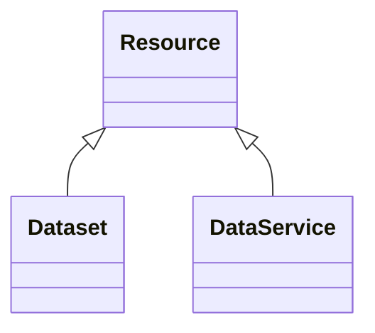

# Class: Resource (Resource)


_Resource published or curated by a single agent._


URI: [EVORAO:Resource](https://raw.githubusercontent.com/EVORA-project/evora-ontology/refs/heads/main/models/owl/evora_ontology.owl.ttl#Resource)





## Inheritance
* **Resource**
    * [Dataset](Dataset.md)
    * [DataService](DataService.md)


## Slots

| Name | Cardinality and Range | Description | Inheritance |
| ---  | --- | --- | --- |


## Identifier and Mapping Information


### Schema Source


* from schema: https://raw.githubusercontent.com/EVORA-project/evora-ontology/refs/heads/main/models/owl/evora_ontology.owl.ttl#


## Mappings

| Mapping Type | Mapped Value |
| ---  | ---  |
| self | EVORAO:Resource |
| native | EVORAO:Resource |
| exact | dcat:Resource |


## LinkML Source

<!-- TODO: investigate https://stackoverflow.com/questions/37606292/how-to-create-tabbed-code-blocks-in-mkdocs-or-sphinx -->

### Direct

<details>
```yaml
name: Resource
description: Resource published or curated by a single agent.
title: Resource
from_schema: https://raw.githubusercontent.com/EVORA-project/evora-ontology/refs/heads/main/models/owl/evora_ontology.owl.ttl#
exact_mappings:
- dcat:Resource

```
</details>

### Induced

<details>
```yaml
name: Resource
description: Resource published or curated by a single agent.
title: Resource
from_schema: https://raw.githubusercontent.com/EVORA-project/evora-ontology/refs/heads/main/models/owl/evora_ontology.owl.ttl#
exact_mappings:
- dcat:Resource

```
</details>