# Class: Resource (Resource) 


_Resource published or curated by a single agent._


* __NOTE__: this is an abstract class and should not be instantiated directly


URI: [dcat:Resource](http://www.w3.org/ns/dcat#Resource)

```mermaid
 classDiagram
    class Resource
    click Resource href "../Resource"
      Resource <|-- Dataset
        click Dataset href "../Dataset"
      Resource <|-- DataService
        click DataService href "../DataService"
      Resource <|-- Version
        click Version href "../Version"
      Resource <|-- PathogenIdentification
        click PathogenIdentification href "../PathogenIdentification"
      Resource <|-- Publication
        click Publication href "../Publication"
      Resource <|-- Term
        click Term href "../Term"
      Resource <|-- ExternalRelatedReference
        click ExternalRelatedReference href "../ExternalRelatedReference"
      Resource <|-- Sequence
        click Sequence href "../Sequence"
      Resource <|-- SequenceReference
        click SequenceReference href "../SequenceReference"
      Resource <|-- PersonOrOrganization
        click PersonOrOrganization href "../PersonOrOrganization"
      Resource <|-- BiologicalMaterialOrigin
        click BiologicalMaterialOrigin href "../BiologicalMaterialOrigin"
      Resource <|-- BiologicalPartOrigin
        click BiologicalPartOrigin href "../BiologicalPartOrigin"
      Resource <|-- RecombinantPartIdentification
        click RecombinantPartIdentification href "../RecombinantPartIdentification"
      Resource <|-- MSDS
        click MSDS href "../MSDS"
      Resource <|-- File
        click File href "../File"
      Resource <|-- ContactPoint
        click ContactPoint href "../ContactPoint"
      Resource <|-- License
        click License href "../License"
      Resource <|-- Certification
        click Certification href "../Certification"
      
      
```





## Inheritance
* **Resource**
    * [Dataset](Dataset.md)
    * [DataService](DataService.md)
    * [Version](Version.md)
    * [PathogenIdentification](PathogenIdentification.md)
    * [Publication](Publication.md)
    * [Term](Term.md)
    * [ExternalRelatedReference](ExternalRelatedReference.md)
    * [Sequence](Sequence.md)
    * [SequenceReference](SequenceReference.md)
    * [PersonOrOrganization](PersonOrOrganization.md)
    * [BiologicalMaterialOrigin](BiologicalMaterialOrigin.md)
    * [BiologicalPartOrigin](BiologicalPartOrigin.md)
    * [RecombinantPartIdentification](RecombinantPartIdentification.md)
    * [MSDS](MSDS.md)
    * [File](File.md)
    * [ContactPoint](ContactPoint.md)
    * [License](License.md)
    * [Certification](Certification.md)


## Slots

| Name | Cardinality and Range | Description | Inheritance |
| ---  | --- | --- | --- |


## Identifier and Mapping Information


### Schema Source


* from schema: https://w3id.org/evorao/


## Mappings

| Mapping Type | Mapped Value |
| ---  | ---  |
| self | dcat:Resource |
| native | EVORAO:Resource |


## LinkML Source

<!-- TODO: investigate https://stackoverflow.com/questions/37606292/how-to-create-tabbed-code-blocks-in-mkdocs-or-sphinx -->

### Direct

<details>
```yaml
name: Resource
description: Resource published or curated by a single agent.
title: Resource
from_schema: https://w3id.org/evorao/
abstract: true
class_uri: dcat:Resource

```
</details>

### Induced

<details>
```yaml
name: Resource
description: Resource published or curated by a single agent.
title: Resource
from_schema: https://w3id.org/evorao/
abstract: true
class_uri: dcat:Resource

```
</details>