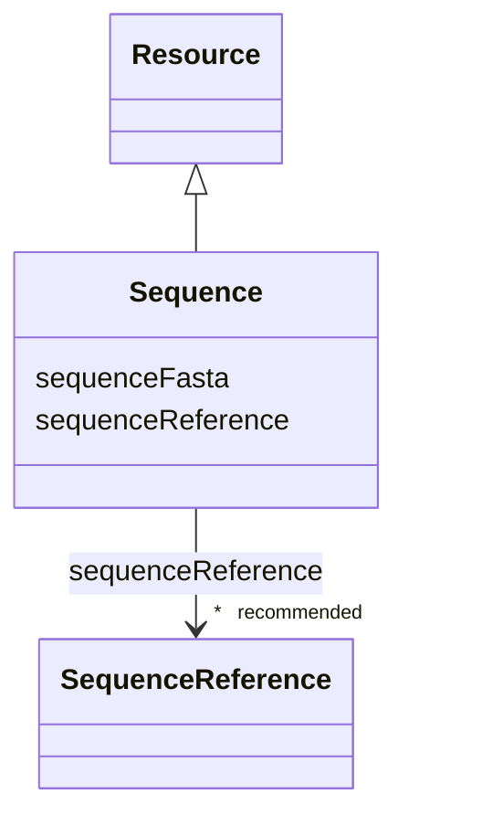

# Class: Sequence (Sequence) 


_A nucleic acid or protein sequence information_


URI: [EVORAO:Sequence](https://w3id.org/evorao/Sequence)





## Inheritance
* [Resource](Resource.md)
    * **Sequence**


## Slots

| Name | Cardinality and Range | Description | Inheritance |
| ---  | --- | --- | --- |
| [sequenceReference](sequenceReference.md) | * _recommended_ <br/> [SequenceReference](SequenceReference.md) | A reference that permits to retrieve the sequence information from a sequence... | direct |
| [sequenceFasta](sequenceFasta.md) | 0..1 <br/> [String](String.md) | Textual encoding of a biological sequence information in FASTA format | direct |


## Usages

| used by | used in | type | used |
| ---  | --- | --- | --- |
| [RecombinantPartIdentification](RecombinantPartIdentification.md) | [sequence](sequence.md) | range | [Sequence](Sequence.md) |
| [Protein](Protein.md) | [sequence](sequence.md) | range | [Sequence](Sequence.md) |
| [NucleicAcid](NucleicAcid.md) | [sequence](sequence.md) | range | [Sequence](Sequence.md) |
| [Pathogen](Pathogen.md) | [sequence](sequence.md) | range | [Sequence](Sequence.md) |
| [Virus](Virus.md) | [sequence](sequence.md) | range | [Sequence](Sequence.md) |
| [Bacterium](Bacterium.md) | [sequence](sequence.md) | range | [Sequence](Sequence.md) |
| [Fungus](Fungus.md) | [sequence](sequence.md) | range | [Sequence](Sequence.md) |
| [Protozoan](Protozoan.md) | [sequence](sequence.md) | range | [Sequence](Sequence.md) |
| [Viroid](Viroid.md) | [sequence](sequence.md) | range | [Sequence](Sequence.md) |
| [Prion](Prion.md) | [sequence](sequence.md) | range | [Sequence](Sequence.md) |


## Identifier and Mapping Information


### Schema Source


* from schema: https://w3id.org/evorao/


## Mappings

| Mapping Type | Mapped Value |
| ---  | ---  |
| self | EVORAO:Sequence |
| native | EVORAO:Sequence |
| close | wd:Q3511065, wd:Q3511065 |


## LinkML Source

<!-- TODO: investigate https://stackoverflow.com/questions/37606292/how-to-create-tabbed-code-blocks-in-mkdocs-or-sphinx -->

### Direct

<details>
```yaml
name: Sequence
description: A nucleic acid or protein sequence information
title: Sequence
from_schema: https://w3id.org/evorao/
close_mappings:
- wd:Q3511065
- wd:Q3511065
is_a: Resource
slots:
- sequenceReference
- sequenceFasta
slot_usage:
  sequenceReference:
    name: sequenceReference
    description: A reference that permits to retrieve the sequence information from
      a sequence provider
    title: sequence reference
    domain_of:
    - Sequence
    - Antibody
    range: SequenceReference
    required: false
    recommended: true
    multivalued: true
  sequenceFasta:
    name: sequenceFasta
    description: Textual encoding of a biological sequence information in FASTA format
    title: sequence FASTA
    comments:
    - In cases where no reference sequence exists in public repositories, the corresponding
      FASTA sequence is expected; otherwise, the reference sequence is sufficient.
      In FASTA format the line before the nucleotide sequence, called the FASTA definition
      line, must begin with a charater ('>'), followed by a unique SeqID (sequence
      identifier). In case the sequence is made of multiple parts several fasta sequences
      can be provided
    domain_of:
    - Sequence
    range: string
    required: false
    multivalued: false

```
</details>

### Induced

<details>
```yaml
name: Sequence
description: A nucleic acid or protein sequence information
title: Sequence
from_schema: https://w3id.org/evorao/
close_mappings:
- wd:Q3511065
- wd:Q3511065
is_a: Resource
slot_usage:
  sequenceReference:
    name: sequenceReference
    description: A reference that permits to retrieve the sequence information from
      a sequence provider
    title: sequence reference
    domain_of:
    - Sequence
    - Antibody
    range: SequenceReference
    required: false
    recommended: true
    multivalued: true
  sequenceFasta:
    name: sequenceFasta
    description: Textual encoding of a biological sequence information in FASTA format
    title: sequence FASTA
    comments:
    - In cases where no reference sequence exists in public repositories, the corresponding
      FASTA sequence is expected; otherwise, the reference sequence is sufficient.
      In FASTA format the line before the nucleotide sequence, called the FASTA definition
      line, must begin with a charater ('>'), followed by a unique SeqID (sequence
      identifier). In case the sequence is made of multiple parts several fasta sequences
      can be provided
    domain_of:
    - Sequence
    range: string
    required: false
    multivalued: false
attributes:
  sequenceReference:
    name: sequenceReference
    description: A reference that permits to retrieve the sequence information from
      a sequence provider
    title: sequence reference
    from_schema: https://w3id.org/evorao/
    rank: 1000
    alias: sequenceReference
    owner: Sequence
    domain_of:
    - Sequence
    - Antibody
    range: SequenceReference
    required: false
    recommended: true
    multivalued: true
  sequenceFasta:
    name: sequenceFasta
    description: Textual encoding of a biological sequence information in FASTA format
    title: sequence FASTA
    comments:
    - In cases where no reference sequence exists in public repositories, the corresponding
      FASTA sequence is expected; otherwise, the reference sequence is sufficient.
      In FASTA format the line before the nucleotide sequence, called the FASTA definition
      line, must begin with a charater ('>'), followed by a unique SeqID (sequence
      identifier). In case the sequence is made of multiple parts several fasta sequences
      can be provided
    from_schema: https://w3id.org/evorao/
    rank: 1000
    alias: sequenceFasta
    owner: Sequence
    domain_of:
    - Sequence
    range: string
    required: false
    multivalued: false

```
</details>