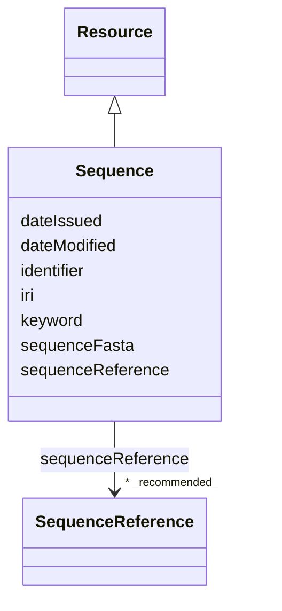

# Class: Sequence (Sequence) 


_A nucleic acid or protein sequence information._


URI: [EVORAO:Sequence](https://w3id.org/evorao/Sequence)





## Inheritance
* [Resource](Resource.md)
    * **Sequence**


## Slots

| Name | Cardinality and Range | Description | Inheritance |
| ---  | --- | --- | --- |
| [sequenceReference](sequenceReference.md) | * _recommended_ <br/> [SequenceReference](SequenceReference.md) | A reference that permits to retrieve the sequence information from a sequence... | direct |
| [sequenceFasta](sequenceFasta.md) | 0..1 <br/> [String](String.md) | Textual encoding of a biological sequence information in FASTA format | direct |
| [keyword](keyword.md) | * <br/> [String](String.md) | A keyword or tag describing the resource | [Resource](Resource.md) |
| [dateIssued](dateIssued.md) | 0..1 <br/> [Datetime](Datetime.md) | Date of formal issuance (e | [Resource](Resource.md) |
| [dateModified](dateModified.md) | 0..1 <br/> [Datetime](Datetime.md) | Most recent date on which the resource was changed, updated or modified | [Resource](Resource.md) |
| [identifier](identifier.md) | * <br/> [String](String.md) | A unique identifier of the resource being described or cataloged | [Resource](Resource.md) |
| [iri](iri.md) | * <br/> [Uri](Uri.md) | International Resource Identifier (IRI) that uniquely identifies or refers to... | [Resource](Resource.md) |


## Usages

| used by | used in | type | used |
| ---  | --- | --- | --- |
| [RecombinantPartIdentification](RecombinantPartIdentification.md) | [sequence](sequence.md) | range | [Sequence](Sequence.md) |
| [Protein](Protein.md) | [sequence](sequence.md) | range | [Sequence](Sequence.md) |
| [NucleicAcid](NucleicAcid.md) | [sequence](sequence.md) | range | [Sequence](Sequence.md) |
| [Pathogen](Pathogen.md) | [sequence](sequence.md) | range | [Sequence](Sequence.md) |
| [Virus](Virus.md) | [sequence](sequence.md) | range | [Sequence](Sequence.md) |
| [Bacterium](Bacterium.md) | [sequence](sequence.md) | range | [Sequence](Sequence.md) |
| [Fungus](Fungus.md) | [sequence](sequence.md) | range | [Sequence](Sequence.md) |
| [Protozoan](Protozoan.md) | [sequence](sequence.md) | range | [Sequence](Sequence.md) |
| [Viroid](Viroid.md) | [sequence](sequence.md) | range | [Sequence](Sequence.md) |
| [Prion](Prion.md) | [sequence](sequence.md) | range | [Sequence](Sequence.md) |


## Identifier and Mapping Information


### Schema Source


* from schema: https://w3id.org/evorao/


## Mappings

| Mapping Type | Mapped Value |
| ---  | ---  |
| self | EVORAO:Sequence |
| native | EVORAO:Sequence |
| related | uniprotrdfs:Sequence, uniprotrdfs:Sequence |
| close | wd:Q3511065, wd:Q3511065 |


## LinkML Source

<!-- TODO: investigate https://stackoverflow.com/questions/37606292/how-to-create-tabbed-code-blocks-in-mkdocs-or-sphinx -->

### Direct

<details>
```yaml
name: Sequence
description: A nucleic acid or protein sequence information.
title: Sequence
from_schema: https://w3id.org/evorao/
close_mappings:
- wd:Q3511065
- wd:Q3511065
related_mappings:
- uniprotrdfs:Sequence
- uniprotrdfs:Sequence
is_a: Resource
slots:
- sequenceReference
- sequenceFasta
slot_usage:
  sequenceReference:
    name: sequenceReference
    description: A reference that permits to retrieve the sequence information from
      a sequence provider.
    title: sequence reference
    domain_of:
    - Sequence
    - Antibody
    range: SequenceReference
    required: false
    recommended: true
    multivalued: true
  sequenceFasta:
    name: sequenceFasta
    description: Textual encoding of a biological sequence information in FASTA format.
    title: sequence FASTA
    comments:
    - In cases where no reference sequence exists in public repositories, the corresponding
      FASTA sequence is expected; otherwise, the reference sequence is sufficient.
      In FASTA format the line before the nucleotide sequence, called the FASTA definition
      line, must begin with a charater ('>'), followed by a unique SeqID (sequence
      identifier). In case the sequence is made of multiple parts several fasta sequences
      can be provided.
    domain_of:
    - Sequence
    range: string
    required: false
    multivalued: false

```
</details>

### Induced

<details>
```yaml
name: Sequence
description: A nucleic acid or protein sequence information.
title: Sequence
from_schema: https://w3id.org/evorao/
close_mappings:
- wd:Q3511065
- wd:Q3511065
related_mappings:
- uniprotrdfs:Sequence
- uniprotrdfs:Sequence
is_a: Resource
slot_usage:
  sequenceReference:
    name: sequenceReference
    description: A reference that permits to retrieve the sequence information from
      a sequence provider.
    title: sequence reference
    domain_of:
    - Sequence
    - Antibody
    range: SequenceReference
    required: false
    recommended: true
    multivalued: true
  sequenceFasta:
    name: sequenceFasta
    description: Textual encoding of a biological sequence information in FASTA format.
    title: sequence FASTA
    comments:
    - In cases where no reference sequence exists in public repositories, the corresponding
      FASTA sequence is expected; otherwise, the reference sequence is sufficient.
      In FASTA format the line before the nucleotide sequence, called the FASTA definition
      line, must begin with a charater ('>'), followed by a unique SeqID (sequence
      identifier). In case the sequence is made of multiple parts several fasta sequences
      can be provided.
    domain_of:
    - Sequence
    range: string
    required: false
    multivalued: false
attributes:
  sequenceReference:
    name: sequenceReference
    description: A reference that permits to retrieve the sequence information from
      a sequence provider.
    title: sequence reference
    from_schema: https://w3id.org/evorao/
    rank: 1000
    alias: sequenceReference
    owner: Sequence
    domain_of:
    - Sequence
    - Antibody
    range: SequenceReference
    required: false
    recommended: true
    multivalued: true
  sequenceFasta:
    name: sequenceFasta
    description: Textual encoding of a biological sequence information in FASTA format.
    title: sequence FASTA
    comments:
    - In cases where no reference sequence exists in public repositories, the corresponding
      FASTA sequence is expected; otherwise, the reference sequence is sufficient.
      In FASTA format the line before the nucleotide sequence, called the FASTA definition
      line, must begin with a charater ('>'), followed by a unique SeqID (sequence
      identifier). In case the sequence is made of multiple parts several fasta sequences
      can be provided.
    from_schema: https://w3id.org/evorao/
    rank: 1000
    alias: sequenceFasta
    owner: Sequence
    domain_of:
    - Sequence
    range: string
    required: false
    multivalued: false
  keyword:
    name: keyword
    description: A keyword or tag describing the resource.
    title: keyword
    from_schema: https://w3id.org/evorao/
    rank: 1000
    slot_uri: dcat:keyword
    alias: keyword
    owner: Sequence
    domain_of:
    - Resource
    range: string
    required: false
    multivalued: true
  dateIssued:
    name: dateIssued
    description: Date of formal issuance (e.g., publication) of the resource.
    title: date issued
    comments:
    - encoded using the relevant ISO 8601 Date and Time compliant string [DATETIME].
    from_schema: https://w3id.org/evorao/
    exact_mappings:
    - sepio:0000051
    close_mappings:
    - schema:datePublished
    - schema:dateCreated
    rank: 1000
    slot_uri: dct:issued
    alias: dateIssued
    owner: Sequence
    domain_of:
    - Resource
    range: datetime
    required: false
    multivalued: false
  dateModified:
    name: dateModified
    description: Most recent date on which the resource was changed, updated or modified.
    title: date modified
    comments:
    - encoded using the relevant ISO 8601 Date and Time compliant string [DATETIME].
    from_schema: https://w3id.org/evorao/
    exact_mappings:
    - sepio:0000036
    close_mappings:
    - schema:dateModified
    rank: 1000
    slot_uri: dct:modified
    alias: dateModified
    owner: Sequence
    domain_of:
    - Resource
    range: datetime
    required: false
    multivalued: false
  identifier:
    name: identifier
    description: A unique identifier of the resource being described or cataloged.
    title: identifier
    comments:
    - The identifier is a text string which is assigned to the resource to provide
      an unambiguous reference within a particular context. Persistent identifiers
      should be provided as HTTP URIs.
    from_schema: https://w3id.org/evorao/
    exact_mappings:
    - schema:identifier
    rank: 1000
    slot_uri: dct:identifier
    alias: identifier
    owner: Sequence
    domain_of:
    - Resource
    range: string
    required: false
    multivalued: true
  iri:
    name: iri
    description: International Resource Identifier (IRI) that uniquely identifies
      or refers to the resource. IRIs include URIs, and URIs include URLs.
    title: IRI
    comments:
    - An IRI is a global identifier standardized by IETF RFC 3987. It may or may not
      be resolvable on the web. IRIs include URIs, and URIs include URLs.
    from_schema: https://w3id.org/evorao/
    close_mappings:
    - biolink:iri
    related_mappings:
    - mi:url
    narrow_mappings:
    - schema:url
    rank: 1000
    is_a: identifier
    alias: iri
    owner: Sequence
    domain_of:
    - Resource
    range: uri
    required: false
    multivalued: true

```
</details>