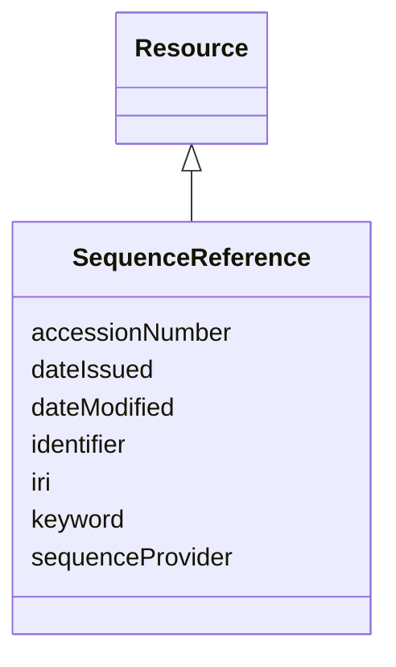

# Class: Sequence reference (SequenceReference) 


_A reference that permits to retrieve the sequence information from a sequence provider_


URI: [EVORAO:SequenceReference](https://w3id.org/evorao/SequenceReference)





## Inheritance
* [Resource](Resource.md)
    * **SequenceReference**


## Slots

| Name | Cardinality and Range | Description | Inheritance |
| ---  | --- | --- | --- |
| [accessionNumber](accessionNumber.md) | 1 <br/> [String](String.md) | The sequence ID that permits to retrieve the sequence information from the se... | direct |
| [sequenceProvider](sequenceProvider.md) | 1 <br/> [String](String.md) | The name of the sequence provider within the list of accepted sequence provid... | direct |
| [keyword](keyword.md) | * <br/> [String](String.md) | A keyword or tag describing the resource | [Resource](Resource.md) |
| [dateIssued](dateIssued.md) | 0..1 <br/> [Datetime](Datetime.md) | Date of formal issuance (e | [Resource](Resource.md) |
| [dateModified](dateModified.md) | 0..1 <br/> [Datetime](Datetime.md) | Most recent date on which the resource was changed, updated or modified | [Resource](Resource.md) |
| [identifier](identifier.md) | * <br/> [String](String.md) | A unique identifier of the resource being described or cataloged | [Resource](Resource.md) |
| [iri](iri.md) | * <br/> [Uri](Uri.md) | International Resource Identifier (IRI) that uniquely identifies or refers to... | [Resource](Resource.md) |


## Usages

| used by | used in | type | used |
| ---  | --- | --- | --- |
| [Sequence](Sequence.md) | [sequenceReference](sequenceReference.md) | range | [SequenceReference](SequenceReference.md) |
| [Antibody](Antibody.md) | [sequenceReference](sequenceReference.md) | range | [SequenceReference](SequenceReference.md) |
| [Hybridoma](Hybridoma.md) | [sequenceReference](sequenceReference.md) | range | [SequenceReference](SequenceReference.md) |


## Comments

* A work on making it a subclass of External related reference might be consistent and beneficial for data structuration but special attention will have to be take to ensure it remains consistent with the actual the use cases for users

## Identifier and Mapping Information


### Schema Source


* from schema: https://w3id.org/evorao/


## Mappings

| Mapping Type | Mapped Value |
| ---  | ---  |
| self | EVORAO:SequenceReference |
| native | EVORAO:SequenceReference |


## LinkML Source

<!-- TODO: investigate https://stackoverflow.com/questions/37606292/how-to-create-tabbed-code-blocks-in-mkdocs-or-sphinx -->

### Direct

<details>
```yaml
name: SequenceReference
description: A reference that permits to retrieve the sequence information from a
  sequence provider
title: Sequence reference
comments:
- A work on making it a subclass of External related reference might be consistent
  and beneficial for data structuration but special attention will have to be take
  to ensure it remains consistent with the actual the use cases for users
from_schema: https://w3id.org/evorao/
is_a: Resource
slots:
- accessionNumber
- sequenceProvider
slot_usage:
  accessionNumber:
    name: accessionNumber
    description: The sequence ID that permits to retrieve the sequence information
      from the sequence provider
    title: accession number
    related_mappings:
    - dct:identifier
    narrow_mappings:
    - ncit:P102
    broad_mappings:
    - schema:identifier
    is_a: identifier
    domain_of:
    - SequenceReference
    range: string
    required: true
    multivalued: false
  sequenceProvider:
    name: sequenceProvider
    description: The name of the sequence provider within the list of accepted sequence
      providers
    title: sequence provider
    close_mappings:
    - dct:publisher
    domain_of:
    - SequenceReference
    range: string
    required: true
    multivalued: false

```
</details>

### Induced

<details>
```yaml
name: SequenceReference
description: A reference that permits to retrieve the sequence information from a
  sequence provider
title: Sequence reference
comments:
- A work on making it a subclass of External related reference might be consistent
  and beneficial for data structuration but special attention will have to be take
  to ensure it remains consistent with the actual the use cases for users
from_schema: https://w3id.org/evorao/
is_a: Resource
slot_usage:
  accessionNumber:
    name: accessionNumber
    description: The sequence ID that permits to retrieve the sequence information
      from the sequence provider
    title: accession number
    related_mappings:
    - dct:identifier
    narrow_mappings:
    - ncit:P102
    broad_mappings:
    - schema:identifier
    is_a: identifier
    domain_of:
    - SequenceReference
    range: string
    required: true
    multivalued: false
  sequenceProvider:
    name: sequenceProvider
    description: The name of the sequence provider within the list of accepted sequence
      providers
    title: sequence provider
    close_mappings:
    - dct:publisher
    domain_of:
    - SequenceReference
    range: string
    required: true
    multivalued: false
attributes:
  accessionNumber:
    name: accessionNumber
    description: The sequence ID that permits to retrieve the sequence information
      from the sequence provider
    title: accession number
    from_schema: https://w3id.org/evorao/
    related_mappings:
    - dct:identifier
    narrow_mappings:
    - ncit:P102
    broad_mappings:
    - schema:identifier
    rank: 1000
    is_a: identifier
    alias: accessionNumber
    owner: SequenceReference
    domain_of:
    - SequenceReference
    range: string
    required: true
    multivalued: false
  sequenceProvider:
    name: sequenceProvider
    description: The name of the sequence provider within the list of accepted sequence
      providers
    title: sequence provider
    from_schema: https://w3id.org/evorao/
    close_mappings:
    - dct:publisher
    rank: 1000
    alias: sequenceProvider
    owner: SequenceReference
    domain_of:
    - SequenceReference
    range: string
    required: true
    multivalued: false
    equals_string_in:
    - ENA
    - GenBank
  keyword:
    name: keyword
    description: A keyword or tag describing the resource
    title: keyword
    from_schema: https://w3id.org/evorao/
    rank: 1000
    slot_uri: dcat:keyword
    alias: keyword
    owner: SequenceReference
    domain_of:
    - Resource
    range: string
    required: false
    multivalued: true
  dateIssued:
    name: dateIssued
    description: Date of formal issuance (e.g., publication) of the resource
    title: date issued
    comments:
    - encoded using the relevant ISO 8601 Date and Time compliant string [DATETIME]
    from_schema: https://w3id.org/evorao/
    exact_mappings:
    - sepio:0000051
    close_mappings:
    - schema:datePublished
    - schema:dateCreated
    rank: 1000
    slot_uri: dct:issued
    alias: dateIssued
    owner: SequenceReference
    domain_of:
    - Resource
    range: datetime
    required: false
    multivalued: false
  dateModified:
    name: dateModified
    description: Most recent date on which the resource was changed, updated or modified
    title: date modified
    comments:
    - encoded using the relevant ISO 8601 Date and Time compliant string [DATETIME]
    from_schema: https://w3id.org/evorao/
    exact_mappings:
    - sepio:0000036
    close_mappings:
    - schema:dateModified
    rank: 1000
    slot_uri: dct:modified
    alias: dateModified
    owner: SequenceReference
    domain_of:
    - Resource
    range: datetime
    required: false
    multivalued: false
  identifier:
    name: identifier
    description: A unique identifier of the resource being described or cataloged
    title: identifier
    comments:
    - The identifier is a text string which is assigned to the resource to provide
      an unambiguous reference within a particular context. Persistent identifiers
      should be provided as HTTP URIs
    from_schema: https://w3id.org/evorao/
    exact_mappings:
    - schema:identifier
    rank: 1000
    slot_uri: dct:identifier
    alias: identifier
    owner: SequenceReference
    domain_of:
    - Resource
    range: string
    required: false
    multivalued: true
  iri:
    name: iri
    description: International Resource Identifier (IRI) that uniquely identifies
      or refers to the resource. IRIs include URIs, and URIs include URLs
    title: IRI
    comments:
    - An IRI is a global identifier standardized by IETF RFC 3987. It may or may not
      be resolvable on the web. IRIs include URIs, and URIs include URLs
    from_schema: https://w3id.org/evorao/
    rank: 1000
    is_a: identifier
    alias: iri
    owner: SequenceReference
    domain_of:
    - Resource
    range: uri
    required: false
    multivalued: true

```
</details>