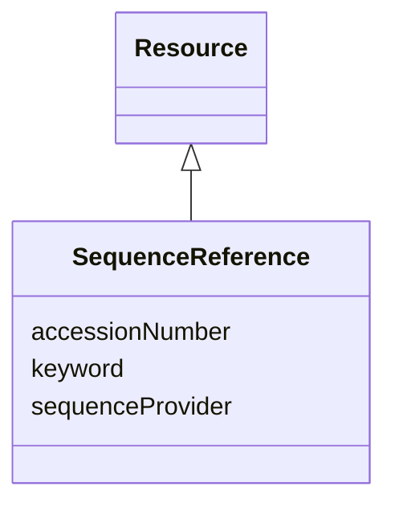

# Class: Sequence reference (SequenceReference) 


_A reference that permits to retrieve the sequence information from a sequence provider_


URI: [EVORAO:SequenceReference](https://w3id.org/evorao/SequenceReference)





## Inheritance
* [Resource](Resource.md)
    * **SequenceReference**


## Slots

| Name | Cardinality and Range | Description | Inheritance |
| ---  | --- | --- | --- |
| [accessionNumber](accessionNumber.md) | 1 <br/> [String](String.md) | The sequence ID that permits to retrieve the sequence information from the se... | direct |
| [sequenceProvider](sequenceProvider.md) | 1 <br/> [String](String.md) | The name of the sequence provider within the list of accepted sequence provid... | direct |
| [keyword](keyword.md) | * <br/> [String](String.md) | A keyword or tag describing the resource | [Resource](Resource.md) |


## Usages

| used by | used in | type | used |
| ---  | --- | --- | --- |
| [Sequence](Sequence.md) | [sequenceReference](sequenceReference.md) | range | [SequenceReference](SequenceReference.md) |
| [Antibody](Antibody.md) | [sequenceReference](sequenceReference.md) | range | [SequenceReference](SequenceReference.md) |
| [Hybridoma](Hybridoma.md) | [sequenceReference](sequenceReference.md) | range | [SequenceReference](SequenceReference.md) |


## Comments

* A work on making it a subclass of External related reference might be consistent and beneficial for data structuration but special attention will have to be take to ensure it remains consistent with the actual the use cases for users

## Identifier and Mapping Information


### Schema Source


* from schema: https://w3id.org/evorao/


## Mappings

| Mapping Type | Mapped Value |
| ---  | ---  |
| self | EVORAO:SequenceReference |
| native | EVORAO:SequenceReference |


## LinkML Source

<!-- TODO: investigate https://stackoverflow.com/questions/37606292/how-to-create-tabbed-code-blocks-in-mkdocs-or-sphinx -->

### Direct

<details>
```yaml
name: SequenceReference
description: A reference that permits to retrieve the sequence information from a
  sequence provider
title: Sequence reference
comments:
- A work on making it a subclass of External related reference might be consistent
  and beneficial for data structuration but special attention will have to be take
  to ensure it remains consistent with the actual the use cases for users
from_schema: https://w3id.org/evorao/
is_a: Resource
slots:
- accessionNumber
- sequenceProvider
slot_usage:
  accessionNumber:
    name: accessionNumber
    description: The sequence ID that permits to retrieve the sequence information
      from the sequence provider
    title: accession number
    related_mappings:
    - dct:identifier
    narrow_mappings:
    - ncit:P102
    broad_mappings:
    - schema:identifier
    domain_of:
    - SequenceReference
    range: string
    required: true
    multivalued: false
  sequenceProvider:
    name: sequenceProvider
    description: The name of the sequence provider within the list of accepted sequence
      providers
    title: sequence provider
    close_mappings:
    - dct:publisher
    domain_of:
    - SequenceReference
    range: string
    required: true
    multivalued: false

```
</details>

### Induced

<details>
```yaml
name: SequenceReference
description: A reference that permits to retrieve the sequence information from a
  sequence provider
title: Sequence reference
comments:
- A work on making it a subclass of External related reference might be consistent
  and beneficial for data structuration but special attention will have to be take
  to ensure it remains consistent with the actual the use cases for users
from_schema: https://w3id.org/evorao/
is_a: Resource
slot_usage:
  accessionNumber:
    name: accessionNumber
    description: The sequence ID that permits to retrieve the sequence information
      from the sequence provider
    title: accession number
    related_mappings:
    - dct:identifier
    narrow_mappings:
    - ncit:P102
    broad_mappings:
    - schema:identifier
    domain_of:
    - SequenceReference
    range: string
    required: true
    multivalued: false
  sequenceProvider:
    name: sequenceProvider
    description: The name of the sequence provider within the list of accepted sequence
      providers
    title: sequence provider
    close_mappings:
    - dct:publisher
    domain_of:
    - SequenceReference
    range: string
    required: true
    multivalued: false
attributes:
  accessionNumber:
    name: accessionNumber
    description: The sequence ID that permits to retrieve the sequence information
      from the sequence provider
    title: accession number
    from_schema: https://w3id.org/evorao/
    related_mappings:
    - dct:identifier
    narrow_mappings:
    - ncit:P102
    broad_mappings:
    - schema:identifier
    rank: 1000
    alias: accessionNumber
    owner: SequenceReference
    domain_of:
    - SequenceReference
    range: string
    required: true
    multivalued: false
  sequenceProvider:
    name: sequenceProvider
    description: The name of the sequence provider within the list of accepted sequence
      providers
    title: sequence provider
    from_schema: https://w3id.org/evorao/
    close_mappings:
    - dct:publisher
    rank: 1000
    alias: sequenceProvider
    owner: SequenceReference
    domain_of:
    - SequenceReference
    range: string
    required: true
    multivalued: false
    equals_string_in:
    - ENA
    - GenBank
  keyword:
    name: keyword
    description: A keyword or tag describing the resource
    title: keyword
    from_schema: https://w3id.org/evorao/
    rank: 1000
    slot_uri: dcat:keyword
    alias: keyword
    owner: SequenceReference
    domain_of:
    - Resource
    range: string
    required: false
    multivalued: true

```
</details>