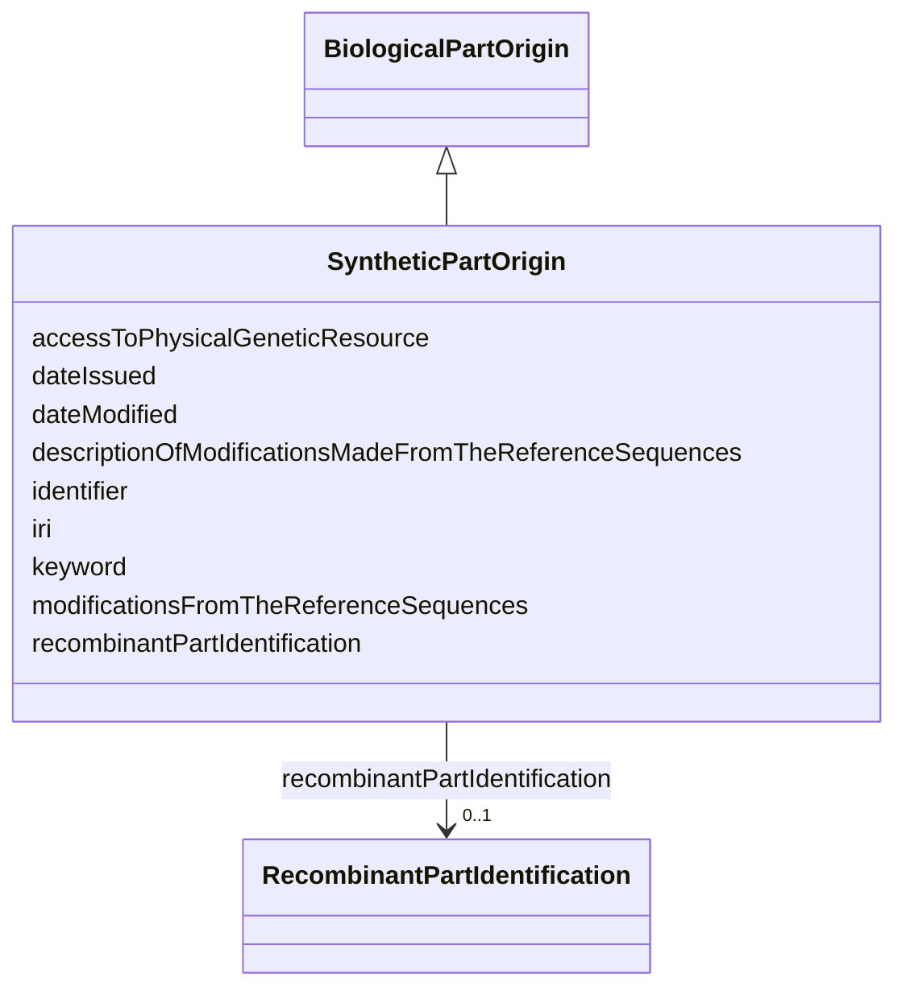

# Class: Synthetic part origin (SyntheticPartOrigin) 


_Information on the origin of a synthetic part that composes the biological material._


URI: [EVORAO:SyntheticPartOrigin](https://w3id.org/evorao/SyntheticPartOrigin)





## Inheritance
* [Resource](Resource.md)
    * [BiologicalPartOrigin](BiologicalPartOrigin.md)
        * **SyntheticPartOrigin**


## Slots

| Name | Cardinality and Range | Description | Inheritance |
| ---  | --- | --- | --- |
| [modificationsFromTheReferenceSequences](modificationsFromTheReferenceSequences.md) | 1 <br/> [Boolean](Boolean.md) | Set to TRUE if there was is any modification made from the reference sequence | direct |
| [descriptionOfModificationsMadeFromTheReferenceSequences](descriptionOfModificationsMadeFromTheReferenceSequences.md) | 0..1 _recommended_ <br/> [String](String.md) | List the modifications mades from the reference sequence if any | direct |
| [recombinantPartIdentification](recombinantPartIdentification.md) | 0..1 <br/> [RecombinantPartIdentification](RecombinantPartIdentification.md) | Identification of a recombinant part | [BiologicalPartOrigin](BiologicalPartOrigin.md) |
| [accessToPhysicalGeneticResource](accessToPhysicalGeneticResource.md) | 1 <br/> [Boolean](Boolean.md) | Indicate if the biological part was produced with access to a physical geneti... | [BiologicalPartOrigin](BiologicalPartOrigin.md) |
| [keyword](keyword.md) | * <br/> [String](String.md) | A keyword or tag describing the resource | [Resource](Resource.md) |
| [dateIssued](dateIssued.md) | 0..1 <br/> [Datetime](Datetime.md) | Date of formal issuance (e | [Resource](Resource.md) |
| [dateModified](dateModified.md) | 0..1 <br/> [Datetime](Datetime.md) | Most recent date on which the resource was changed, updated or modified | [Resource](Resource.md) |
| [identifier](identifier.md) | * <br/> [String](String.md) | A unique identifier of the resource being described or cataloged | [Resource](Resource.md) |
| [iri](iri.md) | * <br/> [Uri](Uri.md) | International Resource Identifier (IRI) that uniquely identifies or refers to... | [Resource](Resource.md) |


## Identifier and Mapping Information


### Schema Source


* from schema: https://w3id.org/evorao/


## Mappings

| Mapping Type | Mapped Value |
| ---  | ---  |
| self | EVORAO:SyntheticPartOrigin |
| native | EVORAO:SyntheticPartOrigin |


## LinkML Source

<!-- TODO: investigate https://stackoverflow.com/questions/37606292/how-to-create-tabbed-code-blocks-in-mkdocs-or-sphinx -->

### Direct

<details>
```yaml
name: SyntheticPartOrigin
description: Information on the origin of a synthetic part that composes the biological
  material.
title: Synthetic part origin
from_schema: https://w3id.org/evorao/
is_a: BiologicalPartOrigin
slots:
- modificationsFromTheReferenceSequences
- descriptionOfModificationsMadeFromTheReferenceSequences
slot_usage:
  modificationsFromTheReferenceSequences:
    name: modificationsFromTheReferenceSequences
    description: Set to TRUE if there was is any modification made from the reference
      sequence.
    title: modifications from the reference sequence(s)
    related_mappings:
    - geno:0000967
    domain_of:
    - SyntheticPartOrigin
    range: boolean
    required: true
    multivalued: false
  descriptionOfModificationsMadeFromTheReferenceSequences:
    name: descriptionOfModificationsMadeFromTheReferenceSequences
    description: List the modifications mades from the reference sequence if any.
    title: description of modification(s) made from the reference sequence(s)
    related_mappings:
    - uniprotrdfs:modification
    domain_of:
    - SyntheticPartOrigin
    range: string
    required: false
    recommended: true
    multivalued: false

```
</details>

### Induced

<details>
```yaml
name: SyntheticPartOrigin
description: Information on the origin of a synthetic part that composes the biological
  material.
title: Synthetic part origin
from_schema: https://w3id.org/evorao/
is_a: BiologicalPartOrigin
slot_usage:
  modificationsFromTheReferenceSequences:
    name: modificationsFromTheReferenceSequences
    description: Set to TRUE if there was is any modification made from the reference
      sequence.
    title: modifications from the reference sequence(s)
    related_mappings:
    - geno:0000967
    domain_of:
    - SyntheticPartOrigin
    range: boolean
    required: true
    multivalued: false
  descriptionOfModificationsMadeFromTheReferenceSequences:
    name: descriptionOfModificationsMadeFromTheReferenceSequences
    description: List the modifications mades from the reference sequence if any.
    title: description of modification(s) made from the reference sequence(s)
    related_mappings:
    - uniprotrdfs:modification
    domain_of:
    - SyntheticPartOrigin
    range: string
    required: false
    recommended: true
    multivalued: false
attributes:
  modificationsFromTheReferenceSequences:
    name: modificationsFromTheReferenceSequences
    description: Set to TRUE if there was is any modification made from the reference
      sequence.
    title: modifications from the reference sequence(s)
    from_schema: https://w3id.org/evorao/
    related_mappings:
    - geno:0000967
    rank: 1000
    alias: modificationsFromTheReferenceSequences
    owner: SyntheticPartOrigin
    domain_of:
    - SyntheticPartOrigin
    range: boolean
    required: true
    multivalued: false
  descriptionOfModificationsMadeFromTheReferenceSequences:
    name: descriptionOfModificationsMadeFromTheReferenceSequences
    description: List the modifications mades from the reference sequence if any.
    title: description of modification(s) made from the reference sequence(s)
    from_schema: https://w3id.org/evorao/
    related_mappings:
    - uniprotrdfs:modification
    rank: 1000
    alias: descriptionOfModificationsMadeFromTheReferenceSequences
    owner: SyntheticPartOrigin
    domain_of:
    - SyntheticPartOrigin
    range: string
    required: false
    recommended: true
    multivalued: false
  recombinantPartIdentification:
    name: recombinantPartIdentification
    description: Identification of a recombinant part.
    title: recombinant part identification
    comments:
    - Information not required if the current biological part constitutes the complete
      biological material.
    from_schema: https://w3id.org/evorao/
    rank: 1000
    alias: recombinantPartIdentification
    owner: SyntheticPartOrigin
    domain_of:
    - BiologicalPartOrigin
    range: RecombinantPartIdentification
    required: false
    multivalued: false
  accessToPhysicalGeneticResource:
    name: accessToPhysicalGeneticResource
    description: Indicate if the biological part was produced with access to a physical
      genetic resource.
    title: access to physical genetic resource
    from_schema: https://w3id.org/evorao/
    rank: 1000
    alias: accessToPhysicalGeneticResource
    owner: SyntheticPartOrigin
    domain_of:
    - BiologicalPartOrigin
    range: boolean
    required: true
    multivalued: false
  keyword:
    name: keyword
    description: A keyword or tag describing the resource.
    title: keyword
    from_schema: https://w3id.org/evorao/
    rank: 1000
    slot_uri: dcat:keyword
    alias: keyword
    owner: SyntheticPartOrigin
    domain_of:
    - Resource
    range: string
    required: false
    multivalued: true
  dateIssued:
    name: dateIssued
    description: Date of formal issuance (e.g., publication) of the resource.
    title: date issued
    comments:
    - encoded using the relevant ISO 8601 Date and Time compliant string [DATETIME].
    from_schema: https://w3id.org/evorao/
    exact_mappings:
    - sepio:0000051
    close_mappings:
    - schema:datePublished
    - schema:dateCreated
    rank: 1000
    slot_uri: dct:issued
    alias: dateIssued
    owner: SyntheticPartOrigin
    domain_of:
    - Resource
    range: datetime
    required: false
    multivalued: false
  dateModified:
    name: dateModified
    description: Most recent date on which the resource was changed, updated or modified.
    title: date modified
    comments:
    - encoded using the relevant ISO 8601 Date and Time compliant string [DATETIME].
    from_schema: https://w3id.org/evorao/
    exact_mappings:
    - sepio:0000036
    close_mappings:
    - schema:dateModified
    rank: 1000
    slot_uri: dct:modified
    alias: dateModified
    owner: SyntheticPartOrigin
    domain_of:
    - Resource
    range: datetime
    required: false
    multivalued: false
  identifier:
    name: identifier
    description: A unique identifier of the resource being described or cataloged.
    title: identifier
    comments:
    - The identifier is a text string which is assigned to the resource to provide
      an unambiguous reference within a particular context. Persistent identifiers
      should be provided as HTTP URIs.
    from_schema: https://w3id.org/evorao/
    exact_mappings:
    - schema:identifier
    rank: 1000
    slot_uri: dct:identifier
    alias: identifier
    owner: SyntheticPartOrigin
    domain_of:
    - Resource
    range: string
    required: false
    multivalued: true
  iri:
    name: iri
    description: International Resource Identifier (IRI) that uniquely identifies
      or refers to the resource. IRIs include URIs, and URIs include URLs.
    title: IRI
    comments:
    - An IRI is a global identifier standardized by IETF RFC 3987. It may or may not
      be resolvable on the web. IRIs include URIs, and URIs include URLs.
    from_schema: https://w3id.org/evorao/
    close_mappings:
    - biolink:iri
    related_mappings:
    - mi:url
    narrow_mappings:
    - schema:url
    rank: 1000
    is_a: identifier
    alias: iri
    owner: SyntheticPartOrigin
    domain_of:
    - Resource
    range: uri
    required: false
    multivalued: true

```
</details>