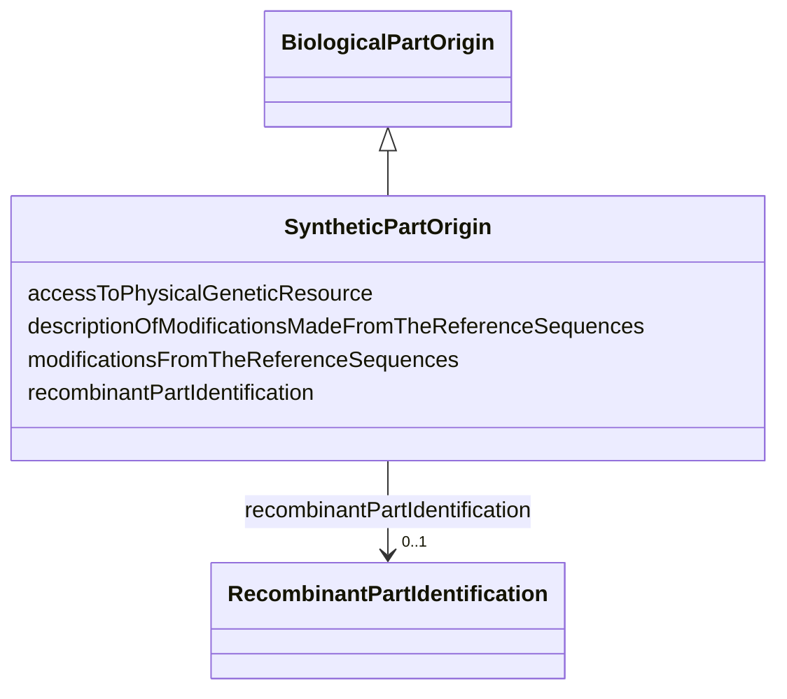

# Class: Synthetic part origin (SyntheticPartOrigin)


_Information on the origin of a synthetic part that composes the biological material_


URI: [EVORAO:SyntheticPartOrigin](https://raw.githubusercontent.com/EVORA-project/evora-ontology/refs/heads/main/models/owl/evora_ontology.owl.ttl#SyntheticPartOrigin)





## Inheritance
* [Resource](Resource.md)
    * [Dataset](Dataset.md)
        * [BiologicalPartOrigin](BiologicalPartOrigin.md)
            * **SyntheticPartOrigin**


## Slots

| Name | Cardinality and Range | Description | Inheritance |
| ---  | --- | --- | --- |
| [modificationsFromTheReferenceSequences](modificationsFromTheReferenceSequences.md) | 1 <br/> [Boolean](Boolean.md) | Set to TRUE if there was is any modification made from the reference sequence | direct |
| [descriptionOfModificationsMadeFromTheReferenceSequences](descriptionOfModificationsMadeFromTheReferenceSequences.md) | 0..1 _recommended_ <br/> [String](String.md) | List the modifications mades from the reference sequence if any | direct |
| [recombinantPartIdentification](recombinantPartIdentification.md) | 0..1 <br/> [RecombinantPartIdentification](RecombinantPartIdentification.md) | Identification of a recombinant part | [BiologicalPartOrigin](BiologicalPartOrigin.md) |
| [accessToPhysicalGeneticResource](accessToPhysicalGeneticResource.md) | 1 <br/> [Boolean](Boolean.md) | Indicate if the biological part was produced with access to a physical geneti... | [BiologicalPartOrigin](BiologicalPartOrigin.md) |


## Identifier and Mapping Information


### Schema Source


* from schema: https://raw.githubusercontent.com/EVORA-project/evora-ontology/refs/heads/main/models/owl/evora_ontology.owl.ttl#


## Mappings

| Mapping Type | Mapped Value |
| ---  | ---  |
| self | EVORAO:SyntheticPartOrigin |
| native | EVORAO:SyntheticPartOrigin |


## LinkML Source

<!-- TODO: investigate https://stackoverflow.com/questions/37606292/how-to-create-tabbed-code-blocks-in-mkdocs-or-sphinx -->

### Direct

<details>
```yaml
name: SyntheticPartOrigin
description: Information on the origin of a synthetic part that composes the biological
  material
title: Synthetic part origin
from_schema: https://raw.githubusercontent.com/EVORA-project/evora-ontology/refs/heads/main/models/owl/evora_ontology.owl.ttl#
is_a: BiologicalPartOrigin
slots:
- modificationsFromTheReferenceSequences
- descriptionOfModificationsMadeFromTheReferenceSequences
slot_usage:
  modificationsFromTheReferenceSequences:
    name: modificationsFromTheReferenceSequences
    description: Set to TRUE if there was is any modification made from the reference
      sequence
    title: modifications from the reference sequence(s)
    domain_of:
    - SyntheticPartOrigin
    range: boolean
    required: true
    multivalued: false
  descriptionOfModificationsMadeFromTheReferenceSequences:
    name: descriptionOfModificationsMadeFromTheReferenceSequences
    description: List the modifications mades from the reference sequence if any
    title: description of modification(s) made from the reference sequence(s)
    domain_of:
    - SyntheticPartOrigin
    range: string
    required: false
    recommended: true
    multivalued: false

```
</details>

### Induced

<details>
```yaml
name: SyntheticPartOrigin
description: Information on the origin of a synthetic part that composes the biological
  material
title: Synthetic part origin
from_schema: https://raw.githubusercontent.com/EVORA-project/evora-ontology/refs/heads/main/models/owl/evora_ontology.owl.ttl#
is_a: BiologicalPartOrigin
slot_usage:
  modificationsFromTheReferenceSequences:
    name: modificationsFromTheReferenceSequences
    description: Set to TRUE if there was is any modification made from the reference
      sequence
    title: modifications from the reference sequence(s)
    domain_of:
    - SyntheticPartOrigin
    range: boolean
    required: true
    multivalued: false
  descriptionOfModificationsMadeFromTheReferenceSequences:
    name: descriptionOfModificationsMadeFromTheReferenceSequences
    description: List the modifications mades from the reference sequence if any
    title: description of modification(s) made from the reference sequence(s)
    domain_of:
    - SyntheticPartOrigin
    range: string
    required: false
    recommended: true
    multivalued: false
attributes:
  modificationsFromTheReferenceSequences:
    name: modificationsFromTheReferenceSequences
    description: Set to TRUE if there was is any modification made from the reference
      sequence
    title: modifications from the reference sequence(s)
    from_schema: https://raw.githubusercontent.com/EVORA-project/evora-ontology/refs/heads/main/models/owl/evora_ontology.owl.ttl#
    rank: 1000
    alias: modificationsFromTheReferenceSequences
    owner: SyntheticPartOrigin
    domain_of:
    - SyntheticPartOrigin
    range: boolean
    required: true
    multivalued: false
  descriptionOfModificationsMadeFromTheReferenceSequences:
    name: descriptionOfModificationsMadeFromTheReferenceSequences
    description: List the modifications mades from the reference sequence if any
    title: description of modification(s) made from the reference sequence(s)
    from_schema: https://raw.githubusercontent.com/EVORA-project/evora-ontology/refs/heads/main/models/owl/evora_ontology.owl.ttl#
    rank: 1000
    alias: descriptionOfModificationsMadeFromTheReferenceSequences
    owner: SyntheticPartOrigin
    domain_of:
    - SyntheticPartOrigin
    range: string
    required: false
    recommended: true
    multivalued: false
  recombinantPartIdentification:
    name: recombinantPartIdentification
    description: Identification of a recombinant part
    title: recombinant part identification
    comments:
    - Information not required if the current biological part constitutes the complete
      biological material
    from_schema: https://raw.githubusercontent.com/EVORA-project/evora-ontology/refs/heads/main/models/owl/evora_ontology.owl.ttl#
    rank: 1000
    alias: recombinantPartIdentification
    owner: SyntheticPartOrigin
    domain_of:
    - BiologicalPartOrigin
    range: RecombinantPartIdentification
    required: false
    multivalued: false
  accessToPhysicalGeneticResource:
    name: accessToPhysicalGeneticResource
    description: Indicate if the biological part was produced with access to a physical
      genetic resource
    title: access to physical genetic resource
    from_schema: https://raw.githubusercontent.com/EVORA-project/evora-ontology/refs/heads/main/models/owl/evora_ontology.owl.ttl#
    rank: 1000
    alias: accessToPhysicalGeneticResource
    owner: SyntheticPartOrigin
    domain_of:
    - BiologicalPartOrigin
    range: boolean
    required: true
    multivalued: false

```
</details>