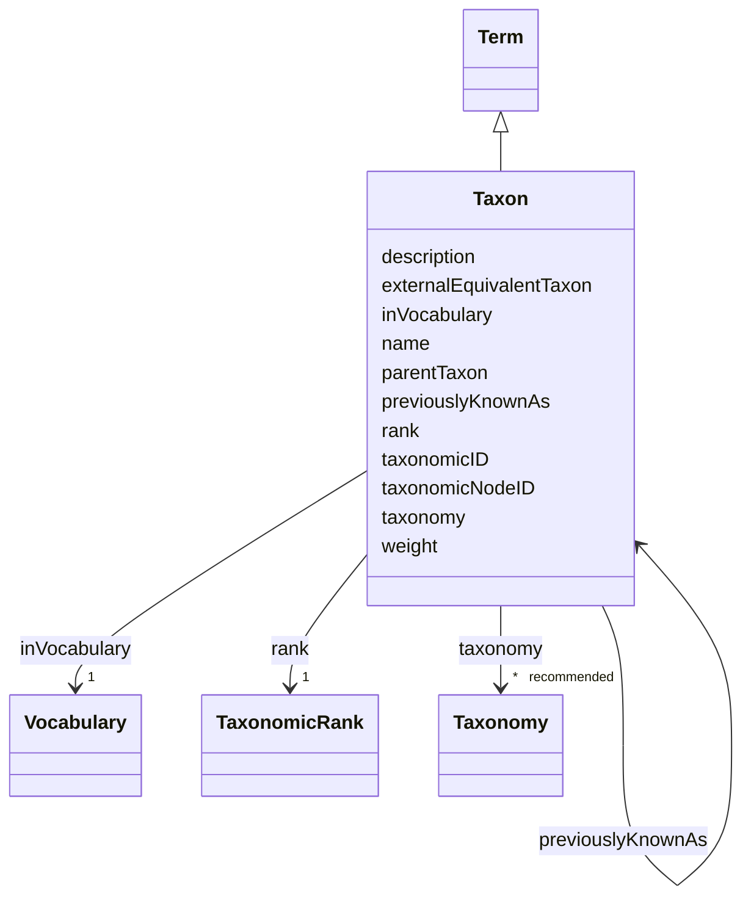

# Class: Taxon (Taxon)


_Conceptual entity that groups one or more populations of an organism or organisms, as seen by taxonomists, to form a unit_


URI: [EVORAO:Taxon](https://raw.githubusercontent.com/EVORA-project/evora-ontology/refs/heads/main/models/owl/evora_ontology.owl.ttl#Taxon)





## Inheritance
* [Resource](Resource.md)
    * [Dataset](Dataset.md)
        * [Term](Term.md)
            * **Taxon**


## Slots

| Name | Cardinality and Range | Description | Inheritance |
| ---  | --- | --- | --- |
| [taxonomy](taxonomy.md) | * _recommended_ <br/> [Taxonomy](Taxonomy.md) | The taxonomy release(s) in which this entity exists | direct |
| [parentTaxon](parentTaxon.md) | 1 <br/> [Taxon](Taxon.md) | The parent taxon of the current taxon | direct |
| [rank](rank.md) | 1 <br/> [TaxonomicRank](TaxonomicRank.md) | Relative level or position of the identified taxon in the taxonomy | direct |
| [previouslyKnownAs](previouslyKnownAs.md) | * <br/> [Taxon](Taxon.md) | Any historic version of this taxon having a different name | direct |
| [externalEquivalentTaxon](externalEquivalentTaxon.md) | * <br/> [Taxon](Taxon.md) | Any equivalent taxon in a different taxonomy if exists/known to serve as a br... | direct |
| [taxonomicID](taxonomicID.md) | 1 <br/> [String](String.md) | The taxonomic identifier as a persistent identifier accross releases | direct |
| [taxonomicNodeID](taxonomicNodeID.md) | 0..1 _recommended_ <br/> [String](String.md) | The taxonomic_Node Identifier as an identifier specific the current taxon in ... | direct |
| [name](name.md) | 1 <br/> [String](String.md) | The label that allows humans to identify the current item | [Term](Term.md) |
| [description](description.md) | 0..1 _recommended_ <br/> [String](String.md) | A short explanation of the characteristics, features, or nature of the curren... | [Term](Term.md) |
| [weight](weight.md) | 1 <br/> [Integer](Integer.md) | A numerical value indicating relative importance or priority, generally proce... | [Term](Term.md) |
| [inVocabulary](inVocabulary.md) | 1 <br/> [Vocabulary](Vocabulary.md) | Terms belong to a specific vocabulary | [Term](Term.md) |


## Usages

| used by | used in | type | used |
| ---  | --- | --- | --- |
| [Taxonomy](Taxonomy.md) | [taxon](taxon.md) | range | [Taxon](Taxon.md) |
| [PathogenIdentification](PathogenIdentification.md) | [taxon](taxon.md) | range | [Taxon](Taxon.md) |
| [Taxon](Taxon.md) | [parentTaxon](parentTaxon.md) | range | [Taxon](Taxon.md) |
| [Taxon](Taxon.md) | [previouslyKnownAs](previouslyKnownAs.md) | range | [Taxon](Taxon.md) |
| [Taxon](Taxon.md) | [externalEquivalentTaxon](externalEquivalentTaxon.md) | range | [Taxon](Taxon.md) |


## Comments

* The taxonomic taxons connected to their parent so that a full lienage can be rebuild. Use of Data provider recommended

## Identifier and Mapping Information


### Schema Source


* from schema: https://raw.githubusercontent.com/EVORA-project/evora-ontology/refs/heads/main/models/owl/evora_ontology.owl.ttl#


## Mappings

| Mapping Type | Mapped Value |
| ---  | ---  |
| self | EVORAO:Taxon |
| native | EVORAO:Taxon |
| exact | dwc:Taxon |
| close | wd:Q16521 |


## LinkML Source

<!-- TODO: investigate https://stackoverflow.com/questions/37606292/how-to-create-tabbed-code-blocks-in-mkdocs-or-sphinx -->

### Direct

<details>
```yaml
name: Taxon
description: Conceptual entity that groups one or more populations of an organism
  or organisms, as seen by taxonomists, to form a unit
title: Taxon
comments:
- The taxonomic taxons connected to their parent so that a full lienage can be rebuild.
  Use of Data provider recommended
from_schema: https://raw.githubusercontent.com/EVORA-project/evora-ontology/refs/heads/main/models/owl/evora_ontology.owl.ttl#
exact_mappings:
- dwc:Taxon
close_mappings:
- wd:Q16521
is_a: Term
slots:
- taxonomy
- parentTaxon
- rank
- previouslyKnownAs
- externalEquivalentTaxon
- taxonomicID
- taxonomicNodeID
slot_usage:
  taxonomy:
    name: taxonomy
    description: The taxonomy release(s) in which this entity exists
    title: taxonomy
    domain_of:
    - Taxon
    - TaxonomicRank
    range: Taxonomy
    required: false
    recommended: true
    multivalued: true
  parentTaxon:
    name: parentTaxon
    description: The parent taxon of the current taxon
    title: parent taxon
    close_mappings:
    - dwc:Taxon
    domain_of:
    - Taxon
    range: Taxon
    required: true
    multivalued: false
  rank:
    name: rank
    description: Relative level or position of the identified taxon in the taxonomy
    title: rank
    exact_mappings:
    - dwc:taxonRank
    domain_of:
    - Taxon
    - Taxonomy
    range: TaxonomicRank
    required: true
    multivalued: false
  previouslyKnownAs:
    name: previouslyKnownAs
    description: Any historic version of this taxon having a different name
    title: previously known as
    close_mappings:
    - dwc:Taxon
    domain_of:
    - Taxon
    range: Taxon
    required: false
    multivalued: true
  externalEquivalentTaxon:
    name: externalEquivalentTaxon
    description: Any equivalent taxon in a different taxonomy if exists/known to serve
      as a bridge (e.g, ICTV towards NCBI)
    title: external equivalent taxon
    comments:
    - Could serve as a bridge between ICTV and NCBI as several providers currently
      uses NCBI Taxonomy
    close_mappings:
    - dwc:taxonID
    domain_of:
    - Taxon
    range: Taxon
    required: false
    multivalued: true
  taxonomicID:
    name: taxonomicID
    description: The taxonomic identifier as a persistent identifier accross releases
    title: taxonomic ID
    close_mappings:
    - dwc:taxonID
    domain_of:
    - Taxon
    range: string
    required: true
    multivalued: false
  taxonomicNodeID:
    name: taxonomicNodeID
    description: The taxonomic_Node Identifier as an identifier specific the current
      taxon in the corresponding release/version of the taxonomy
    title: taxonomic node ID
    comments:
    - NCBI does not have a taxon_node id, only a taxonomicID. Taxon_node id is Unique  in
      NCBI= Key of the taxon node !! Could be replaced by a composite key made of
      "taxonomic ID" + "has version" But can be referenced as it seems the "taxonomic
      node_ID" will be generated and provided by the ICTV
    close_mappings:
    - dwc:taxonID
    domain_of:
    - Taxon
    range: string
    required: false
    recommended: true
    multivalued: false

```
</details>

### Induced

<details>
```yaml
name: Taxon
description: Conceptual entity that groups one or more populations of an organism
  or organisms, as seen by taxonomists, to form a unit
title: Taxon
comments:
- The taxonomic taxons connected to their parent so that a full lienage can be rebuild.
  Use of Data provider recommended
from_schema: https://raw.githubusercontent.com/EVORA-project/evora-ontology/refs/heads/main/models/owl/evora_ontology.owl.ttl#
exact_mappings:
- dwc:Taxon
close_mappings:
- wd:Q16521
is_a: Term
slot_usage:
  taxonomy:
    name: taxonomy
    description: The taxonomy release(s) in which this entity exists
    title: taxonomy
    domain_of:
    - Taxon
    - TaxonomicRank
    range: Taxonomy
    required: false
    recommended: true
    multivalued: true
  parentTaxon:
    name: parentTaxon
    description: The parent taxon of the current taxon
    title: parent taxon
    close_mappings:
    - dwc:Taxon
    domain_of:
    - Taxon
    range: Taxon
    required: true
    multivalued: false
  rank:
    name: rank
    description: Relative level or position of the identified taxon in the taxonomy
    title: rank
    exact_mappings:
    - dwc:taxonRank
    domain_of:
    - Taxon
    - Taxonomy
    range: TaxonomicRank
    required: true
    multivalued: false
  previouslyKnownAs:
    name: previouslyKnownAs
    description: Any historic version of this taxon having a different name
    title: previously known as
    close_mappings:
    - dwc:Taxon
    domain_of:
    - Taxon
    range: Taxon
    required: false
    multivalued: true
  externalEquivalentTaxon:
    name: externalEquivalentTaxon
    description: Any equivalent taxon in a different taxonomy if exists/known to serve
      as a bridge (e.g, ICTV towards NCBI)
    title: external equivalent taxon
    comments:
    - Could serve as a bridge between ICTV and NCBI as several providers currently
      uses NCBI Taxonomy
    close_mappings:
    - dwc:taxonID
    domain_of:
    - Taxon
    range: Taxon
    required: false
    multivalued: true
  taxonomicID:
    name: taxonomicID
    description: The taxonomic identifier as a persistent identifier accross releases
    title: taxonomic ID
    close_mappings:
    - dwc:taxonID
    domain_of:
    - Taxon
    range: string
    required: true
    multivalued: false
  taxonomicNodeID:
    name: taxonomicNodeID
    description: The taxonomic_Node Identifier as an identifier specific the current
      taxon in the corresponding release/version of the taxonomy
    title: taxonomic node ID
    comments:
    - NCBI does not have a taxon_node id, only a taxonomicID. Taxon_node id is Unique  in
      NCBI= Key of the taxon node !! Could be replaced by a composite key made of
      "taxonomic ID" + "has version" But can be referenced as it seems the "taxonomic
      node_ID" will be generated and provided by the ICTV
    close_mappings:
    - dwc:taxonID
    domain_of:
    - Taxon
    range: string
    required: false
    recommended: true
    multivalued: false
attributes:
  taxonomy:
    name: taxonomy
    description: The taxonomy release(s) in which this entity exists
    title: taxonomy
    from_schema: https://raw.githubusercontent.com/EVORA-project/evora-ontology/refs/heads/main/models/owl/evora_ontology.owl.ttl#
    rank: 1000
    alias: taxonomy
    owner: Taxon
    domain_of:
    - Taxon
    - TaxonomicRank
    range: Taxonomy
    required: false
    recommended: true
    multivalued: true
  parentTaxon:
    name: parentTaxon
    description: The parent taxon of the current taxon
    title: parent taxon
    from_schema: https://raw.githubusercontent.com/EVORA-project/evora-ontology/refs/heads/main/models/owl/evora_ontology.owl.ttl#
    close_mappings:
    - dwc:Taxon
    rank: 1000
    alias: parentTaxon
    owner: Taxon
    domain_of:
    - Taxon
    range: Taxon
    required: true
    multivalued: false
  rank:
    name: rank
    description: Relative level or position of the identified taxon in the taxonomy
    title: rank
    from_schema: https://raw.githubusercontent.com/EVORA-project/evora-ontology/refs/heads/main/models/owl/evora_ontology.owl.ttl#
    exact_mappings:
    - dwc:taxonRank
    rank: 1000
    alias: rank
    owner: Taxon
    domain_of:
    - Taxon
    - Taxonomy
    range: TaxonomicRank
    required: true
    multivalued: false
  previouslyKnownAs:
    name: previouslyKnownAs
    description: Any historic version of this taxon having a different name
    title: previously known as
    from_schema: https://raw.githubusercontent.com/EVORA-project/evora-ontology/refs/heads/main/models/owl/evora_ontology.owl.ttl#
    close_mappings:
    - dwc:Taxon
    rank: 1000
    alias: previouslyKnownAs
    owner: Taxon
    domain_of:
    - Taxon
    range: Taxon
    required: false
    multivalued: true
  externalEquivalentTaxon:
    name: externalEquivalentTaxon
    description: Any equivalent taxon in a different taxonomy if exists/known to serve
      as a bridge (e.g, ICTV towards NCBI)
    title: external equivalent taxon
    comments:
    - Could serve as a bridge between ICTV and NCBI as several providers currently
      uses NCBI Taxonomy
    from_schema: https://raw.githubusercontent.com/EVORA-project/evora-ontology/refs/heads/main/models/owl/evora_ontology.owl.ttl#
    close_mappings:
    - dwc:taxonID
    rank: 1000
    alias: externalEquivalentTaxon
    owner: Taxon
    domain_of:
    - Taxon
    range: Taxon
    required: false
    multivalued: true
  taxonomicID:
    name: taxonomicID
    description: The taxonomic identifier as a persistent identifier accross releases
    title: taxonomic ID
    from_schema: https://raw.githubusercontent.com/EVORA-project/evora-ontology/refs/heads/main/models/owl/evora_ontology.owl.ttl#
    close_mappings:
    - dwc:taxonID
    rank: 1000
    alias: taxonomicID
    owner: Taxon
    domain_of:
    - Taxon
    range: string
    required: true
    multivalued: false
  taxonomicNodeID:
    name: taxonomicNodeID
    description: The taxonomic_Node Identifier as an identifier specific the current
      taxon in the corresponding release/version of the taxonomy
    title: taxonomic node ID
    comments:
    - NCBI does not have a taxon_node id, only a taxonomicID. Taxon_node id is Unique  in
      NCBI= Key of the taxon node !! Could be replaced by a composite key made of
      "taxonomic ID" + "has version" But can be referenced as it seems the "taxonomic
      node_ID" will be generated and provided by the ICTV
    from_schema: https://raw.githubusercontent.com/EVORA-project/evora-ontology/refs/heads/main/models/owl/evora_ontology.owl.ttl#
    close_mappings:
    - dwc:taxonID
    rank: 1000
    alias: taxonomicNodeID
    owner: Taxon
    domain_of:
    - Taxon
    range: string
    required: false
    recommended: true
    multivalued: false
  name:
    name: name
    description: The label that allows humans to identify the current item
    title: name
    comments:
    - 'The title of the item should be as short and descriptive as possible. E.g.
      for virus products it should basically be based on the following Pattern:

      "Virus name", "virus host type", "collection year", "country of collection"
      ex "suspected epidemiological origin", "genotype", "strain", "variant name or
      specific feature"'
    from_schema: https://raw.githubusercontent.com/EVORA-project/evora-ontology/refs/heads/main/models/owl/evora_ontology.owl.ttl#
    exact_mappings:
    - dct:title
    close_mappings:
    - rdfs:label
    rank: 1000
    alias: name
    owner: Taxon
    domain_of:
    - Term
    - DataService
    - Catalogue
    - PersonOrOrganization
    - ProductOrService
    - File
    - ContactPoint
    - License
    - Certification
    range: string
    required: true
    multivalued: false
  description:
    name: description
    description: A short explanation of the characteristics, features, or nature of
      the current item
    title: description
    comments:
    - 'Describe this item in few lines. This description will serve as a summary to
      present the item.

      '
    from_schema: https://raw.githubusercontent.com/EVORA-project/evora-ontology/refs/heads/main/models/owl/evora_ontology.owl.ttl#
    exact_mappings:
    - dct:description
    rank: 1000
    alias: description
    owner: Taxon
    domain_of:
    - Term
    - DataService
    - Catalogue
    - PersonOrOrganization
    - ProductOrService
    - File
    - ContactPoint
    - License
    - Certification
    range: string
    required: false
    recommended: true
    multivalued: false
  weight:
    name: weight
    description: A numerical value indicating relative importance or priority, generally
      processed in ascending order. This weight helps prioritize content when organizing
      or processing data. Its value can be negative, with a default set to 0
    title: weight
    from_schema: https://raw.githubusercontent.com/EVORA-project/evora-ontology/refs/heads/main/models/owl/evora_ontology.owl.ttl#
    close_mappings:
    - adms:status
    rank: 1000
    ifabsent: int(0)
    alias: weight
    owner: Taxon
    domain_of:
    - Term
    - DataProvider
    range: integer
    required: true
    multivalued: false
  inVocabulary:
    name: inVocabulary
    description: Terms belong to a specific vocabulary
    title: in Vocabulary
    from_schema: https://raw.githubusercontent.com/EVORA-project/evora-ontology/refs/heads/main/models/owl/evora_ontology.owl.ttl#
    close_mappings:
    - wdp:P972
    rank: 1000
    alias: inVocabulary
    owner: Taxon
    domain_of:
    - Term
    range: Vocabulary
    required: true
    multivalued: false

```
</details>