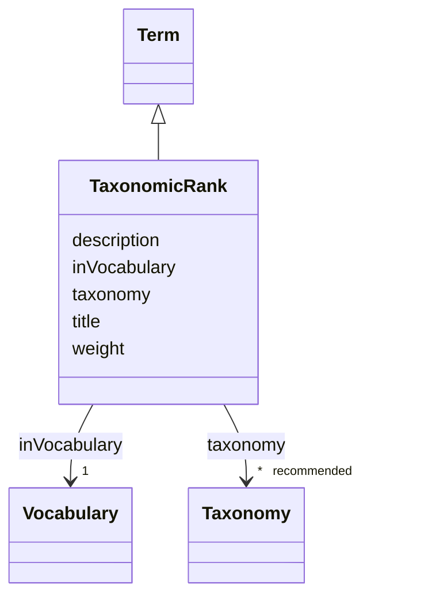

# Class: Taxonomic rank (TaxonomicRank)


_The possible taxonomic ranks and their description_


URI: [EVORAO:TaxonomicRank](https://raw.githubusercontent.com/EVORA-project/evora-ontology/refs/heads/main/models/owl/evora_ontology.owl.ttl#TaxonomicRank)





## Inheritance
* [Resource](Resource.md)
    * [Term](Term.md)
        * **TaxonomicRank**


## Slots

| Name | Cardinality and Range | Description | Inheritance |
| ---  | --- | --- | --- |
| [taxonomy](taxonomy.md) | * _recommended_ <br/> [Taxonomy](Taxonomy.md) | The taxonomy release(s) in which this entity exists | direct |
| [title](title.md) | 1 <br/> [String](String.md) | A name given to the resource | [Term](Term.md) |
| [description](description.md) | 0..1 _recommended_ <br/> [String](String.md) | A short explanation of the characteristics, features, or nature of the curren... | [Term](Term.md) |
| [weight](weight.md) | 1 <br/> [Integer](Integer.md) | A numerical value indicating relative importance or priority, generally proce... | [Term](Term.md) |
| [inVocabulary](inVocabulary.md) | 1 <br/> [Vocabulary](Vocabulary.md) | Terms belong to a specific vocabulary | [Term](Term.md) |


## Usages

| used by | used in | type | used |
| ---  | --- | --- | --- |
| [Taxonomy](Taxonomy.md) | [rank](rank.md) | range | [TaxonomicRank](TaxonomicRank.md) |
| [Taxon](Taxon.md) | [rank](rank.md) | range | [TaxonomicRank](TaxonomicRank.md) |


## Comments

* Use of Data provider recommended

## Identifier and Mapping Information


### Schema Source


* from schema: https://raw.githubusercontent.com/EVORA-project/evora-ontology/refs/heads/main/models/owl/evora_ontology.owl.ttl#


## Mappings

| Mapping Type | Mapped Value |
| ---  | ---  |
| self | EVORAO:TaxonomicRank |
| native | EVORAO:TaxonomicRank |
| close | wd:Q427626, wd:Q427626 |


## LinkML Source

<!-- TODO: investigate https://stackoverflow.com/questions/37606292/how-to-create-tabbed-code-blocks-in-mkdocs-or-sphinx -->

### Direct

<details>
```yaml
name: TaxonomicRank
description: The possible taxonomic ranks and their description
title: Taxonomic rank
comments:
- Use of Data provider recommended
from_schema: https://raw.githubusercontent.com/EVORA-project/evora-ontology/refs/heads/main/models/owl/evora_ontology.owl.ttl#
close_mappings:
- wd:Q427626
- wd:Q427626
is_a: Term
slots:
- taxonomy
slot_usage:
  taxonomy:
    name: taxonomy
    description: The taxonomy release(s) in which this entity exists
    title: taxonomy
    domain_of:
    - TaxonomicRank
    - Taxon
    range: Taxonomy
    required: false
    multivalued: true

```
</details>

### Induced

<details>
```yaml
name: TaxonomicRank
description: The possible taxonomic ranks and their description
title: Taxonomic rank
comments:
- Use of Data provider recommended
from_schema: https://raw.githubusercontent.com/EVORA-project/evora-ontology/refs/heads/main/models/owl/evora_ontology.owl.ttl#
close_mappings:
- wd:Q427626
- wd:Q427626
is_a: Term
slot_usage:
  taxonomy:
    name: taxonomy
    description: The taxonomy release(s) in which this entity exists
    title: taxonomy
    domain_of:
    - TaxonomicRank
    - Taxon
    range: Taxonomy
    required: false
    multivalued: true
attributes:
  taxonomy:
    name: taxonomy
    description: The taxonomy release(s) in which this entity exists
    title: taxonomy
    from_schema: https://raw.githubusercontent.com/EVORA-project/evora-ontology/refs/heads/main/models/owl/evora_ontology.owl.ttl#
    rank: 1000
    alias: taxonomy
    owner: TaxonomicRank
    domain_of:
    - TaxonomicRank
    - Taxon
    range: Taxonomy
    required: false
    recommended: true
    multivalued: true
  title:
    name: title
    description: A name given to the resource
    title: title
    comments:
    - 'The title of the item should be as short and descriptive as possible. E.g.
      for virus products it should basically be based on the following Pattern:

      ''Virus name'', ''virus host type'', ''collection year'', ''country of collection''
      ex ''suspected epidemiological origin'', ''genotype'', ''strain'', ''variant
      name or specific feature'
    from_schema: https://raw.githubusercontent.com/EVORA-project/evora-ontology/refs/heads/main/models/owl/evora_ontology.owl.ttl#
    close_mappings:
    - rdfs:label
    rank: 1000
    slot_uri: dct:title
    alias: title
    owner: TaxonomicRank
    domain_of:
    - Term
    - Dataset
    - DataService
    - Publication
    - License
    - Certification
    range: string
    required: true
    multivalued: false
  description:
    name: description
    description: A short explanation of the characteristics, features, or nature of
      the current item
    title: description
    comments:
    - 'Describe this item in few lines. This description will serve as a summary to
      present the resource.

      '
    from_schema: https://raw.githubusercontent.com/EVORA-project/evora-ontology/refs/heads/main/models/owl/evora_ontology.owl.ttl#
    rank: 1000
    slot_uri: dct:description
    alias: description
    owner: TaxonomicRank
    domain_of:
    - Term
    - Dataset
    - DataService
    - PersonOrOrganization
    - File
    - ContactPoint
    - License
    - Certification
    range: string
    required: false
    recommended: true
    multivalued: false
  weight:
    name: weight
    description: A numerical value indicating relative importance or priority, generally
      processed in ascending order. This weight helps prioritize content when organizing
      or processing data. Its value can be negative, with a default set to 0
    title: weight
    comments:
    - The lowest weighted Data providers are triggered first, this may be usefull
      to populate at first entities that are referenced by others (e.g. Version ahead
      of Rank ahead of Taxon)
    from_schema: https://raw.githubusercontent.com/EVORA-project/evora-ontology/refs/heads/main/models/owl/evora_ontology.owl.ttl#
    close_mappings:
    - adms:status
    rank: 1000
    ifabsent: int(0)
    alias: weight
    owner: TaxonomicRank
    domain_of:
    - Term
    - DataProvider
    range: integer
    required: true
    multivalued: false
  inVocabulary:
    name: inVocabulary
    description: Terms belong to a specific vocabulary
    title: in Vocabulary
    from_schema: https://raw.githubusercontent.com/EVORA-project/evora-ontology/refs/heads/main/models/owl/evora_ontology.owl.ttl#
    close_mappings:
    - wdp:P972
    rank: 1000
    alias: inVocabulary
    owner: TaxonomicRank
    domain_of:
    - Term
    range: Vocabulary
    required: true
    multivalued: false

```
</details>