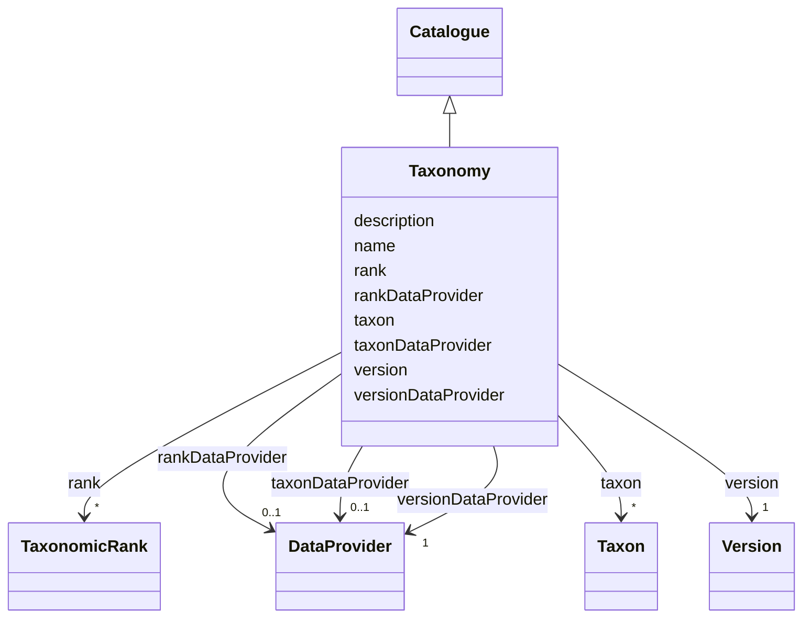

# Class: Taxonomy (Taxonomy)


_Science of naming, defining and classifying organisms_


URI: [EVORAO:Taxonomy](https://raw.githubusercontent.com/EVORA-project/evora-ontology/refs/heads/main/models/owl/evora_ontology.owl.ttl#Taxonomy)





## Inheritance
* [Resource](Resource.md)
    * [Dataset](Dataset.md)
        * [Catalogue](Catalogue.md)
            * **Taxonomy**


## Slots

| Name | Cardinality and Range | Description | Inheritance |
| ---  | --- | --- | --- |
| [taxon](taxon.md) | * <br/> [Taxon](Taxon.md) | Scientifically classified group or entity within the reference taxonomy | direct |
| [taxonDataProvider](taxonDataProvider.md) | 0..1 <br/> [DataProvider](DataProvider.md) | The data provider for the taxons of the taxonomy | direct |
| [version](version.md) | 1 <br/> [Version](Version.md) | The version of this instance of entity | direct |
| [versionDataProvider](versionDataProvider.md) | 1 <br/> [DataProvider](DataProvider.md) | The data provider for the Version ID of this taxonomy | direct |
| [rank](rank.md) | * <br/> [TaxonomicRank](TaxonomicRank.md) | Relative level or position of the identified taxon in the taxonomy | direct |
| [rankDataProvider](rankDataProvider.md) | 0..1 <br/> [DataProvider](DataProvider.md) | The data provider for the description of the taxonomic ranks used in this tax... | direct |
| [name](name.md) | 1 <br/> [String](String.md) | The label that allows humans to identify the current item | [Catalogue](Catalogue.md) |
| [description](description.md) | 0..1 _recommended_ <br/> [String](String.md) | A short explanation of the characteristics, features, or nature of the curren... | [Catalogue](Catalogue.md) |


## Usages

| used by | used in | type | used |
| ---  | --- | --- | --- |
| [TaxonomicRank](TaxonomicRank.md) | [taxonomy](taxonomy.md) | range | [Taxonomy](Taxonomy.md) |
| [Taxon](Taxon.md) | [taxonomy](taxonomy.md) | range | [Taxonomy](Taxonomy.md) |


## Identifier and Mapping Information


### Schema Source


* from schema: https://raw.githubusercontent.com/EVORA-project/evora-ontology/refs/heads/main/models/owl/evora_ontology.owl.ttl#


## Mappings

| Mapping Type | Mapped Value |
| ---  | ---  |
| self | EVORAO:Taxonomy |
| native | EVORAO:Taxonomy |
| close | wd:Q8269924, skos:Collection, wd:Q8269924, skos:Collection |


## LinkML Source

<!-- TODO: investigate https://stackoverflow.com/questions/37606292/how-to-create-tabbed-code-blocks-in-mkdocs-or-sphinx -->

### Direct

<details>
```yaml
name: Taxonomy
description: Science of naming, defining and classifying organisms
title: Taxonomy
from_schema: https://raw.githubusercontent.com/EVORA-project/evora-ontology/refs/heads/main/models/owl/evora_ontology.owl.ttl#
close_mappings:
- wd:Q8269924
- skos:Collection
- wd:Q8269924
- skos:Collection
is_a: Catalogue
slots:
- taxon
- taxonDataProvider
- version
- versionDataProvider
- rank
- rankDataProvider
slot_usage:
  taxon:
    name: taxon
    description: Scientifically classified group or entity within the reference taxonomy
    title: taxon
    close_mappings:
    - dwc:Taxon
    domain_of:
    - Taxonomy
    - PathogenIdentification
    range: Taxon
    required: false
    multivalued: true
  taxonDataProvider:
    name: taxonDataProvider
    description: The data provider for the taxons of the taxonomy
    title: taxon data provider
    domain_of:
    - Taxonomy
    range: DataProvider
    required: false
    multivalued: false
  version:
    name: version
    description: The version of this instance of entity
    title: version
    domain_of:
    - Taxonomy
    range: Version
    required: true
    multivalued: false
  versionDataProvider:
    name: versionDataProvider
    description: The data provider for the Version ID of this taxonomy
    title: version data provider
    domain_of:
    - Taxonomy
    range: DataProvider
    required: true
    multivalued: false
  rank:
    name: rank
    description: Relative level or position of the identified taxon in the taxonomy
    title: rank
    domain_of:
    - Taxonomy
    - Taxon
    range: TaxonomicRank
    required: false
    multivalued: true
  rankDataProvider:
    name: rankDataProvider
    description: The data provider for the description of the taxonomic ranks used
      in this taxonomy
    title: rank data provider
    domain_of:
    - Taxonomy
    range: DataProvider
    required: false
    multivalued: false

```
</details>

### Induced

<details>
```yaml
name: Taxonomy
description: Science of naming, defining and classifying organisms
title: Taxonomy
from_schema: https://raw.githubusercontent.com/EVORA-project/evora-ontology/refs/heads/main/models/owl/evora_ontology.owl.ttl#
close_mappings:
- wd:Q8269924
- skos:Collection
- wd:Q8269924
- skos:Collection
is_a: Catalogue
slot_usage:
  taxon:
    name: taxon
    description: Scientifically classified group or entity within the reference taxonomy
    title: taxon
    close_mappings:
    - dwc:Taxon
    domain_of:
    - Taxonomy
    - PathogenIdentification
    range: Taxon
    required: false
    multivalued: true
  taxonDataProvider:
    name: taxonDataProvider
    description: The data provider for the taxons of the taxonomy
    title: taxon data provider
    domain_of:
    - Taxonomy
    range: DataProvider
    required: false
    multivalued: false
  version:
    name: version
    description: The version of this instance of entity
    title: version
    domain_of:
    - Taxonomy
    range: Version
    required: true
    multivalued: false
  versionDataProvider:
    name: versionDataProvider
    description: The data provider for the Version ID of this taxonomy
    title: version data provider
    domain_of:
    - Taxonomy
    range: DataProvider
    required: true
    multivalued: false
  rank:
    name: rank
    description: Relative level or position of the identified taxon in the taxonomy
    title: rank
    domain_of:
    - Taxonomy
    - Taxon
    range: TaxonomicRank
    required: false
    multivalued: true
  rankDataProvider:
    name: rankDataProvider
    description: The data provider for the description of the taxonomic ranks used
      in this taxonomy
    title: rank data provider
    domain_of:
    - Taxonomy
    range: DataProvider
    required: false
    multivalued: false
attributes:
  taxon:
    name: taxon
    description: Scientifically classified group or entity within the reference taxonomy
    title: taxon
    comments:
    - The taxon of the highest rank known that can be used to classify a pathogen
      or group of pathogens (e.g viruses) in the reference taxonomy
    from_schema: https://raw.githubusercontent.com/EVORA-project/evora-ontology/refs/heads/main/models/owl/evora_ontology.owl.ttl#
    close_mappings:
    - dwc:Taxon
    rank: 1000
    alias: taxon
    owner: Taxonomy
    domain_of:
    - Taxonomy
    - PathogenIdentification
    range: Taxon
    required: false
    multivalued: true
  taxonDataProvider:
    name: taxonDataProvider
    description: The data provider for the taxons of the taxonomy
    title: taxon data provider
    from_schema: https://raw.githubusercontent.com/EVORA-project/evora-ontology/refs/heads/main/models/owl/evora_ontology.owl.ttl#
    rank: 1000
    alias: taxonDataProvider
    owner: Taxonomy
    domain_of:
    - Taxonomy
    range: DataProvider
    required: false
    multivalued: false
  version:
    name: version
    description: The version of this instance of entity
    title: version
    from_schema: https://raw.githubusercontent.com/EVORA-project/evora-ontology/refs/heads/main/models/owl/evora_ontology.owl.ttl#
    rank: 1000
    alias: version
    owner: Taxonomy
    domain_of:
    - Taxonomy
    range: Version
    required: true
    multivalued: false
  versionDataProvider:
    name: versionDataProvider
    description: The data provider for the Version ID of this taxonomy
    title: version data provider
    from_schema: https://raw.githubusercontent.com/EVORA-project/evora-ontology/refs/heads/main/models/owl/evora_ontology.owl.ttl#
    rank: 1000
    alias: versionDataProvider
    owner: Taxonomy
    domain_of:
    - Taxonomy
    range: DataProvider
    required: true
    multivalued: false
  rank:
    name: rank
    description: Relative level or position of the identified taxon in the taxonomy
    title: rank
    from_schema: https://raw.githubusercontent.com/EVORA-project/evora-ontology/refs/heads/main/models/owl/evora_ontology.owl.ttl#
    exact_mappings:
    - dwc:taxonRank
    rank: 1000
    alias: rank
    owner: Taxonomy
    domain_of:
    - Taxonomy
    - Taxon
    range: TaxonomicRank
    required: false
    multivalued: true
  rankDataProvider:
    name: rankDataProvider
    description: The data provider for the description of the taxonomic ranks used
      in this taxonomy
    title: rank data provider
    from_schema: https://raw.githubusercontent.com/EVORA-project/evora-ontology/refs/heads/main/models/owl/evora_ontology.owl.ttl#
    rank: 1000
    alias: rankDataProvider
    owner: Taxonomy
    domain_of:
    - Taxonomy
    range: DataProvider
    required: false
    multivalued: false
  name:
    name: name
    description: The label that allows humans to identify the current item
    title: name
    comments:
    - 'The title of the item should be as short and descriptive as possible. E.g.
      for virus products it should basically be based on the following Pattern:

      ''Virus name'', ''virus host type'', ''collection year'', ''country of collection''
      ex ''suspected epidemiological origin'', ''genotype'', ''strain'', ''variant
      name or specific feature'
    from_schema: https://raw.githubusercontent.com/EVORA-project/evora-ontology/refs/heads/main/models/owl/evora_ontology.owl.ttl#
    exact_mappings:
    - dct:title
    close_mappings:
    - rdfs:label
    rank: 1000
    alias: name
    owner: Taxonomy
    domain_of:
    - Catalogue
    - DataService
    - Term
    - PersonOrOrganization
    - ProductOrService
    - File
    - ContactPoint
    - License
    - Certification
    range: string
    required: true
    multivalued: false
  description:
    name: description
    description: A short explanation of the characteristics, features, or nature of
      the current item
    title: description
    comments:
    - 'Describe this item in few lines. This description will serve as a summary to
      present the item.

      '
    from_schema: https://raw.githubusercontent.com/EVORA-project/evora-ontology/refs/heads/main/models/owl/evora_ontology.owl.ttl#
    exact_mappings:
    - dct:description
    rank: 1000
    alias: description
    owner: Taxonomy
    domain_of:
    - Catalogue
    - DataService
    - Term
    - PersonOrOrganization
    - ProductOrService
    - File
    - ContactPoint
    - License
    - Certification
    range: string
    required: false
    recommended: true
    multivalued: false

```
</details>