# Class: Term (Term)


_Word or phrase from a specialized area of knowledge_


* __NOTE__: this is an abstract class and should not be instantiated directly


URI: [EVORAO:Term](https://raw.githubusercontent.com/EVORA-project/evora-ontology/refs/heads/main/models/owl/evora_ontology.owl.ttl#Term)

```mermaid
 classDiagram
    class Term
    click Term href "../Term"
      Dataset <|-- Term
        click Dataset href "../Dataset"
      

      Term <|-- CommonName
        click CommonName href "../CommonName"
      Term <|-- AlternateName
        click AlternateName href "../AlternateName"
      Term <|-- RiskGroup
        click RiskGroup href "../RiskGroup"
      Term <|-- DOI
        click DOI href "../DOI"
      Term <|-- Journal
        click Journal href "../Journal"
      Term <|-- PDBReference
        click PDBReference href "../PDBReference"
      Term <|-- Keyword
        click Keyword href "../Keyword"
      Term <|-- ProteinTag
        click ProteinTag href "../ProteinTag"
      Term <|-- SpecialFeature
        click SpecialFeature href "../SpecialFeature"
      Term <|-- ExpressionVector
        click ExpressionVector href "../ExpressionVector"
      Term <|-- PlasmidSelection
        click PlasmidSelection href "../PlasmidSelection"
      Term <|-- PropagationHost
        click PropagationHost href "../PropagationHost"
      Term <|-- TransmissionMethod
        click TransmissionMethod href "../TransmissionMethod"
      Term <|-- ProductionCellLine
        click ProductionCellLine href "../ProductionCellLine"
      Term <|-- ProductCategory
        click ProductCategory href "../ProductCategory"
      Term <|-- IsolationHost
        click IsolationHost href "../IsolationHost"
      Term <|-- GeographicalOrigin
        click GeographicalOrigin href "../GeographicalOrigin"
      Term <|-- Country
        click Country href "../Country"
      Term <|-- IATAClassification
        click IATAClassification href "../IATAClassification"
      Term <|-- TaxonomicRank
        click TaxonomicRank href "../TaxonomicRank"
      Term <|-- Taxon
        click Taxon href "../Taxon"
      
      
      Term : description
        
      Term : inVocabulary
        
          
    
    
    Term --> "1" Vocabulary : inVocabulary
    click Vocabulary href "../Vocabulary"

        
      Term : name
        
      Term : weight
        
      
```





## Inheritance
* [Resource](Resource.md)
    * [Dataset](Dataset.md)
        * **Term**
            * [CommonName](CommonName.md)
            * [AlternateName](AlternateName.md)
            * [RiskGroup](RiskGroup.md)
            * [DOI](DOI.md)
            * [Journal](Journal.md)
            * [PDBReference](PDBReference.md)
            * [Keyword](Keyword.md)
            * [ProteinTag](ProteinTag.md)
            * [SpecialFeature](SpecialFeature.md)
            * [ExpressionVector](ExpressionVector.md)
            * [PlasmidSelection](PlasmidSelection.md)
            * [PropagationHost](PropagationHost.md)
            * [TransmissionMethod](TransmissionMethod.md)
            * [ProductionCellLine](ProductionCellLine.md)
            * [ProductCategory](ProductCategory.md)
            * [IsolationHost](IsolationHost.md)
            * [GeographicalOrigin](GeographicalOrigin.md)
            * [Country](Country.md)
            * [IATAClassification](IATAClassification.md)
            * [TaxonomicRank](TaxonomicRank.md)
            * [Taxon](Taxon.md)


## Slots

| Name | Cardinality and Range | Description | Inheritance |
| ---  | --- | --- | --- |
| [name](name.md) | 1 <br/> [String](String.md) | The label that allows humans to identify the current item | direct |
| [description](description.md) | 0..1 _recommended_ <br/> [String](String.md) | A short explanation of the characteristics, features, or nature of the curren... | direct |
| [weight](weight.md) | 1 <br/> [Integer](Integer.md) | A numerical value indicating relative importance or priority, generally proce... | direct |
| [inVocabulary](inVocabulary.md) | 1 <br/> [Vocabulary](Vocabulary.md) | Terms belong to a specific vocabulary | direct |


## Usages

| used by | used in | type | used |
| ---  | --- | --- | --- |
| [Vocabulary](Vocabulary.md) | [term](term.md) | range | [Term](Term.md) |


## Identifier and Mapping Information


### Schema Source


* from schema: https://raw.githubusercontent.com/EVORA-project/evora-ontology/refs/heads/main/models/owl/evora_ontology.owl.ttl#


## Mappings

| Mapping Type | Mapped Value |
| ---  | ---  |
| self | EVORAO:Term |
| native | EVORAO:Term |
| close | wd:Q1969448 |


## LinkML Source

<!-- TODO: investigate https://stackoverflow.com/questions/37606292/how-to-create-tabbed-code-blocks-in-mkdocs-or-sphinx -->

### Direct

<details>
```yaml
name: Term
description: Word or phrase from a specialized area of knowledge
title: Term
from_schema: https://raw.githubusercontent.com/EVORA-project/evora-ontology/refs/heads/main/models/owl/evora_ontology.owl.ttl#
close_mappings:
- wd:Q1969448
is_a: Dataset
abstract: true
slots:
- name
- description
- weight
- inVocabulary
slot_usage:
  name:
    name: name
    description: The label that allows humans to identify the current item
    title: name
    comments:
    - 'The title of the item should be as short and descriptive as possible. E.g.
      for virus products it should basically be based on the following Pattern:

      "Virus name", "virus host type", "collection year", "country of collection"
      ex "suspected epidemiological origin", "genotype", "strain", "variant name or
      specific feature"'
    exact_mappings:
    - dct:title
    close_mappings:
    - rdfs:label
    domain_of:
    - Term
    - DataService
    - Catalogue
    - PersonOrOrganization
    - ProductOrService
    - File
    - ContactPoint
    - License
    - Certification
    range: string
    required: true
    multivalued: false
  description:
    name: description
    description: A short explanation of the characteristics, features, or nature of
      the current item
    title: description
    comments:
    - 'Describe this item in few lines. This description will serve as a summary to
      present the item.

      '
    exact_mappings:
    - dct:description
    domain_of:
    - Term
    - DataService
    - Catalogue
    - PersonOrOrganization
    - ProductOrService
    - File
    - ContactPoint
    - License
    - Certification
    range: string
    required: false
    recommended: true
    multivalued: false
  weight:
    name: weight
    description: A numerical value indicating relative importance or priority, generally
      processed in ascending order. This weight helps prioritize content when organizing
      or processing data. Its value can be negative, with a default set to 0
    title: weight
    close_mappings:
    - adms:status
    ifabsent: int(0)
    domain_of:
    - Term
    - DataProvider
    range: integer
    required: true
    multivalued: false
  inVocabulary:
    name: inVocabulary
    description: Terms belong to a specific vocabulary
    title: in Vocabulary
    close_mappings:
    - wdp:P972
    domain_of:
    - Term
    range: Vocabulary
    required: true
    multivalued: false

```
</details>

### Induced

<details>
```yaml
name: Term
description: Word or phrase from a specialized area of knowledge
title: Term
from_schema: https://raw.githubusercontent.com/EVORA-project/evora-ontology/refs/heads/main/models/owl/evora_ontology.owl.ttl#
close_mappings:
- wd:Q1969448
is_a: Dataset
abstract: true
slot_usage:
  name:
    name: name
    description: The label that allows humans to identify the current item
    title: name
    comments:
    - 'The title of the item should be as short and descriptive as possible. E.g.
      for virus products it should basically be based on the following Pattern:

      "Virus name", "virus host type", "collection year", "country of collection"
      ex "suspected epidemiological origin", "genotype", "strain", "variant name or
      specific feature"'
    exact_mappings:
    - dct:title
    close_mappings:
    - rdfs:label
    domain_of:
    - Term
    - DataService
    - Catalogue
    - PersonOrOrganization
    - ProductOrService
    - File
    - ContactPoint
    - License
    - Certification
    range: string
    required: true
    multivalued: false
  description:
    name: description
    description: A short explanation of the characteristics, features, or nature of
      the current item
    title: description
    comments:
    - 'Describe this item in few lines. This description will serve as a summary to
      present the item.

      '
    exact_mappings:
    - dct:description
    domain_of:
    - Term
    - DataService
    - Catalogue
    - PersonOrOrganization
    - ProductOrService
    - File
    - ContactPoint
    - License
    - Certification
    range: string
    required: false
    recommended: true
    multivalued: false
  weight:
    name: weight
    description: A numerical value indicating relative importance or priority, generally
      processed in ascending order. This weight helps prioritize content when organizing
      or processing data. Its value can be negative, with a default set to 0
    title: weight
    close_mappings:
    - adms:status
    ifabsent: int(0)
    domain_of:
    - Term
    - DataProvider
    range: integer
    required: true
    multivalued: false
  inVocabulary:
    name: inVocabulary
    description: Terms belong to a specific vocabulary
    title: in Vocabulary
    close_mappings:
    - wdp:P972
    domain_of:
    - Term
    range: Vocabulary
    required: true
    multivalued: false
attributes:
  name:
    name: name
    description: The label that allows humans to identify the current item
    title: name
    comments:
    - 'The title of the item should be as short and descriptive as possible. E.g.
      for virus products it should basically be based on the following Pattern:

      "Virus name", "virus host type", "collection year", "country of collection"
      ex "suspected epidemiological origin", "genotype", "strain", "variant name or
      specific feature"'
    from_schema: https://raw.githubusercontent.com/EVORA-project/evora-ontology/refs/heads/main/models/owl/evora_ontology.owl.ttl#
    exact_mappings:
    - dct:title
    close_mappings:
    - rdfs:label
    rank: 1000
    alias: name
    owner: Term
    domain_of:
    - Term
    - DataService
    - Catalogue
    - PersonOrOrganization
    - ProductOrService
    - File
    - ContactPoint
    - License
    - Certification
    range: string
    required: true
    multivalued: false
  description:
    name: description
    description: A short explanation of the characteristics, features, or nature of
      the current item
    title: description
    comments:
    - 'Describe this item in few lines. This description will serve as a summary to
      present the item.

      '
    from_schema: https://raw.githubusercontent.com/EVORA-project/evora-ontology/refs/heads/main/models/owl/evora_ontology.owl.ttl#
    exact_mappings:
    - dct:description
    rank: 1000
    alias: description
    owner: Term
    domain_of:
    - Term
    - DataService
    - Catalogue
    - PersonOrOrganization
    - ProductOrService
    - File
    - ContactPoint
    - License
    - Certification
    range: string
    required: false
    recommended: true
    multivalued: false
  weight:
    name: weight
    description: A numerical value indicating relative importance or priority, generally
      processed in ascending order. This weight helps prioritize content when organizing
      or processing data. Its value can be negative, with a default set to 0
    title: weight
    from_schema: https://raw.githubusercontent.com/EVORA-project/evora-ontology/refs/heads/main/models/owl/evora_ontology.owl.ttl#
    close_mappings:
    - adms:status
    rank: 1000
    ifabsent: int(0)
    alias: weight
    owner: Term
    domain_of:
    - Term
    - DataProvider
    range: integer
    required: true
    multivalued: false
  inVocabulary:
    name: inVocabulary
    description: Terms belong to a specific vocabulary
    title: in Vocabulary
    from_schema: https://raw.githubusercontent.com/EVORA-project/evora-ontology/refs/heads/main/models/owl/evora_ontology.owl.ttl#
    close_mappings:
    - wdp:P972
    rank: 1000
    alias: inVocabulary
    owner: Term
    domain_of:
    - Term
    range: Vocabulary
    required: true
    multivalued: false

```
</details>