# Class: Term (Term) 


_Word or phrase from a specialized area of knowledge_


* __NOTE__: this is an abstract class and should not be instantiated directly


URI: [EVORAO:Term](https://w3id.org/evorao/Term)

```mermaid
 classDiagram
    class Term
    click Term href "../Term"
      Resource <|-- Term
        click Resource href "../Resource"
      

      Term <|-- CommonName
        click CommonName href "../CommonName"
      Term <|-- AlternateName
        click AlternateName href "../AlternateName"
      Term <|-- RiskGroup
        click RiskGroup href "../RiskGroup"
      Term <|-- Doi
        click Doi href "../Doi"
      Term <|-- Journal
        click Journal href "../Journal"
      Term <|-- PdbReference
        click PdbReference href "../PdbReference"
      Term <|-- Keyword
        click Keyword href "../Keyword"
      Term <|-- TagSequence
        click TagSequence href "../TagSequence"
      Term <|-- SpecialFeature
        click SpecialFeature href "../SpecialFeature"
      Term <|-- ExpressionVector
        click ExpressionVector href "../ExpressionVector"
      Term <|-- PlasmidSelection
        click PlasmidSelection href "../PlasmidSelection"
      Term <|-- PropagationHost
        click PropagationHost href "../PropagationHost"
      Term <|-- TransmissionMethod
        click TransmissionMethod href "../TransmissionMethod"
      Term <|-- ProductionCellLine
        click ProductionCellLine href "../ProductionCellLine"
      Term <|-- ProductCategory
        click ProductCategory href "../ProductCategory"
      Term <|-- IsolationHost
        click IsolationHost href "../IsolationHost"
      Term <|-- GeographicalOrigin
        click GeographicalOrigin href "../GeographicalOrigin"
      Term <|-- Country
        click Country href "../Country"
      Term <|-- IataClassification
        click IataClassification href "../IataClassification"
      Term <|-- TaxonomicRank
        click TaxonomicRank href "../TaxonomicRank"
      Term <|-- Taxon
        click Taxon href "../Taxon"
      
      
      Term : description
        
      Term : inVocabulary
        
          
    
    
    Term --> "1" Vocabulary : inVocabulary
    click Vocabulary href "../Vocabulary"

        
      Term : keyword
        
      Term : title
        
      Term : weight
        
      
```





## Inheritance
* [Resource](Resource.md)
    * **Term**
        * [CommonName](CommonName.md)
        * [AlternateName](AlternateName.md)
        * [RiskGroup](RiskGroup.md)
        * [Doi](Doi.md)
        * [Journal](Journal.md)
        * [PdbReference](PdbReference.md)
        * [Keyword](Keyword.md)
        * [TagSequence](TagSequence.md)
        * [SpecialFeature](SpecialFeature.md)
        * [ExpressionVector](ExpressionVector.md)
        * [PlasmidSelection](PlasmidSelection.md)
        * [PropagationHost](PropagationHost.md)
        * [TransmissionMethod](TransmissionMethod.md)
        * [ProductionCellLine](ProductionCellLine.md)
        * [ProductCategory](ProductCategory.md)
        * [IsolationHost](IsolationHost.md)
        * [GeographicalOrigin](GeographicalOrigin.md)
        * [Country](Country.md)
        * [IataClassification](IataClassification.md)
        * [TaxonomicRank](TaxonomicRank.md)
        * [Taxon](Taxon.md)


## Slots

| Name | Cardinality and Range | Description | Inheritance |
| ---  | --- | --- | --- |
| [title](title.md) | 1 <br/> [String](String.md) | A name given to the resource | direct |
| [description](description.md) | 0..1 _recommended_ <br/> [String](String.md) | A short explanation of the characteristics, features, or nature of the curren... | direct |
| [weight](weight.md) | 1 <br/> [Integer](Integer.md) | A numerical value indicating relative importance or priority, generally proce... | direct |
| [inVocabulary](inVocabulary.md) | 1 <br/> [Vocabulary](Vocabulary.md) | Terms belong to a specific vocabulary | direct |
| [keyword](keyword.md) | * <br/> [String](String.md) | A keyword or tag describing the resource | [Resource](Resource.md) |


## Usages

| used by | used in | type | used |
| ---  | --- | --- | --- |
| [Vocabulary](Vocabulary.md) | [term](term.md) | range | [Term](Term.md) |


## Identifier and Mapping Information


### Schema Source


* from schema: https://w3id.org/evorao/


## Mappings

| Mapping Type | Mapped Value |
| ---  | ---  |
| self | EVORAO:Term |
| native | EVORAO:Term |
| exact | sio:000275, ncit:C45559, wd:Q1969448, sio:000275, ncit:C45559, wd:Q1969448 |
| narrow | wd:Q12812139, wd:Q12812139 |


## LinkML Source

<!-- TODO: investigate https://stackoverflow.com/questions/37606292/how-to-create-tabbed-code-blocks-in-mkdocs-or-sphinx -->

### Direct

<details>
```yaml
name: Term
description: Word or phrase from a specialized area of knowledge
title: Term
from_schema: https://w3id.org/evorao/
exact_mappings:
- sio:000275
- ncit:C45559
- wd:Q1969448
- sio:000275
- ncit:C45559
- wd:Q1969448
narrow_mappings:
- wd:Q12812139
- wd:Q12812139
is_a: Resource
abstract: true
slots:
- title
- description
- weight
- inVocabulary
slot_usage:
  title:
    name: title
    description: A name given to the resource
    title: title
    comments:
    - 'The title of the item should be as short and descriptive as possible. E.g.
      for virus products it should basically be based on the following Pattern: ''Virus
      name'', ''virus host type'', ''collection year'', ''country of collection''
      ex ''suspected epidemiological origin'', ''genotype'', ''strain'', ''variant
      name or specific feature'
    exact_mappings:
    - schema:name
    - rdfs:label
    slot_uri: dct:title
    domain_of:
    - Term
    - Dataset
    - DataService
    - Publication
    - License
    - Certification
    range: string
    required: true
    multivalued: false
  description:
    name: description
    description: A short explanation of the characteristics, features, or nature of
      the current item
    title: description
    comments:
    - Describe this item in few lines. This description will serve as a summary to
      present the resource.
    exact_mappings:
    - schema:description
    slot_uri: dct:description
    domain_of:
    - Term
    - Dataset
    - DataService
    - PersonOrOrganization
    - File
    - ContactPoint
    - License
    - Certification
    range: string
    required: false
    recommended: true
    multivalued: false
  weight:
    name: weight
    description: A numerical value indicating relative importance or priority, generally
      processed in ascending order. This weight helps prioritize content when organizing
      or processing data. Its value can be negative, with a default set to 0
    title: weight
    close_mappings:
    - adms:status
    ifabsent: int(0)
    domain_of:
    - Term
    - DataProvider
    range: integer
    required: true
    multivalued: false
  inVocabulary:
    name: inVocabulary
    description: Terms belong to a specific vocabulary
    title: in Vocabulary
    close_mappings:
    - wdp:P972
    related_mappings:
    - dct:isReferencedBy
    broad_mappings:
    - dct:isPartOf
    domain_of:
    - Term
    range: Vocabulary
    required: true
    multivalued: false

```
</details>

### Induced

<details>
```yaml
name: Term
description: Word or phrase from a specialized area of knowledge
title: Term
from_schema: https://w3id.org/evorao/
exact_mappings:
- sio:000275
- ncit:C45559
- wd:Q1969448
- sio:000275
- ncit:C45559
- wd:Q1969448
narrow_mappings:
- wd:Q12812139
- wd:Q12812139
is_a: Resource
abstract: true
slot_usage:
  title:
    name: title
    description: A name given to the resource
    title: title
    comments:
    - 'The title of the item should be as short and descriptive as possible. E.g.
      for virus products it should basically be based on the following Pattern: ''Virus
      name'', ''virus host type'', ''collection year'', ''country of collection''
      ex ''suspected epidemiological origin'', ''genotype'', ''strain'', ''variant
      name or specific feature'
    exact_mappings:
    - schema:name
    - rdfs:label
    slot_uri: dct:title
    domain_of:
    - Term
    - Dataset
    - DataService
    - Publication
    - License
    - Certification
    range: string
    required: true
    multivalued: false
  description:
    name: description
    description: A short explanation of the characteristics, features, or nature of
      the current item
    title: description
    comments:
    - Describe this item in few lines. This description will serve as a summary to
      present the resource.
    exact_mappings:
    - schema:description
    slot_uri: dct:description
    domain_of:
    - Term
    - Dataset
    - DataService
    - PersonOrOrganization
    - File
    - ContactPoint
    - License
    - Certification
    range: string
    required: false
    recommended: true
    multivalued: false
  weight:
    name: weight
    description: A numerical value indicating relative importance or priority, generally
      processed in ascending order. This weight helps prioritize content when organizing
      or processing data. Its value can be negative, with a default set to 0
    title: weight
    close_mappings:
    - adms:status
    ifabsent: int(0)
    domain_of:
    - Term
    - DataProvider
    range: integer
    required: true
    multivalued: false
  inVocabulary:
    name: inVocabulary
    description: Terms belong to a specific vocabulary
    title: in Vocabulary
    close_mappings:
    - wdp:P972
    related_mappings:
    - dct:isReferencedBy
    broad_mappings:
    - dct:isPartOf
    domain_of:
    - Term
    range: Vocabulary
    required: true
    multivalued: false
attributes:
  title:
    name: title
    description: A name given to the resource
    title: title
    comments:
    - 'The title of the item should be as short and descriptive as possible. E.g.
      for virus products it should basically be based on the following Pattern: ''Virus
      name'', ''virus host type'', ''collection year'', ''country of collection''
      ex ''suspected epidemiological origin'', ''genotype'', ''strain'', ''variant
      name or specific feature'
    from_schema: https://w3id.org/evorao/
    exact_mappings:
    - schema:name
    - rdfs:label
    rank: 1000
    slot_uri: dct:title
    alias: title
    owner: Term
    domain_of:
    - Term
    - Dataset
    - DataService
    - Publication
    - License
    - Certification
    range: string
    required: true
    multivalued: false
  description:
    name: description
    description: A short explanation of the characteristics, features, or nature of
      the current item
    title: description
    comments:
    - Describe this item in few lines. This description will serve as a summary to
      present the resource.
    from_schema: https://w3id.org/evorao/
    exact_mappings:
    - schema:description
    close_mappings:
    - schema:description
    rank: 1000
    slot_uri: dct:description
    alias: description
    owner: Term
    domain_of:
    - Term
    - Dataset
    - DataService
    - PersonOrOrganization
    - File
    - ContactPoint
    - License
    - Certification
    range: string
    required: false
    recommended: true
    multivalued: false
  weight:
    name: weight
    description: A numerical value indicating relative importance or priority, generally
      processed in ascending order. This weight helps prioritize content when organizing
      or processing data. Its value can be negative, with a default set to 0
    title: weight
    comments:
    - The lowest weighted Data providers are triggered first, this may be usefull
      to populate at first entities that are referenced by others (e.g. Version ahead
      of Rank ahead of Taxon)
    from_schema: https://w3id.org/evorao/
    close_mappings:
    - adms:status
    rank: 1000
    ifabsent: int(0)
    alias: weight
    owner: Term
    domain_of:
    - Term
    - DataProvider
    range: integer
    required: true
    multivalued: false
  inVocabulary:
    name: inVocabulary
    description: Terms belong to a specific vocabulary
    title: in Vocabulary
    from_schema: https://w3id.org/evorao/
    close_mappings:
    - wdp:P972
    related_mappings:
    - dct:isReferencedBy
    broad_mappings:
    - dct:isPartOf
    rank: 1000
    alias: inVocabulary
    owner: Term
    domain_of:
    - Term
    range: Vocabulary
    required: true
    multivalued: false
  keyword:
    name: keyword
    description: A keyword or tag describing the resource
    title: keyword
    from_schema: https://w3id.org/evorao/
    rank: 1000
    slot_uri: dcat:keyword
    alias: keyword
    owner: Term
    domain_of:
    - Resource
    range: string
    required: false
    multivalued: true

```
</details>