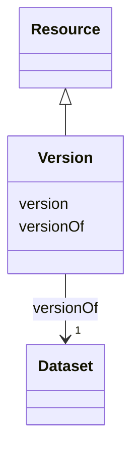

# Class: Version (Version) 


_Numeric code assigned to identify a particular historical version of a work (e.g. software or technical standards)_


URI: [EVORAO:Version](https://w3id.org/evorao/Version)





## Inheritance
* [Resource](Resource.md)
    * **Version**


## Slots

| Name | Cardinality and Range | Description | Inheritance |
| ---  | --- | --- | --- |
| [version](version.md) | 1 _recommended_ <br/> [String](String.md) | The version indicator (name or identifier) of a resource | direct |
| [versionOf](versionOf.md) | 1 <br/> [Dataset](Dataset.md) | Identifier of what type of entities the version qualifies | direct |


## Identifier and Mapping Information


### Schema Source


* from schema: https://w3id.org/evorao/


## Mappings

| Mapping Type | Mapped Value |
| ---  | ---  |
| self | EVORAO:Version |
| native | EVORAO:Version |
| close | wd:Q114469879, wd:Q114469879 |


## LinkML Source

<!-- TODO: investigate https://stackoverflow.com/questions/37606292/how-to-create-tabbed-code-blocks-in-mkdocs-or-sphinx -->

### Direct

<details>
```yaml
name: Version
description: Numeric code assigned to identify a particular historical version of
  a work (e.g. software or technical standards)
title: Version
from_schema: https://w3id.org/evorao/
close_mappings:
- wd:Q114469879
- wd:Q114469879
is_a: Resource
slots:
- version
- versionOf
slot_usage:
  version:
    name: version
    description: The version indicator (name or identifier) of a resource
    title: version
    close_mappings:
    - wdp:P393
    - schema:version
    slot_uri: dcat:version
    domain_of:
    - Version
    - Dataset
    - Taxonomy
    range: string
    required: true
    multivalued: false
  versionOf:
    name: versionOf
    description: Identifier of what type of entities the version qualifies
    title: version Of
    domain_of:
    - Version
    range: Dataset
    required: true
    multivalued: false

```
</details>

### Induced

<details>
```yaml
name: Version
description: Numeric code assigned to identify a particular historical version of
  a work (e.g. software or technical standards)
title: Version
from_schema: https://w3id.org/evorao/
close_mappings:
- wd:Q114469879
- wd:Q114469879
is_a: Resource
slot_usage:
  version:
    name: version
    description: The version indicator (name or identifier) of a resource
    title: version
    close_mappings:
    - wdp:P393
    - schema:version
    slot_uri: dcat:version
    domain_of:
    - Version
    - Dataset
    - Taxonomy
    range: string
    required: true
    multivalued: false
  versionOf:
    name: versionOf
    description: Identifier of what type of entities the version qualifies
    title: version Of
    domain_of:
    - Version
    range: Dataset
    required: true
    multivalued: false
attributes:
  version:
    name: version
    description: The version indicator (name or identifier) of a resource
    title: version
    from_schema: https://w3id.org/evorao/
    close_mappings:
    - wdp:P393
    - schema:version
    rank: 1000
    slot_uri: dcat:version
    alias: version
    owner: Version
    domain_of:
    - Version
    - Dataset
    - Taxonomy
    range: string
    required: true
    recommended: true
    multivalued: false
  versionOf:
    name: versionOf
    description: Identifier of what type of entities the version qualifies
    title: version Of
    from_schema: https://w3id.org/evorao/
    rank: 1000
    alias: versionOf
    owner: Version
    domain_of:
    - Version
    range: Dataset
    required: true
    multivalued: false

```
</details>