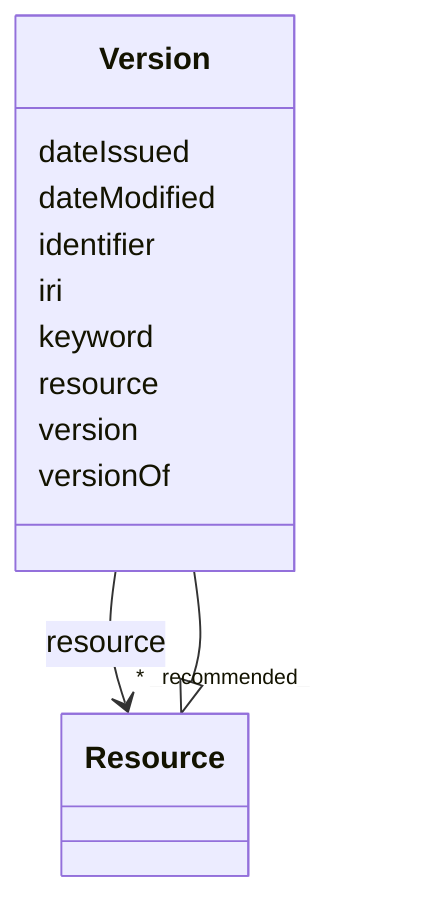

# Class: Version (Version) 


_Numeric code assigned to identify a particular historical version of a work (e.g. software or technical standards)._


URI: [EVORAO:Version](https://w3id.org/evorao/Version)





## Inheritance
* [Resource](Resource.md)
    * **Version**


## Slots

| Name | Cardinality and Range | Description | Inheritance |
| ---  | --- | --- | --- |
| [version](version.md) | 1 _recommended_ <br/> [String](String.md) | The version indicator (name or identifier) of a resource | direct |
| [versionOf](versionOf.md) | 1 <br/> [String](String.md) | Identifier of what type of entities the version qualifies | direct |
| [resource](resource.md) | * _recommended_ <br/> [Resource](Resource.md) | Resource published or curated by a single agent | direct |
| [keyword](keyword.md) | * <br/> [String](String.md) | A keyword or tag describing the resource | [Resource](Resource.md) |
| [dateIssued](dateIssued.md) | 0..1 <br/> [Datetime](Datetime.md) | Date of formal issuance (e | [Resource](Resource.md) |
| [dateModified](dateModified.md) | 0..1 <br/> [Datetime](Datetime.md) | Most recent date on which the resource was changed, updated or modified | [Resource](Resource.md) |
| [identifier](identifier.md) | * <br/> [String](String.md) | A unique identifier of the resource being described or cataloged | [Resource](Resource.md) |
| [iri](iri.md) | * <br/> [Uri](Uri.md) | International Resource Identifier (IRI) that uniquely identifies or refers to... | [Resource](Resource.md) |


## Comments

* Represents a specific snapshot/release of a resource (e.g., a dataset).
* It enables managing multiple versions as first-class nodes and linking each version to its subject via evorao:versionOf and to the using resource via evorao:version (e.g., as nodes in a graph database).

## Identifier and Mapping Information


### Schema Source


* from schema: https://w3id.org/evorao/


## Mappings

| Mapping Type | Mapped Value |
| ---  | ---  |
| self | EVORAO:Version |
| native | EVORAO:Version |
| related | wd:Q114469879, wd:Q114469879 |
| close | reproduceme:Version, reproduceme:Version |


## LinkML Source

<!-- TODO: investigate https://stackoverflow.com/questions/37606292/how-to-create-tabbed-code-blocks-in-mkdocs-or-sphinx -->

### Direct

<details>
```yaml
name: Version
description: Numeric code assigned to identify a particular historical version of
  a work (e.g. software or technical standards).
title: Version
comments:
- Represents a specific snapshot/release of a resource (e.g., a dataset).
- It enables managing multiple versions as first-class nodes and linking each version
  to its subject via evorao:versionOf and to the using resource via evorao:version
  (e.g., as nodes in a graph database).
from_schema: https://w3id.org/evorao/
close_mappings:
- reproduceme:Version
- reproduceme:Version
related_mappings:
- wd:Q114469879
- wd:Q114469879
is_a: Resource
slots:
- version
- versionOf
- resource
slot_usage:
  version:
    name: version
    description: The version indicator (name or identifier) of a resource.
    title: version
    exact_mappings:
    - pav:version
    close_mappings:
    - wdp:P393
    - schema:version
    related_mappings:
    - schema:identifier
    slot_uri: dcat:version
    domain_of:
    - Version
    - Dataset
    - Taxonomy
    range: string
    required: true
    multivalued: false
  versionOf:
    name: versionOf
    description: Identifier of what type of entities the version qualifies.
    title: version Of
    related_mappings:
    - dct:isVersionOf
    domain_of:
    - Version
    range: string
    required: true
    multivalued: false
  resource:
    name: resource
    description: Resource published or curated by a single agent.
    title: resource
    domain_of:
    - Version
    range: Resource
    required: false
    recommended: true
    multivalued: true

```
</details>

### Induced

<details>
```yaml
name: Version
description: Numeric code assigned to identify a particular historical version of
  a work (e.g. software or technical standards).
title: Version
comments:
- Represents a specific snapshot/release of a resource (e.g., a dataset).
- It enables managing multiple versions as first-class nodes and linking each version
  to its subject via evorao:versionOf and to the using resource via evorao:version
  (e.g., as nodes in a graph database).
from_schema: https://w3id.org/evorao/
close_mappings:
- reproduceme:Version
- reproduceme:Version
related_mappings:
- wd:Q114469879
- wd:Q114469879
is_a: Resource
slot_usage:
  version:
    name: version
    description: The version indicator (name or identifier) of a resource.
    title: version
    exact_mappings:
    - pav:version
    close_mappings:
    - wdp:P393
    - schema:version
    related_mappings:
    - schema:identifier
    slot_uri: dcat:version
    domain_of:
    - Version
    - Dataset
    - Taxonomy
    range: string
    required: true
    multivalued: false
  versionOf:
    name: versionOf
    description: Identifier of what type of entities the version qualifies.
    title: version Of
    related_mappings:
    - dct:isVersionOf
    domain_of:
    - Version
    range: string
    required: true
    multivalued: false
  resource:
    name: resource
    description: Resource published or curated by a single agent.
    title: resource
    domain_of:
    - Version
    range: Resource
    required: false
    recommended: true
    multivalued: true
attributes:
  version:
    name: version
    description: The version indicator (name or identifier) of a resource.
    title: version
    from_schema: https://w3id.org/evorao/
    exact_mappings:
    - pav:version
    close_mappings:
    - wdp:P393
    - schema:version
    related_mappings:
    - schema:identifier
    rank: 1000
    slot_uri: dcat:version
    alias: version
    owner: Version
    domain_of:
    - Version
    - Dataset
    - Taxonomy
    range: string
    required: true
    recommended: true
    multivalued: false
  versionOf:
    name: versionOf
    description: Identifier of what type of entities the version qualifies.
    title: version Of
    from_schema: https://w3id.org/evorao/
    related_mappings:
    - dct:isVersionOf
    rank: 1000
    alias: versionOf
    owner: Version
    domain_of:
    - Version
    range: string
    required: true
    multivalued: false
  resource:
    name: resource
    description: Resource published or curated by a single agent.
    title: resource
    from_schema: https://w3id.org/evorao/
    rank: 1000
    alias: resource
    owner: Version
    domain_of:
    - Version
    range: Resource
    required: false
    recommended: true
    multivalued: true
  keyword:
    name: keyword
    description: A keyword or tag describing the resource.
    title: keyword
    from_schema: https://w3id.org/evorao/
    rank: 1000
    slot_uri: dcat:keyword
    alias: keyword
    owner: Version
    domain_of:
    - Resource
    range: string
    required: false
    multivalued: true
  dateIssued:
    name: dateIssued
    description: Date of formal issuance (e.g., publication) of the resource.
    title: date issued
    comments:
    - encoded using the relevant ISO 8601 Date and Time compliant string [DATETIME].
    from_schema: https://w3id.org/evorao/
    exact_mappings:
    - sepio:0000051
    close_mappings:
    - schema:datePublished
    - schema:dateCreated
    rank: 1000
    slot_uri: dct:issued
    alias: dateIssued
    owner: Version
    domain_of:
    - Resource
    range: datetime
    required: false
    multivalued: false
  dateModified:
    name: dateModified
    description: Most recent date on which the resource was changed, updated or modified.
    title: date modified
    comments:
    - encoded using the relevant ISO 8601 Date and Time compliant string [DATETIME].
    from_schema: https://w3id.org/evorao/
    exact_mappings:
    - sepio:0000036
    close_mappings:
    - schema:dateModified
    rank: 1000
    slot_uri: dct:modified
    alias: dateModified
    owner: Version
    domain_of:
    - Resource
    range: datetime
    required: false
    multivalued: false
  identifier:
    name: identifier
    description: A unique identifier of the resource being described or cataloged.
    title: identifier
    comments:
    - The identifier is a text string which is assigned to the resource to provide
      an unambiguous reference within a particular context. Persistent identifiers
      should be provided as HTTP URIs.
    from_schema: https://w3id.org/evorao/
    exact_mappings:
    - schema:identifier
    rank: 1000
    slot_uri: dct:identifier
    alias: identifier
    owner: Version
    domain_of:
    - Resource
    range: string
    required: false
    multivalued: true
  iri:
    name: iri
    description: International Resource Identifier (IRI) that uniquely identifies
      or refers to the resource. IRIs include URIs, and URIs include URLs.
    title: IRI
    comments:
    - An IRI is a global identifier standardized by IETF RFC 3987. It may or may not
      be resolvable on the web. IRIs include URIs, and URIs include URLs.
    from_schema: https://w3id.org/evorao/
    close_mappings:
    - biolink:iri
    related_mappings:
    - mi:url
    narrow_mappings:
    - schema:url
    rank: 1000
    is_a: identifier
    alias: iri
    owner: Version
    domain_of:
    - Resource
    range: uri
    required: false
    multivalued: true

```
</details>