# Class: Virus (Virus) 


_The virus as a biological material_


URI: [EVORAO:Virus](https://w3id.org/evorao/Virus)

```mermaid
 classDiagram
    class Virus
    click Virus href "../Virus"
      Pathogen <|-- Virus
        click Pathogen href "../Pathogen"
      
      Virus : accessPointUrl
        
      Virus : additionalCategory
        
          
    
    
    Virus --> "* _recommended_" ProductCategory : additionalCategory
    click ProductCategory href "../ProductCategory"

        
      Virus : availability
        
      Virus : biologicalMaterialOrigin
        
          
    
    
    Virus --> "1" BiologicalMaterialOrigin : biologicalMaterialOrigin
    click BiologicalMaterialOrigin href "../BiologicalMaterialOrigin"

        
      Virus : biosafetyRestrictions
        
      Virus : canBeUsedToProduceGmo
        
      Virus : category
        
          
    
    
    Virus --> "1" ProductCategory : category
    click ProductCategory href "../ProductCategory"

        
      Virus : certification
        
          
    
    
    Virus --> "*" Certification : certification
    click Certification href "../Certification"

        
      Virus : clinicalInformation
        
      Virus : coInfectingViruses
        
          
    
    
    Virus --> "*" VirusName : coInfectingViruses
    click VirusName href "../VirusName"

        
      Virus : collection
        
          
    
    
    Virus --> "1..*" Collection : collection
    click Collection href "../Collection"

        
      Virus : complementaryDocument
        
          
    
    
    Virus --> "*" Document : complementaryDocument
    click Document href "../Document"

        
      Virus : contactPoint
        
          
    
    
    Virus --> "0..1 _recommended_" ContactPoint : contactPoint
    click ContactPoint href "../ContactPoint"

        
      Virus : contaminationWithCoInfectingViruses
        
      Virus : cultivability
        
      Virus : description
        
      Virus : doi
        
          
    
    
    Virus --> "*" Doi : doi
    click Doi href "../Doi"

        
      Virus : externalRelatedReference
        
          
    
    
    Virus --> "*" ExternalRelatedReference : externalRelatedReference
    click ExternalRelatedReference href "../ExternalRelatedReference"

        
      Virus : genomeSequencing
        
      Virus : iataClassification
        
          
    
    
    Virus --> "1" IataClassification : iataClassification
    click IataClassification href "../IataClassification"

        
      Virus : identificationTechnique
        
      Virus : infectivity
        
      Virus : infectivityTest
        
      Virus : internalReference
        
      Virus : isolationConditions
        
      Virus : isolationHost
        
          
    
    
    Virus --> "*" IsolationHost : isolationHost
    click IsolationHost href "../IsolationHost"

        
      Virus : isolationTechnique
        
      Virus : keywords
        
          
    
    
    Virus --> "1..* _recommended_" Keyword : keywords
    click Keyword href "../Keyword"

        
      Virus : letterOfAuthority
        
      Virus : materialSafetyDataSheet
        
          
    
    
    Virus --> "0..1" ReasearchInfrastructure : materialSafetyDataSheet
    click ReasearchInfrastructure href "../ReasearchInfrastructure"

        
      Virus : mycoplasmicContent
        
      Virus : note
        
      Virus : originator
        
          
    
    
    Virus --> "0..1" Originator : originator
    click Originator href "../Originator"

        
      Virus : passage
        
      Virus : pathogenIdentification
        
          
    
    
    Virus --> "1..*" PathogenIdentification : pathogenIdentification
    click PathogenIdentification href "../PathogenIdentification"

        
      Virus : productionCellLine
        
          
    
    
    Virus --> "*" ProductionCellLine : productionCellLine
    click ProductionCellLine href "../ProductionCellLine"

        
      Virus : productPicture
        
          
    
    
    Virus --> "*" Image : productPicture
    click Image href "../Image"

        
      Virus : propagationHost
        
          
    
    
    Virus --> "*" PropagationHost : propagationHost
    click PropagationHost href "../PropagationHost"

        
      Virus : provider
        
          
    
    
    Virus --> "1" Provider : provider
    click Provider href "../Provider"

        
      Virus : qualityGrading
        
      Virus : refSku
        
      Virus : riskGroup
        
          
    
    
    Virus --> "0..1 _recommended_" RiskGroup : riskGroup
    click RiskGroup href "../RiskGroup"

        
      Virus : sequence
        
          
    
    
    Virus --> "1..* _recommended_" Sequence : sequence
    click Sequence href "../Sequence"

        
      Virus : shippingConditions
        
      Virus : storageConditions
        
      Virus : suspectedEpidemiologicalOrigin
        
          
    
    
    Virus --> "*" GeographicalOrigin : suspectedEpidemiologicalOrigin
    click GeographicalOrigin href "../GeographicalOrigin"

        
      Virus : technicalRecommendation
        
      Virus : thirdPartyDistributionConsent
        
      Virus : titer
        
      Virus : title
        
      Virus : transmissionMethod
        
          
    
    
    Virus --> "*" TransmissionMethod : transmissionMethod
    click TransmissionMethod href "../TransmissionMethod"

        
      Virus : unitCost
        
      Virus : unitDefinition
        
      Virus : usageRestrictions
        
      Virus : version
        
      
```





## Inheritance
* [Resource](Resource.md)
    * [Dataset](Dataset.md)
        * [ProductOrService](ProductOrService.md)
            * [Product](Product.md)
                * [Pathogen](Pathogen.md)
                    * **Virus**


## Slots

| Name | Cardinality and Range | Description | Inheritance |
| ---  | --- | --- | --- |
| [coInfectingViruses](coInfectingViruses.md) | * <br/> [VirusName](VirusName.md) | Identifies other viruses that may co-infect the host organism along with the ... | direct |
| [contaminationWithCoInfectingViruses](contaminationWithCoInfectingViruses.md) | 1 <br/> [Boolean](Boolean.md) | A boolean value indicating whether there is contamination with co-infecting v... | direct |
| [mycoplasmicContent](mycoplasmicContent.md) | 1 <br/> [Boolean](Boolean.md) | Indicates the presence of mycoplasma contamination within the sample | direct |
| [biologicalMaterialOrigin](biologicalMaterialOrigin.md) | 1 <br/> [BiologicalMaterialOrigin](BiologicalMaterialOrigin.md) | Information about the origin of the biological material, essential for access... | [Pathogen](Pathogen.md) |
| [suspectedEpidemiologicalOrigin](suspectedEpidemiologicalOrigin.md) | * <br/> [GeographicalOrigin](GeographicalOrigin.md) | The potential geographical or environmental source from which the pathogen is... | [Pathogen](Pathogen.md) |
| [isolationHost](isolationHost.md) | * <br/> [IsolationHost](IsolationHost.md) | The host organism from which the pathogen was originally isolated | [Pathogen](Pathogen.md) |
| [productionCellLine](productionCellLine.md) | * <br/> [ProductionCellLine](ProductionCellLine.md) | The cell line used for the production or propagation of the pathogen, detaili... | [Pathogen](Pathogen.md) |
| [propagationHost](propagationHost.md) | * <br/> [PropagationHost](PropagationHost.md) | The host organism that propagates the pathogen | [Pathogen](Pathogen.md) |
| [transmissionMethod](transmissionMethod.md) | * <br/> [TransmissionMethod](TransmissionMethod.md) | The method or route through which the pathogen is transmitted from one host t... | [Pathogen](Pathogen.md) |
| [sequence](sequence.md) | 1..* _recommended_ <br/> [Sequence](Sequence.md) | The related sequence information from a sequence provider or in fasta format | [Pathogen](Pathogen.md) |
| [cultivability](cultivability.md) | 1 <br/> [String](String.md) | The ability of the pathogen to be cultivated or grown in laboratory condition... | [Pathogen](Pathogen.md) |
| [clinicalInformation](clinicalInformation.md) | 0..1 <br/> [String](String.md) | Details about the clinical aspects of the pathogen, including symptoms, sever... | [Pathogen](Pathogen.md) |
| [identificationTechnique](identificationTechnique.md) | 0..1 <br/> [String](String.md) | A method or procedure used to detect, identify, and confirm the presence of a... | [Pathogen](Pathogen.md) |
| [infectivity](infectivity.md) | 1 <br/> [String](String.md) | Indicates the ability of the pathogen to establish an infection in a host org... | [Pathogen](Pathogen.md) |
| [infectivityTest](infectivityTest.md) | 0..1 <br/> [String](String.md) | The description of the completed infectivity test, providing details on the m... | [Pathogen](Pathogen.md) |
| [isolationTechnique](isolationTechnique.md) | 0..1 <br/> [String](String.md) | The specific method or procedure used to isolate the pathogen from a host org... | [Pathogen](Pathogen.md) |
| [isolationConditions](isolationConditions.md) | 0..1 <br/> [String](String.md) | The environmental and procedural conditions under which the pathogen was isol... | [Pathogen](Pathogen.md) |
| [letterOfAuthority](letterOfAuthority.md) | 1 <br/> [String](String.md) | Indicate whether a Letter of Authority is required, confirming the necessity ... | [Pathogen](Pathogen.md) |
| [passage](passage.md) | 0..1 <br/> [String](String.md) | The number of times the pathogen was cultured through serial passage, a proce... | [Pathogen](Pathogen.md) |
| [genomeSequencing](genomeSequencing.md) | 1 <br/> [String](String.md) | The extent of the pathogen's genetic material that has been sequenced, with p... | [Pathogen](Pathogen.md) |
| [titer](titer.md) | 1 <br/> [String](String.md) | The titer value, its corresponding unit, and the method of quantification (e | [Pathogen](Pathogen.md) |
| [iataClassification](iataClassification.md) | 1 <br/> [IataClassification](IataClassification.md) | The corresponding International Air Transport Association (IATA)'s category f... | [Product](Product.md) |
| [shippingConditions](shippingConditions.md) | 1 <br/> [String](String.md) | Specification of the terms and parameters for transporting | [Product](Product.md) |
| [materialSafetyDataSheet](materialSafetyDataSheet.md) | 0..1 <br/> [ReasearchInfrastructure](ReasearchInfrastructure.md) | A Material Safety Data Sheet (MSDS) or Safety Data Sheet (SDS) is a standardi... | [Product](Product.md) |
| [originator](originator.md) | 0..1 <br/> [Originator](Originator.md) | The individual or organization responsible for the original discovery, isolat... | [Product](Product.md) |
| [storageConditions](storageConditions.md) | 1 <br/> [String](String.md) | Specifies the conditions under which the product has to be stored to maintain... | [Product](Product.md) |
| [thirdPartyDistributionConsent](thirdPartyDistributionConsent.md) | 0..1 <br/> [Boolean](Boolean.md) | Indicates whether the biological material can be distributed without restrict... | [Product](Product.md) |
| [usageRestrictions](usageRestrictions.md) | 0..1 <br/> [String](String.md) | Specifies any limitations or conditions on the use of the biological material... | [Product](Product.md) |
| [accessPointUrl](accessPointUrl.md) | 1 <br/> [Uri](Uri.md) | The URL that permits to access to the product/service detailed description pa... | [ProductOrService](ProductOrService.md) |
| [refSku](refSku.md) | 1 <br/> [String](String.md) | The reference or the stock keeping unit of the service or item provided in th... | [ProductOrService](ProductOrService.md) |
| [unitDefinition](unitDefinition.md) | 0..1 _recommended_ <br/> [String](String.md) | A short description of what will be delivered by ordering one unit of this it... | [ProductOrService](ProductOrService.md) |
| [category](category.md) | 1 <br/> [ProductCategory](ProductCategory.md) | The main category of the service or product | [ProductOrService](ProductOrService.md) |
| [additionalCategory](additionalCategory.md) | * _recommended_ <br/> [ProductCategory](ProductCategory.md) | Any category apart from its main category in which this product or service ca... | [ProductOrService](ProductOrService.md) |
| [unitCost](unitCost.md) | 1 _recommended_ <br/> [String](String.md) | The cost per access for one unit as defined by the unit definition | [ProductOrService](ProductOrService.md) |
| [qualityGrading](qualityGrading.md) | 0..1 <br/> [String](String.md) | Information that permits to assess the quality level of what will be provided | [ProductOrService](ProductOrService.md) |
| [pathogenIdentification](pathogenIdentification.md) | 1..* <br/> [PathogenIdentification](PathogenIdentification.md) | The identification of the pathogen or group of pathogens (e | [ProductOrService](ProductOrService.md) |
| [doi](doi.md) | * <br/> [Doi](Doi.md) | A Digital Object Identifier (DOI) that can be related | [ProductOrService](ProductOrService.md) |
| [riskGroup](riskGroup.md) | 0..1 _recommended_ <br/> [RiskGroup](RiskGroup.md) | The highest risk group related to this resource | [ProductOrService](ProductOrService.md) |
| [biosafetyRestrictions](biosafetyRestrictions.md) | 0..1 <br/> [String](String.md) | Information about guidelines and regulations designed to prevent the exposure... | [ProductOrService](ProductOrService.md) |
| [canBeUsedToProduceGmo](canBeUsedToProduceGmo.md) | 1 _recommended_ <br/> [Boolean](Boolean.md) | Indicates if the current service or product can be used to produce GMO | [ProductOrService](ProductOrService.md) |
| [provider](provider.md) | 1 <br/> [Provider](Provider.md) | A provider of this product or service, as a specific organization | [ProductOrService](ProductOrService.md) |
| [collection](collection.md) | 1..* <br/> [Collection](Collection.md) | The collection(s) to which belongs this item | [ProductOrService](ProductOrService.md) |
| [keywords](keywords.md) | 1..* _recommended_ <br/> [Keyword](Keyword.md) | List of terms used to tag and categorize this Item | [ProductOrService](ProductOrService.md) |
| [availability](availability.md) | 1 <br/> [String](String.md) | The state or condition in which this item is accessible and ready for use or ... | [ProductOrService](ProductOrService.md) |
| [complementaryDocument](complementaryDocument.md) | * <br/> [Document](Document.md) | Any additional documents that provide supplementary information, instructions... | [ProductOrService](ProductOrService.md) |
| [technicalRecommendation](technicalRecommendation.md) | 0..1 <br/> [String](String.md) | Expert advice or guidelines provided to ensure the optimal use, performance, ... | [ProductOrService](ProductOrService.md) |
| [productPicture](productPicture.md) | * <br/> [Image](Image.md) | A picture that can represent the item | [ProductOrService](ProductOrService.md) |
| [externalRelatedReference](externalRelatedReference.md) | * <br/> [ExternalRelatedReference](ExternalRelatedReference.md) | A reference that permits to retrieve another related item from an external pr... | [ProductOrService](ProductOrService.md) |
| [certification](certification.md) | * <br/> [Certification](Certification.md) | Any certification related to the current product or service; e | [ProductOrService](ProductOrService.md) |
| [internalReference](internalReference.md) | 0..1 <br/> [String](String.md) | Any reference or indication to be used for local retrieval purpose | [ProductOrService](ProductOrService.md) |
| [note](note.md) | 0..1 <br/> [String](String.md) | An aditional information as a textual comment | [ProductOrService](ProductOrService.md) |
| [contactPoint](contactPoint.md) | 0..1 _recommended_ <br/> [ContactPoint](ContactPoint.md) | An information that allows someone to establish communication | [ProductOrService](ProductOrService.md) |
| [title](title.md) | 1 <br/> [String](String.md) | A name given to the resource | [Dataset](Dataset.md) |
| [description](description.md) | 1 _recommended_ <br/> [String](String.md) | A short explanation of the characteristics, features, or nature of the curren... | [Dataset](Dataset.md) |
| [version](version.md) | 0..1 _recommended_ <br/> [String](String.md) | The version indicator (name or identifier) of a resource | [Dataset](Dataset.md) |


## Identifier and Mapping Information


### Schema Source


* from schema: https://w3id.org/evorao/


## Mappings

| Mapping Type | Mapped Value |
| ---  | ---  |
| self | EVORAO:Virus |
| native | EVORAO:Virus |
| close | wd:Q808, wd:Q808 |


## LinkML Source

<!-- TODO: investigate https://stackoverflow.com/questions/37606292/how-to-create-tabbed-code-blocks-in-mkdocs-or-sphinx -->

### Direct

<details>
```yaml
name: Virus
description: The virus as a biological material
title: Virus
from_schema: https://w3id.org/evorao/
close_mappings:
- wd:Q808
- wd:Q808
is_a: Pathogen
slots:
- coInfectingViruses
- contaminationWithCoInfectingViruses
- mycoplasmicContent
slot_usage:
  coInfectingViruses:
    name: coInfectingViruses
    description: Identifies other viruses that may co-infect the host organism along
      with the primary virus, indicating the presence of multiple viral infections
      within the same host.
    title: co-infecting viruses
    domain_of:
    - Virus
    range: VirusName
    required: false
    multivalued: true
  contaminationWithCoInfectingViruses:
    name: contaminationWithCoInfectingViruses
    description: A boolean value indicating whether there is contamination with co-infecting
      viruses
    title: contamination with co-infecting viruses
    ifabsent: 'false'
    domain_of:
    - Virus
    range: boolean
    required: true
    multivalued: false
  mycoplasmicContent:
    name: mycoplasmicContent
    description: Indicates the presence of mycoplasma contamination within the sample
    title: mycoplasmic content
    domain_of:
    - Virus
    range: boolean
    required: true
    multivalued: false

```
</details>

### Induced

<details>
```yaml
name: Virus
description: The virus as a biological material
title: Virus
from_schema: https://w3id.org/evorao/
close_mappings:
- wd:Q808
- wd:Q808
is_a: Pathogen
slot_usage:
  coInfectingViruses:
    name: coInfectingViruses
    description: Identifies other viruses that may co-infect the host organism along
      with the primary virus, indicating the presence of multiple viral infections
      within the same host.
    title: co-infecting viruses
    domain_of:
    - Virus
    range: VirusName
    required: false
    multivalued: true
  contaminationWithCoInfectingViruses:
    name: contaminationWithCoInfectingViruses
    description: A boolean value indicating whether there is contamination with co-infecting
      viruses
    title: contamination with co-infecting viruses
    ifabsent: 'false'
    domain_of:
    - Virus
    range: boolean
    required: true
    multivalued: false
  mycoplasmicContent:
    name: mycoplasmicContent
    description: Indicates the presence of mycoplasma contamination within the sample
    title: mycoplasmic content
    domain_of:
    - Virus
    range: boolean
    required: true
    multivalued: false
attributes:
  coInfectingViruses:
    name: coInfectingViruses
    description: Identifies other viruses that may co-infect the host organism along
      with the primary virus, indicating the presence of multiple viral infections
      within the same host.
    title: co-infecting viruses
    from_schema: https://w3id.org/evorao/
    rank: 1000
    alias: coInfectingViruses
    owner: Virus
    domain_of:
    - Virus
    range: VirusName
    required: false
    multivalued: true
  contaminationWithCoInfectingViruses:
    name: contaminationWithCoInfectingViruses
    description: A boolean value indicating whether there is contamination with co-infecting
      viruses
    title: contamination with co-infecting viruses
    from_schema: https://w3id.org/evorao/
    rank: 1000
    ifabsent: 'false'
    alias: contaminationWithCoInfectingViruses
    owner: Virus
    domain_of:
    - Virus
    range: boolean
    required: true
    multivalued: false
  mycoplasmicContent:
    name: mycoplasmicContent
    description: Indicates the presence of mycoplasma contamination within the sample
    title: mycoplasmic content
    from_schema: https://w3id.org/evorao/
    rank: 1000
    alias: mycoplasmicContent
    owner: Virus
    domain_of:
    - Virus
    range: boolean
    required: true
    multivalued: false
  biologicalMaterialOrigin:
    name: biologicalMaterialOrigin
    description: Information about the origin of the biological material, essential
      for access, utilization, and benefit-sharing of genetic resources in compliance
      with the Nagoya Protocol
    title: biological material origin
    from_schema: https://w3id.org/evorao/
    rank: 1000
    alias: biologicalMaterialOrigin
    owner: Virus
    domain_of:
    - Pathogen
    - Protein
    - NucleicAcid
    range: BiologicalMaterialOrigin
    required: true
    multivalued: false
  suspectedEpidemiologicalOrigin:
    name: suspectedEpidemiologicalOrigin
    description: The potential geographical or environmental source from which the
      pathogen is believed to have originated or been transmitted
    title: suspected epidemiological origin
    from_schema: https://w3id.org/evorao/
    close_mappings:
    - dct:spatial
    rank: 1000
    alias: suspectedEpidemiologicalOrigin
    owner: Virus
    domain_of:
    - Pathogen
    range: GeographicalOrigin
    required: false
    multivalued: true
  isolationHost:
    name: isolationHost
    description: The host organism from which the pathogen was originally isolated
    title: isolation host
    from_schema: https://w3id.org/evorao/
    rank: 1000
    alias: isolationHost
    owner: Virus
    domain_of:
    - Pathogen
    range: IsolationHost
    required: false
    multivalued: true
  productionCellLine:
    name: productionCellLine
    description: The cell line used for the production or propagation of the pathogen,
      detailing the cellular environment employed in its cultivation and study
    title: production cell line
    from_schema: https://w3id.org/evorao/
    rank: 1000
    alias: productionCellLine
    owner: Virus
    domain_of:
    - Pathogen
    range: ProductionCellLine
    required: false
    multivalued: true
  propagationHost:
    name: propagationHost
    description: The host organism that propagates the pathogen
    title: propagation host
    from_schema: https://w3id.org/evorao/
    rank: 1000
    alias: propagationHost
    owner: Virus
    domain_of:
    - Pathogen
    range: PropagationHost
    required: false
    multivalued: true
  transmissionMethod:
    name: transmissionMethod
    description: The method or route through which the pathogen is transmitted from
      one host to another, detailing the mechanisms of infection spread.
    title: transmission method
    from_schema: https://w3id.org/evorao/
    rank: 1000
    alias: transmissionMethod
    owner: Virus
    domain_of:
    - Pathogen
    range: TransmissionMethod
    required: false
    multivalued: true
  sequence:
    name: sequence
    description: The related sequence information from a sequence provider or in fasta
      format
    title: sequence
    from_schema: https://w3id.org/evorao/
    rank: 1000
    alias: sequence
    owner: Virus
    domain_of:
    - Pathogen
    - RecombinantPartIdentification
    - Protein
    - NucleicAcid
    range: Sequence
    required: true
    recommended: true
    multivalued: true
  cultivability:
    name: cultivability
    description: The ability of the pathogen to be cultivated or grown in laboratory
      conditions. Possible values are  'Cultivable pathogen', 'Uncultivable pathogen'
      or 'Inactivated pathogen'
    title: cultivability
    comments:
    - Might also be related to a product sub-category that helps filtering
    from_schema: https://w3id.org/evorao/
    rank: 1000
    ifabsent: string(Cultivable)
    alias: cultivability
    owner: Virus
    domain_of:
    - Pathogen
    range: string
    required: true
    multivalued: false
    equals_string_in:
    - Cultivable
    - Uncultivable
    - Inactivated
  clinicalInformation:
    name: clinicalInformation
    description: Details about the clinical aspects of the pathogen, including symptoms,
      severity, treatment protocols, and patient outcomes
    title: clinical information
    from_schema: https://w3id.org/evorao/
    rank: 1000
    alias: clinicalInformation
    owner: Virus
    domain_of:
    - Pathogen
    range: string
    required: false
    multivalued: false
  identificationTechnique:
    name: identificationTechnique
    description: A method or procedure used to detect, identify, and confirm the presence
      of a specific nucleic acid sequence, pathogen, or associated constructs. This
      may involve various techniques such as PCR, sequencing, hybridization, or other
      molecular methods, utilizing specific tools and procedures for accurate detection
      and analysis
    title: identification technique
    from_schema: https://w3id.org/evorao/
    rank: 1000
    alias: identificationTechnique
    owner: Virus
    domain_of:
    - Pathogen
    - NucleicAcid
    range: string
    required: false
    multivalued: false
  infectivity:
    name: infectivity
    description: Indicates the ability of the pathogen to establish an infection in
      a host organism, with possible values detailing whether infectivity has been
      tested, quantified, or cannot be tested due to non-cultivable nature.
    title: infectivity
    from_schema: https://w3id.org/evorao/
    rank: 1000
    alias: infectivity
    owner: Virus
    domain_of:
    - Pathogen
    range: string
    required: true
    multivalued: false
    equals_string_in:
    - Infectivity tested
    - Infectivity tested and quantified
    - Non cultivable sample, infectivity cannot be tested
  infectivityTest:
    name: infectivityTest
    description: The description of the completed infectivity test, providing details
      on the methods, conditions, and results of the test used to assess the pathogen's
      ability to infect a host organism
    title: infectivity Test
    from_schema: https://w3id.org/evorao/
    rank: 1000
    alias: infectivityTest
    owner: Virus
    domain_of:
    - Pathogen
    range: string
    required: false
    multivalued: false
  isolationTechnique:
    name: isolationTechnique
    description: The specific method or procedure used to isolate the pathogen from
      a host organism or sample, detailing the techniques and tools employed in the
      isolation process
    title: isolation technique
    from_schema: https://w3id.org/evorao/
    rank: 1000
    alias: isolationTechnique
    owner: Virus
    domain_of:
    - Pathogen
    range: string
    required: false
    multivalued: false
  isolationConditions:
    name: isolationConditions
    description: The environmental and procedural conditions under which the pathogen
      was isolated
    title: isolation conditions
    from_schema: https://w3id.org/evorao/
    rank: 1000
    alias: isolationConditions
    owner: Virus
    domain_of:
    - Pathogen
    range: string
    required: false
    multivalued: false
  letterOfAuthority:
    name: letterOfAuthority
    description: Indicate whether a Letter of Authority is required, confirming the
      necessity of formal authorization. The possible values are 'N/A', 'NOT Required',
      'Required for customers in the EU' or 'Required'
    title: letter of authority
    from_schema: https://w3id.org/evorao/
    rank: 1000
    ifabsent: string(Not applicable)
    alias: letterOfAuthority
    owner: Virus
    domain_of:
    - Pathogen
    range: string
    required: true
    multivalued: false
    equals_string_in:
    - Not applicable
    - Not required
    - Required for customers in the EU
    - Required
  passage:
    name: passage
    description: The number of times the pathogen was cultured through serial passage,
      a process used to increase the stock but which can also lead to the evolution
      of the original pathogen.
    title: passage
    from_schema: https://w3id.org/evorao/
    rank: 1000
    alias: passage
    owner: Virus
    domain_of:
    - Pathogen
    range: string
    required: false
    multivalued: false
  genomeSequencing:
    name: genomeSequencing
    description: The extent of the pathogen's genetic material that has been sequenced,
      with possible values including 'Complete genome' for the entire genome, 'Complete
      coding sequence' for all coding regions, and 'Partial sequence' for only a portion
      of the genetic material
    title: genome sequencing
    from_schema: https://w3id.org/evorao/
    rank: 1000
    alias: genomeSequencing
    owner: Virus
    domain_of:
    - Pathogen
    range: string
    required: true
    multivalued: false
    equals_string_in:
    - Complete genome
    - Complete coding sequence
    - Partial sequence
  titer:
    name: titer
    description: The titer value, its corresponding unit, and the method of quantification
      (e.g., RT-qPCR, TCID50), representing the concentration or amount of unit present
      in the sample. The titer corresponds to the highest dilution factor that still
      yields a positive reading
    title: titer
    from_schema: https://w3id.org/evorao/
    close_mappings:
    - wd:Q2166189
    rank: 1000
    alias: titer
    owner: Virus
    domain_of:
    - Pathogen
    - NucleicAcid
    range: string
    required: true
    multivalued: false
  iataClassification:
    name: iataClassification
    description: The corresponding International Air Transport Association (IATA)'s
      category for this Product
    title: IATA classification
    from_schema: https://w3id.org/evorao/
    rank: 1000
    alias: iataClassification
    owner: Virus
    domain_of:
    - Product
    range: IataClassification
    required: true
    multivalued: false
  shippingConditions:
    name: shippingConditions
    description: Specification of the terms and parameters for transporting
    title: shipping conditions
    from_schema: https://w3id.org/evorao/
    rank: 1000
    alias: shippingConditions
    owner: Virus
    domain_of:
    - Product
    range: string
    required: true
    multivalued: false
  materialSafetyDataSheet:
    name: materialSafetyDataSheet
    description: A Material Safety Data Sheet (MSDS) or Safety Data Sheet (SDS) is
      a standardized document that contains crucial occupational safety and health
      information related to the product
    title: material safety data sheet
    comments:
    - The MSD  is a document that provides detailed information about the properties,
      hazards, handling, storage, and emergency procedures related to the use of a
      chemical or substance
    from_schema: https://w3id.org/evorao/
    rank: 1000
    alias: materialSafetyDataSheet
    owner: Virus
    domain_of:
    - Product
    range: ReasearchInfrastructure
    required: false
    multivalued: false
  originator:
    name: originator
    description: The individual or organization responsible for the original discovery,
      isolation, or creation of an item, providing information about the source or
      origin of the sample
    title: originator
    from_schema: https://w3id.org/evorao/
    rank: 1000
    alias: originator
    owner: Virus
    domain_of:
    - Product
    range: Originator
    required: false
    multivalued: false
  storageConditions:
    name: storageConditions
    description: Specifies the conditions under which the product has to be stored
      to maintain stability and integrity, such as temperature, buffer, and other
      environmental factors.
    title: storage conditions
    comments:
    - e.g, could be a xsd:string in enumeration ('Freeze Dried', 'Liquid Nitrogen',
      'Viral Storage Medium -20C', 'Viral Storage Medium -80C', 'Living plant material
      (>= +4°C)', 'Gas Phase', 'Ethanol -20C', 'Ethanol -80C', 'Dried')
    from_schema: https://w3id.org/evorao/
    rank: 1000
    alias: storageConditions
    owner: Virus
    domain_of:
    - Product
    range: string
    required: true
    multivalued: false
  thirdPartyDistributionConsent:
    name: thirdPartyDistributionConsent
    description: Indicates whether the biological material can be distributed without
      restriction to third parties, as indicated by the ABS permit, in case an ABS
      permit is required
    title: third party distribution consent
    from_schema: https://w3id.org/evorao/
    rank: 1000
    alias: thirdPartyDistributionConsent
    owner: Virus
    domain_of:
    - Product
    range: boolean
    required: false
    multivalued: false
  usageRestrictions:
    name: usageRestrictions
    description: Specifies any limitations or conditions on the use of the biological
      material, including restrictions on research, commercial use, or distribution,
      considering any potential concerns about the related genetic material
    title: usage restrictions
    from_schema: https://w3id.org/evorao/
    rank: 1000
    alias: usageRestrictions
    owner: Virus
    domain_of:
    - Product
    range: string
    required: false
    multivalued: false
  accessPointUrl:
    name: accessPointUrl
    description: The URL that permits to access to the product/service detailed description
      page on the provider's website and/or allows to place an order about it or at
      least describe the process to place an order/enquiry
    title: access point URL
    from_schema: https://w3id.org/evorao/
    exact_mappings:
    - dcat:landingPage
    rank: 1000
    alias: accessPointUrl
    owner: Virus
    domain_of:
    - ProductOrService
    range: uri
    required: true
    multivalued: false
  refSku:
    name: refSku
    description: The reference or the stock keeping unit of the service or item provided
      in the provider's catalogue
    title: ref SKU
    from_schema: https://w3id.org/evorao/
    exact_mappings:
    - dct:identifier
    rank: 1000
    alias: refSku
    owner: Virus
    domain_of:
    - ProductOrService
    range: string
    required: true
    multivalued: false
  unitDefinition:
    name: unitDefinition
    description: A short description of what will be delivered by ordering one unit
      of this item
    title: unit definition
    comments:
    - 'The description of what will be delivered to the end-user (e.g.: packaging,
      quantity...)'
    from_schema: https://w3id.org/evorao/
    rank: 1000
    alias: unitDefinition
    owner: Virus
    domain_of:
    - ProductOrService
    range: string
    required: false
    recommended: true
    multivalued: false
  category:
    name: category
    description: The main category of the service or product
    title: category
    from_schema: https://w3id.org/evorao/
    exact_mappings:
    - dcat:theme
    rank: 1000
    alias: category
    owner: Virus
    domain_of:
    - ProductOrService
    range: ProductCategory
    required: true
    multivalued: false
  additionalCategory:
    name: additionalCategory
    description: Any category apart from its main category in which this product or
      service can fit
    title: additional category
    from_schema: https://w3id.org/evorao/
    close_mappings:
    - dcat:theme
    rank: 1000
    alias: additionalCategory
    owner: Virus
    domain_of:
    - ProductOrService
    range: ProductCategory
    required: false
    recommended: true
    multivalued: true
  unitCost:
    name: unitCost
    description: The cost per access for one unit as defined by the unit definition
    title: unit cost
    comments:
    - The cost per access may not be defined or be specific to a request, so it has
      to be a xsd:string instead of an xsd:float as initialy suggested to permit description
      of cost as conditional to what is requested
    from_schema: https://w3id.org/evorao/
    rank: 1000
    ifabsent: string(on request)
    alias: unitCost
    owner: Virus
    domain_of:
    - ProductOrService
    range: string
    required: true
    recommended: true
    multivalued: false
  qualityGrading:
    name: qualityGrading
    description: Information that permits to assess the quality level of what will
      be provided
    title: quality grading
    from_schema: https://w3id.org/evorao/
    rank: 1000
    alias: qualityGrading
    owner: Virus
    domain_of:
    - ProductOrService
    range: string
    required: false
    multivalued: false
  pathogenIdentification:
    name: pathogenIdentification
    description: The identification of the pathogen or group of pathogens (e.g; name,
      taxon identification, etc.) related to the current item.
    title: pathogen identification
    comments:
    - 'The pathogen identification contains information about name and taxon but in
      some cases(e.g: FAIRSHARING) there may have no direct pathogen related but simply
      a taxonomic information .... the default value should be the root of virology:
      Viruses'
    from_schema: https://w3id.org/evorao/
    rank: 1000
    alias: pathogenIdentification
    owner: Virus
    domain_of:
    - ProductOrService
    range: PathogenIdentification
    required: true
    multivalued: true
  doi:
    name: doi
    description: A Digital Object Identifier (DOI) that can be related
    title: DOI
    from_schema: https://w3id.org/evorao/
    exact_mappings:
    - wdp:P356
    close_mappings:
    - wdp:P356
    broad_mappings:
    - dct:bibliographicCitation
    rank: 1000
    alias: doi
    owner: Virus
    domain_of:
    - ProductOrService
    - Publication
    range: Doi
    required: false
    multivalued: true
  riskGroup:
    name: riskGroup
    description: The highest risk group related to this resource. The risk group of
      a biological agent guiding its initial handling in labs according to the risk
      group classification defined by the WHO laboratory biosafety manual
    title: risk group
    from_schema: https://w3id.org/evorao/
    close_mappings:
    - wdp:P12663
    rank: 1000
    alias: riskGroup
    owner: Virus
    domain_of:
    - ProductOrService
    range: RiskGroup
    required: false
    recommended: true
    multivalued: false
  biosafetyRestrictions:
    name: biosafetyRestrictions
    description: Information about guidelines and regulations designed to prevent
      the exposure to or release of potentially harmful biological agents. It thereby
      contributes to protecting people and the environment from biohazards while accessing
      this product or service
    title: biosafety restrictions
    from_schema: https://w3id.org/evorao/
    rank: 1000
    alias: biosafetyRestrictions
    owner: Virus
    domain_of:
    - ProductOrService
    range: string
    required: false
    multivalued: false
  canBeUsedToProduceGmo:
    name: canBeUsedToProduceGmo
    description: Indicates if the current service or product can be used to produce
      GMO
    title: can be used to produce GMO
    comments:
    - Set to TRUE if it can produce GMO. It is recommended to have a value for this
      field, no value will be understood as unknown
    from_schema: https://w3id.org/evorao/
    rank: 1000
    alias: canBeUsedToProduceGmo
    owner: Virus
    domain_of:
    - ProductOrService
    range: boolean
    required: true
    recommended: true
    multivalued: false
  provider:
    name: provider
    description: A provider of this product or service, as a specific organization
    title: provider
    from_schema: https://w3id.org/evorao/
    rank: 1000
    alias: provider
    owner: Virus
    domain_of:
    - ProductOrService
    range: Provider
    required: true
    multivalued: false
  collection:
    name: collection
    description: The collection(s) to which belongs this item
    title: collection
    from_schema: https://w3id.org/evorao/
    rank: 1000
    alias: collection
    owner: Virus
    domain_of:
    - ProductOrService
    range: Collection
    required: true
    multivalued: true
  keywords:
    name: keywords
    description: List of terms used to tag and categorize this Item
    title: keywords
    from_schema: https://w3id.org/evorao/
    exact_mappings:
    - dcat:keyword
    rank: 1000
    alias: keywords
    owner: Virus
    domain_of:
    - ProductOrService
    range: Keyword
    required: true
    recommended: true
    multivalued: true
  availability:
    name: availability
    description: The state or condition in which this item is accessible and ready
      for use or can be obtained
    title: availability
    comments:
    - Possible availabilities may differ from a project to another
    from_schema: https://w3id.org/evorao/
    rank: 1000
    ifabsent: string(on request)
    alias: availability
    owner: Virus
    domain_of:
    - ProductOrService
    range: string
    required: true
    multivalued: false
  complementaryDocument:
    name: complementaryDocument
    description: Any additional documents that provide supplementary information,
      instructions, or guidelines relevant to the use of this item
    title: complementary document
    from_schema: https://w3id.org/evorao/
    rank: 1000
    alias: complementaryDocument
    owner: Virus
    domain_of:
    - ProductOrService
    range: Document
    required: false
    multivalued: true
  technicalRecommendation:
    name: technicalRecommendation
    description: Expert advice or guidelines provided to ensure the optimal use, performance,
      and maintenance of what is provided, including best practices, troubleshooting
      tips, and procedural instructions
    title: technical recommendation
    from_schema: https://w3id.org/evorao/
    rank: 1000
    alias: technicalRecommendation
    owner: Virus
    domain_of:
    - ProductOrService
    range: string
    required: false
    multivalued: false
  productPicture:
    name: productPicture
    description: A picture that can represent the item
    title: product picture
    from_schema: https://w3id.org/evorao/
    rank: 1000
    alias: productPicture
    owner: Virus
    domain_of:
    - ProductOrService
    range: Image
    required: false
    multivalued: true
  externalRelatedReference:
    name: externalRelatedReference
    description: A reference that permits to retrieve another related item from an
      external provider
    title: external related reference
    from_schema: https://w3id.org/evorao/
    rank: 1000
    alias: externalRelatedReference
    owner: Virus
    domain_of:
    - ProductOrService
    range: ExternalRelatedReference
    required: false
    multivalued: true
  certification:
    name: certification
    description: Any certification related to the current product or service; e.g.,
      ISO certification
    title: certification
    from_schema: https://w3id.org/evorao/
    close_mappings:
    - dct:conformsTo
    rank: 1000
    alias: certification
    owner: Virus
    domain_of:
    - ProductOrService
    range: Certification
    required: false
    multivalued: true
  internalReference:
    name: internalReference
    description: Any reference or indication to be used for local retrieval purpose
    title: internal reference
    from_schema: https://w3id.org/evorao/
    rank: 1000
    alias: internalReference
    owner: Virus
    domain_of:
    - ProductOrService
    range: string
    required: false
    multivalued: false
  note:
    name: note
    description: An aditional information as a textual comment
    title: note
    from_schema: https://w3id.org/evorao/
    rank: 1000
    slot_uri: skos:note
    alias: note
    owner: Virus
    domain_of:
    - ProductOrService
    range: string
    required: false
    multivalued: false
  contactPoint:
    name: contactPoint
    description: An information that allows someone to establish communication
    title: contact point
    from_schema: https://w3id.org/evorao/
    exact_mappings:
    - schema:contactPoint
    rank: 1000
    slot_uri: dcat:contactPoint
    alias: contactPoint
    owner: Virus
    domain_of:
    - ProductOrService
    - PersonOrOrganization
    range: ContactPoint
    required: false
    recommended: true
    multivalued: false
  title:
    name: title
    description: A name given to the resource
    title: title
    comments:
    - 'The title of the item should be as short and descriptive as possible. E.g.
      for virus products it should basically be based on the following Pattern: ''Virus
      name'', ''virus host type'', ''collection year'', ''country of collection''
      ex ''suspected epidemiological origin'', ''genotype'', ''strain'', ''variant
      name or specific feature'
    from_schema: https://w3id.org/evorao/
    exact_mappings:
    - schema:name
    - rdfs:label
    rank: 1000
    slot_uri: dct:title
    alias: title
    owner: Virus
    domain_of:
    - Dataset
    - DataService
    - Publication
    - Term
    - License
    - Certification
    range: string
    required: true
    multivalued: false
  description:
    name: description
    description: A short explanation of the characteristics, features, or nature of
      the current item
    title: description
    comments:
    - Describe this item in few lines. This description will serve as a summary to
      present the resource.
    from_schema: https://w3id.org/evorao/
    exact_mappings:
    - schema:description
    close_mappings:
    - schema:description
    - schema:description
    rank: 1000
    slot_uri: dct:description
    alias: description
    owner: Virus
    domain_of:
    - Dataset
    - DataService
    - Term
    - PersonOrOrganization
    - File
    - ContactPoint
    - License
    - Certification
    range: string
    required: true
    recommended: true
    multivalued: false
  version:
    name: version
    description: The version indicator (name or identifier) of a resource
    title: version
    from_schema: https://w3id.org/evorao/
    exact_mappings:
    - pav:version
    close_mappings:
    - wdp:P393
    - schema:version
    related_mappings:
    - schema:identifier
    rank: 1000
    slot_uri: dcat:version
    alias: version
    owner: Virus
    domain_of:
    - Dataset
    - Version
    - Taxonomy
    range: string
    required: false
    recommended: true
    multivalued: false

```
</details>