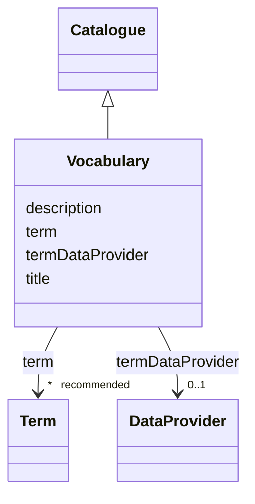

# Class: Vocabulary (Vocabulary)


_A subset of words or phrases specific to a particular subject or field_


URI: [EVORAO:Vocabulary](https://raw.githubusercontent.com/EVORA-project/evora-ontology/refs/heads/main/models/owl/evora_ontology.owl.ttl#Vocabulary)





## Inheritance
* [Resource](Resource.md)
    * [Dataset](Dataset.md)
        * [Catalogue](Catalogue.md)
            * **Vocabulary**


## Slots

| Name | Cardinality and Range | Description | Inheritance |
| ---  | --- | --- | --- |
| [termDataProvider](termDataProvider.md) | 0..1 <br/> [DataProvider](DataProvider.md) | An external API or Endpoint that permits to retrieve the terms of this vocabu... | direct |
| [term](term.md) | * _recommended_ <br/> [Term](Term.md) | The terms related to this vocabulary | direct |
| [title](title.md) | 1 <br/> [String](String.md) | A name given to the resource | [Dataset](Dataset.md) |
| [description](description.md) | 1 _recommended_ <br/> [String](String.md) | A short explanation of the characteristics, features, or nature of the curren... | [Dataset](Dataset.md) |


## Usages

| used by | used in | type | used |
| ---  | --- | --- | --- |
| [Term](Term.md) | [inVocabulary](inVocabulary.md) | range | [Vocabulary](Vocabulary.md) |
| [CommonName](CommonName.md) | [inVocabulary](inVocabulary.md) | range | [Vocabulary](Vocabulary.md) |
| [VirusName](VirusName.md) | [inVocabulary](inVocabulary.md) | range | [Vocabulary](Vocabulary.md) |
| [AlternateName](AlternateName.md) | [inVocabulary](inVocabulary.md) | range | [Vocabulary](Vocabulary.md) |
| [RiskGroup](RiskGroup.md) | [inVocabulary](inVocabulary.md) | range | [Vocabulary](Vocabulary.md) |
| [DOI](DOI.md) | [inVocabulary](inVocabulary.md) | range | [Vocabulary](Vocabulary.md) |
| [Journal](Journal.md) | [inVocabulary](inVocabulary.md) | range | [Vocabulary](Vocabulary.md) |
| [PDBReference](PDBReference.md) | [inVocabulary](inVocabulary.md) | range | [Vocabulary](Vocabulary.md) |
| [Keyword](Keyword.md) | [inVocabulary](inVocabulary.md) | range | [Vocabulary](Vocabulary.md) |
| [ProteinTag](ProteinTag.md) | [inVocabulary](inVocabulary.md) | range | [Vocabulary](Vocabulary.md) |
| [SpecialFeature](SpecialFeature.md) | [inVocabulary](inVocabulary.md) | range | [Vocabulary](Vocabulary.md) |
| [ExpressionVector](ExpressionVector.md) | [inVocabulary](inVocabulary.md) | range | [Vocabulary](Vocabulary.md) |
| [PlasmidSelection](PlasmidSelection.md) | [inVocabulary](inVocabulary.md) | range | [Vocabulary](Vocabulary.md) |
| [PropagationHost](PropagationHost.md) | [inVocabulary](inVocabulary.md) | range | [Vocabulary](Vocabulary.md) |
| [TransmissionMethod](TransmissionMethod.md) | [inVocabulary](inVocabulary.md) | range | [Vocabulary](Vocabulary.md) |
| [ProductionCellLine](ProductionCellLine.md) | [inVocabulary](inVocabulary.md) | range | [Vocabulary](Vocabulary.md) |
| [ProductCategory](ProductCategory.md) | [inVocabulary](inVocabulary.md) | range | [Vocabulary](Vocabulary.md) |
| [IsolationHost](IsolationHost.md) | [inVocabulary](inVocabulary.md) | range | [Vocabulary](Vocabulary.md) |
| [GeographicalOrigin](GeographicalOrigin.md) | [inVocabulary](inVocabulary.md) | range | [Vocabulary](Vocabulary.md) |
| [IPLCOrigin](IPLCOrigin.md) | [inVocabulary](inVocabulary.md) | range | [Vocabulary](Vocabulary.md) |
| [Country](Country.md) | [inVocabulary](inVocabulary.md) | range | [Vocabulary](Vocabulary.md) |
| [IATAClassification](IATAClassification.md) | [inVocabulary](inVocabulary.md) | range | [Vocabulary](Vocabulary.md) |
| [Variant](Variant.md) | [inVocabulary](inVocabulary.md) | range | [Vocabulary](Vocabulary.md) |
| [TaxonomicRank](TaxonomicRank.md) | [inVocabulary](inVocabulary.md) | range | [Vocabulary](Vocabulary.md) |
| [Taxon](Taxon.md) | [inVocabulary](inVocabulary.md) | range | [Vocabulary](Vocabulary.md) |


## Identifier and Mapping Information


### Schema Source


* from schema: https://raw.githubusercontent.com/EVORA-project/evora-ontology/refs/heads/main/models/owl/evora_ontology.owl.ttl#


## Mappings

| Mapping Type | Mapped Value |
| ---  | ---  |
| self | EVORAO:Vocabulary |
| native | EVORAO:Vocabulary |
| close | wd:Q6499736, skos:Collection, wd:Q6499736, skos:Collection |


## LinkML Source

<!-- TODO: investigate https://stackoverflow.com/questions/37606292/how-to-create-tabbed-code-blocks-in-mkdocs-or-sphinx -->

### Direct

<details>
```yaml
name: Vocabulary
description: A subset of words or phrases specific to a particular subject or field
title: Vocabulary
from_schema: https://raw.githubusercontent.com/EVORA-project/evora-ontology/refs/heads/main/models/owl/evora_ontology.owl.ttl#
close_mappings:
- wd:Q6499736
- skos:Collection
- wd:Q6499736
- skos:Collection
is_a: Catalogue
slots:
- termDataProvider
- term
slot_usage:
  termDataProvider:
    name: termDataProvider
    description: An external API or Endpoint that permits to retrieve the terms of
      this vocabulary
    title: term data provider
    domain_of:
    - Vocabulary
    range: DataProvider
    required: false
    multivalued: false
  term:
    name: term
    description: The terms related to this vocabulary
    title: term
    domain_of:
    - Vocabulary
    range: Term
    required: false
    recommended: true
    multivalued: true

```
</details>

### Induced

<details>
```yaml
name: Vocabulary
description: A subset of words or phrases specific to a particular subject or field
title: Vocabulary
from_schema: https://raw.githubusercontent.com/EVORA-project/evora-ontology/refs/heads/main/models/owl/evora_ontology.owl.ttl#
close_mappings:
- wd:Q6499736
- skos:Collection
- wd:Q6499736
- skos:Collection
is_a: Catalogue
slot_usage:
  termDataProvider:
    name: termDataProvider
    description: An external API or Endpoint that permits to retrieve the terms of
      this vocabulary
    title: term data provider
    domain_of:
    - Vocabulary
    range: DataProvider
    required: false
    multivalued: false
  term:
    name: term
    description: The terms related to this vocabulary
    title: term
    domain_of:
    - Vocabulary
    range: Term
    required: false
    recommended: true
    multivalued: true
attributes:
  termDataProvider:
    name: termDataProvider
    description: An external API or Endpoint that permits to retrieve the terms of
      this vocabulary
    title: term data provider
    from_schema: https://raw.githubusercontent.com/EVORA-project/evora-ontology/refs/heads/main/models/owl/evora_ontology.owl.ttl#
    rank: 1000
    alias: termDataProvider
    owner: Vocabulary
    domain_of:
    - Vocabulary
    range: DataProvider
    required: false
    multivalued: false
  term:
    name: term
    description: The terms related to this vocabulary
    title: term
    from_schema: https://raw.githubusercontent.com/EVORA-project/evora-ontology/refs/heads/main/models/owl/evora_ontology.owl.ttl#
    rank: 1000
    alias: term
    owner: Vocabulary
    domain_of:
    - Vocabulary
    range: Term
    required: false
    recommended: true
    multivalued: true
  title:
    name: title
    description: A name given to the resource
    title: title
    comments:
    - 'The title of the item should be as short and descriptive as possible. E.g.
      for virus products it should basically be based on the following Pattern:

      ''Virus name'', ''virus host type'', ''collection year'', ''country of collection''
      ex ''suspected epidemiological origin'', ''genotype'', ''strain'', ''variant
      name or specific feature'
    from_schema: https://raw.githubusercontent.com/EVORA-project/evora-ontology/refs/heads/main/models/owl/evora_ontology.owl.ttl#
    close_mappings:
    - rdfs:label
    rank: 1000
    slot_uri: dct:title
    alias: title
    owner: Vocabulary
    domain_of:
    - Dataset
    - DataService
    - Publication
    - Term
    - License
    - Certification
    range: string
    required: true
    multivalued: false
  description:
    name: description
    description: A short explanation of the characteristics, features, or nature of
      the current item
    title: description
    comments:
    - 'Describe this item in few lines. This description will serve as a summary to
      present the resource.

      '
    from_schema: https://raw.githubusercontent.com/EVORA-project/evora-ontology/refs/heads/main/models/owl/evora_ontology.owl.ttl#
    rank: 1000
    slot_uri: dct:description
    alias: description
    owner: Vocabulary
    domain_of:
    - Dataset
    - DataService
    - Term
    - PersonOrOrganization
    - File
    - ContactPoint
    - License
    - Certification
    range: string
    required: true
    recommended: true
    multivalued: false

```
</details>