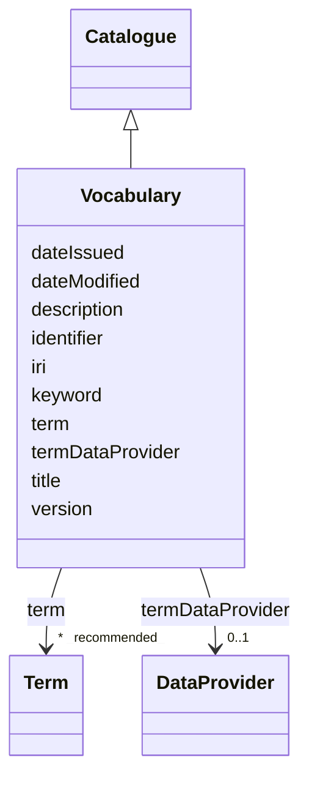

# Class: Vocabulary (Vocabulary) 


_A subset of words or phrases specific to a particular subject or field_


URI: [EVORAO:Vocabulary](https://w3id.org/evorao/Vocabulary)





## Inheritance
* [Resource](Resource.md)
    * [Dataset](Dataset.md)
        * [Catalogue](Catalogue.md)
            * **Vocabulary**


## Slots

| Name | Cardinality and Range | Description | Inheritance |
| ---  | --- | --- | --- |
| [termDataProvider](termDataProvider.md) | 0..1 <br/> [DataProvider](DataProvider.md) | An external API or Endpoint that permits to retrieve the terms of this vocabu... | direct |
| [term](term.md) | * _recommended_ <br/> [Term](Term.md) | The terms related to this vocabulary | direct |
| [title](title.md) | 1 <br/> [String](String.md) | A name given to the resource | [Dataset](Dataset.md) |
| [description](description.md) | 1 _recommended_ <br/> [String](String.md) | A short explanation of the characteristics, features, or nature of the curren... | [Dataset](Dataset.md) |
| [version](version.md) | 0..1 _recommended_ <br/> [String](String.md) | The version indicator (name or identifier) of a resource | [Dataset](Dataset.md) |
| [keyword](keyword.md) | * <br/> [String](String.md) | A keyword or tag describing the resource | [Resource](Resource.md) |
| [dateIssued](dateIssued.md) | 0..1 <br/> [Datetime](Datetime.md) | Date of formal issuance (e | [Resource](Resource.md) |
| [dateModified](dateModified.md) | 0..1 <br/> [Datetime](Datetime.md) | Most recent date on which the resource was changed, updated or modified | [Resource](Resource.md) |
| [identifier](identifier.md) | * <br/> [String](String.md) | A unique identifier of the resource being described or cataloged | [Resource](Resource.md) |
| [iri](iri.md) | * <br/> [Uri](Uri.md) | International Resource Identifier (IRI) that uniquely identifies or refers to... | [Resource](Resource.md) |


## Usages

| used by | used in | type | used |
| ---  | --- | --- | --- |
| [Term](Term.md) | [inVocabulary](inVocabulary.md) | range | [Vocabulary](Vocabulary.md) |
| [CommonName](CommonName.md) | [inVocabulary](inVocabulary.md) | range | [Vocabulary](Vocabulary.md) |
| [VirusName](VirusName.md) | [inVocabulary](inVocabulary.md) | range | [Vocabulary](Vocabulary.md) |
| [AlternateName](AlternateName.md) | [inVocabulary](inVocabulary.md) | range | [Vocabulary](Vocabulary.md) |
| [RiskGroup](RiskGroup.md) | [inVocabulary](inVocabulary.md) | range | [Vocabulary](Vocabulary.md) |
| [Doi](Doi.md) | [inVocabulary](inVocabulary.md) | range | [Vocabulary](Vocabulary.md) |
| [Journal](Journal.md) | [inVocabulary](inVocabulary.md) | range | [Vocabulary](Vocabulary.md) |
| [PdbReference](PdbReference.md) | [inVocabulary](inVocabulary.md) | range | [Vocabulary](Vocabulary.md) |
| [Keyword](Keyword.md) | [inVocabulary](inVocabulary.md) | range | [Vocabulary](Vocabulary.md) |
| [TagSequence](TagSequence.md) | [inVocabulary](inVocabulary.md) | range | [Vocabulary](Vocabulary.md) |
| [SpecialFeature](SpecialFeature.md) | [inVocabulary](inVocabulary.md) | range | [Vocabulary](Vocabulary.md) |
| [ExpressionVector](ExpressionVector.md) | [inVocabulary](inVocabulary.md) | range | [Vocabulary](Vocabulary.md) |
| [PlasmidSelection](PlasmidSelection.md) | [inVocabulary](inVocabulary.md) | range | [Vocabulary](Vocabulary.md) |
| [PropagationHost](PropagationHost.md) | [inVocabulary](inVocabulary.md) | range | [Vocabulary](Vocabulary.md) |
| [TransmissionMethod](TransmissionMethod.md) | [inVocabulary](inVocabulary.md) | range | [Vocabulary](Vocabulary.md) |
| [ProductionCellLine](ProductionCellLine.md) | [inVocabulary](inVocabulary.md) | range | [Vocabulary](Vocabulary.md) |
| [ProductCategory](ProductCategory.md) | [inVocabulary](inVocabulary.md) | range | [Vocabulary](Vocabulary.md) |
| [IsolationHost](IsolationHost.md) | [inVocabulary](inVocabulary.md) | range | [Vocabulary](Vocabulary.md) |
| [GeographicalOrigin](GeographicalOrigin.md) | [inVocabulary](inVocabulary.md) | range | [Vocabulary](Vocabulary.md) |
| [IplcOrigin](IplcOrigin.md) | [inVocabulary](inVocabulary.md) | range | [Vocabulary](Vocabulary.md) |
| [Country](Country.md) | [inVocabulary](inVocabulary.md) | range | [Vocabulary](Vocabulary.md) |
| [IataClassification](IataClassification.md) | [inVocabulary](inVocabulary.md) | range | [Vocabulary](Vocabulary.md) |
| [Variant](Variant.md) | [inVocabulary](inVocabulary.md) | range | [Vocabulary](Vocabulary.md) |
| [TaxonomicRank](TaxonomicRank.md) | [inVocabulary](inVocabulary.md) | range | [Vocabulary](Vocabulary.md) |
| [Taxon](Taxon.md) | [inVocabulary](inVocabulary.md) | range | [Vocabulary](Vocabulary.md) |
| [ClinicalGroup](ClinicalGroup.md) | [inVocabulary](inVocabulary.md) | range | [Vocabulary](Vocabulary.md) |


## Identifier and Mapping Information


### Schema Source


* from schema: https://w3id.org/evorao/


## Mappings

| Mapping Type | Mapped Value |
| ---  | ---  |
| self | EVORAO:Vocabulary |
| native | EVORAO:Vocabulary |
| exact | sio:001080, sio:001080 |
| broad | skos:Collection, skos:Collection |
| related | t4fs:0000335, wd:Q6499736, t4fs:0000335, wd:Q6499736 |
| close | wd:Q1391494, wd:Q6537693, wd:Q8380731, wd:Q1391494, wd:Q6537693, wd:Q8380731 |


## LinkML Source

<!-- TODO: investigate https://stackoverflow.com/questions/37606292/how-to-create-tabbed-code-blocks-in-mkdocs-or-sphinx -->

### Direct

<details>
```yaml
name: Vocabulary
description: A subset of words or phrases specific to a particular subject or field
title: Vocabulary
from_schema: https://w3id.org/evorao/
exact_mappings:
- sio:001080
- sio:001080
close_mappings:
- wd:Q1391494
- wd:Q6537693
- wd:Q8380731
- wd:Q1391494
- wd:Q6537693
- wd:Q8380731
related_mappings:
- t4fs:0000335
- wd:Q6499736
- t4fs:0000335
- wd:Q6499736
broad_mappings:
- skos:Collection
- skos:Collection
is_a: Catalogue
slots:
- termDataProvider
- term
slot_usage:
  termDataProvider:
    name: termDataProvider
    description: An external API or Endpoint that permits to retrieve the terms of
      this vocabulary
    title: term data provider
    domain_of:
    - Vocabulary
    range: DataProvider
    required: false
    multivalued: false
  term:
    name: term
    description: The terms related to this vocabulary
    title: term
    related_mappings:
    - dct:hasPart
    domain_of:
    - Vocabulary
    range: Term
    required: false
    recommended: true
    multivalued: true

```
</details>

### Induced

<details>
```yaml
name: Vocabulary
description: A subset of words or phrases specific to a particular subject or field
title: Vocabulary
from_schema: https://w3id.org/evorao/
exact_mappings:
- sio:001080
- sio:001080
close_mappings:
- wd:Q1391494
- wd:Q6537693
- wd:Q8380731
- wd:Q1391494
- wd:Q6537693
- wd:Q8380731
related_mappings:
- t4fs:0000335
- wd:Q6499736
- t4fs:0000335
- wd:Q6499736
broad_mappings:
- skos:Collection
- skos:Collection
is_a: Catalogue
slot_usage:
  termDataProvider:
    name: termDataProvider
    description: An external API or Endpoint that permits to retrieve the terms of
      this vocabulary
    title: term data provider
    domain_of:
    - Vocabulary
    range: DataProvider
    required: false
    multivalued: false
  term:
    name: term
    description: The terms related to this vocabulary
    title: term
    related_mappings:
    - dct:hasPart
    domain_of:
    - Vocabulary
    range: Term
    required: false
    recommended: true
    multivalued: true
attributes:
  termDataProvider:
    name: termDataProvider
    description: An external API or Endpoint that permits to retrieve the terms of
      this vocabulary
    title: term data provider
    from_schema: https://w3id.org/evorao/
    rank: 1000
    alias: termDataProvider
    owner: Vocabulary
    domain_of:
    - Vocabulary
    range: DataProvider
    required: false
    multivalued: false
  term:
    name: term
    description: The terms related to this vocabulary
    title: term
    from_schema: https://w3id.org/evorao/
    related_mappings:
    - dct:hasPart
    rank: 1000
    alias: term
    owner: Vocabulary
    domain_of:
    - Vocabulary
    range: Term
    required: false
    recommended: true
    multivalued: true
  title:
    name: title
    description: A name given to the resource
    title: title
    comments:
    - 'The title of the item should be as short and descriptive as possible. E.g.
      for virus products it should basically be based on the following Pattern: ''Virus
      name'', ''virus host type'', ''collection year'', ''country of collection''
      ex ''suspected epidemiological origin'', ''genotype'', ''strain'', ''variant
      name or specific feature'
    from_schema: https://w3id.org/evorao/
    exact_mappings:
    - schema:name
    - rdfs:label
    rank: 1000
    slot_uri: dct:title
    alias: title
    owner: Vocabulary
    domain_of:
    - Dataset
    - DataService
    - Publication
    - Term
    - License
    - Certification
    range: string
    required: true
    multivalued: false
  description:
    name: description
    description: A short explanation of the characteristics, features, or nature of
      the current item
    title: description
    comments:
    - Describe this item in few lines. This description will serve as a summary to
      present the resource.
    from_schema: https://w3id.org/evorao/
    exact_mappings:
    - schema:description
    close_mappings:
    - schema:description
    rank: 1000
    slot_uri: dct:description
    alias: description
    owner: Vocabulary
    domain_of:
    - Dataset
    - DataService
    - Term
    - PersonOrOrganization
    - File
    - ContactPoint
    - License
    - Certification
    range: string
    required: true
    recommended: true
    multivalued: false
  version:
    name: version
    description: The version indicator (name or identifier) of a resource
    title: version
    from_schema: https://w3id.org/evorao/
    exact_mappings:
    - pav:version
    close_mappings:
    - wdp:P393
    - schema:version
    related_mappings:
    - schema:identifier
    rank: 1000
    slot_uri: dcat:version
    alias: version
    owner: Vocabulary
    domain_of:
    - Dataset
    - Version
    - Taxonomy
    range: string
    required: false
    recommended: true
    multivalued: false
  keyword:
    name: keyword
    description: A keyword or tag describing the resource
    title: keyword
    from_schema: https://w3id.org/evorao/
    rank: 1000
    slot_uri: dcat:keyword
    alias: keyword
    owner: Vocabulary
    domain_of:
    - Resource
    range: string
    required: false
    multivalued: true
  dateIssued:
    name: dateIssued
    description: Date of formal issuance (e.g., publication) of the resource
    title: date issued
    comments:
    - encoded using the relevant ISO 8601 Date and Time compliant string [DATETIME]
    from_schema: https://w3id.org/evorao/
    exact_mappings:
    - sepio:0000051
    close_mappings:
    - schema:datePublished
    - schema:dateCreated
    rank: 1000
    slot_uri: dct:issued
    alias: dateIssued
    owner: Vocabulary
    domain_of:
    - Resource
    range: datetime
    required: false
    multivalued: false
  dateModified:
    name: dateModified
    description: Most recent date on which the resource was changed, updated or modified
    title: date modified
    comments:
    - encoded using the relevant ISO 8601 Date and Time compliant string [DATETIME]
    from_schema: https://w3id.org/evorao/
    exact_mappings:
    - sepio:0000036
    close_mappings:
    - schema:dateModified
    rank: 1000
    slot_uri: dct:modified
    alias: dateModified
    owner: Vocabulary
    domain_of:
    - Resource
    range: datetime
    required: false
    multivalued: false
  identifier:
    name: identifier
    description: A unique identifier of the resource being described or cataloged
    title: identifier
    comments:
    - The identifier is a text string which is assigned to the resource to provide
      an unambiguous reference within a particular context. Persistent identifiers
      should be provided as HTTP URIs
    from_schema: https://w3id.org/evorao/
    exact_mappings:
    - schema:identifier
    rank: 1000
    slot_uri: dct:identifier
    alias: identifier
    owner: Vocabulary
    domain_of:
    - Resource
    range: string
    required: false
    multivalued: true
  iri:
    name: iri
    description: International Resource Identifier (IRI) that uniquely identifies
      or refers to the resource. IRIs include URIs, and URIs include URLs
    title: IRI
    comments:
    - An IRI is a global identifier standardized by IETF RFC 3987. It may or may not
      be resolvable on the web. IRIs include URIs, and URIs include URLs
    from_schema: https://w3id.org/evorao/
    rank: 1000
    is_a: identifier
    alias: iri
    owner: Vocabulary
    domain_of:
    - Resource
    range: uri
    required: false
    multivalued: true

```
</details>